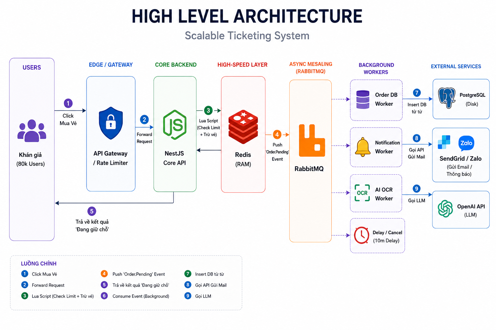
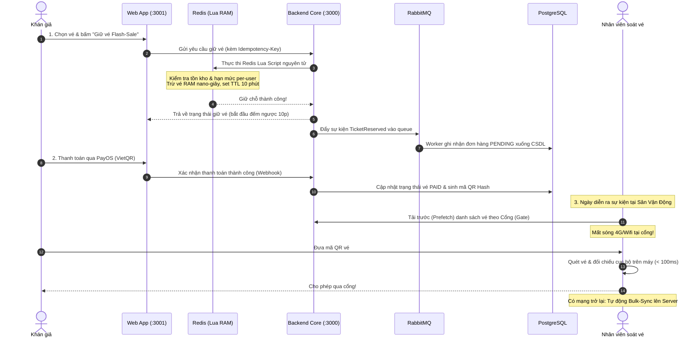

# Tixora — High-Concurrency Ticketing & Event Gate Distribution Platform
### Nền Tảng Phân Phối Vé & Soát Vé Sự Kiện Chịu Tải Cao

<p align="center">
  
</p>

<p align="center">
  
  
  
  
  
  
  
  
  
</p>

> **Tixora** là một nền tảng bán vé và quản trị sự kiện trực tuyến hoàn chỉnh (tương tự mô hình *Ticketbox* hay *Ticketmaster*). Hệ thống được thiết kế đặc thù để giải quyết **2 bài toán kỹ thuật "sống còn"** của ngành công nghiệp sự kiện & hòa nhạc quy mô lớn:
> 1. **Cơn ác mộng mở bán vé "Flash-Sale"**: Hàng chục ngàn khán giả đổ xô bấm nút "Mua vé" cùng lúc gây sập server, nghẽn database và bán vượt quá số lượng vé thực tế (Overselling / Race condition).
> 2. **Cơn ác mộng nghẽn cổng soát vé**: Sóng 4G/Wifi bị tê liệt tại sân vận động có 40.000 khán giả, khiến ứng dụng soát vé quay tròn không tải được dữ liệu, gây ùn tắc kéo dài tại cổng check-in.

---

## 🌐 Trải Nghiệm Trực Tiếp Trên Cloud (Instant Live Demo & Test Accounts)

> Toàn bộ hệ thống Tixora đã được triển khai sẵn sàng trên Cloud Vercel. Bạn có thể truy cập ngay vào 2 cổng độc lập dưới đây:

<p align="center">
  <a href="https://tixora.tvquang.id.vn" target="_blank">
    
  </a>
  &nbsp;&nbsp;
  <a href="https://tixora-admin.tvquang.id.vn" target="_blank">
    
  </a>
</p>

### 🔑 Danh Sách Tài Khoản Thử Nghiệm Nạp Sẵn Dữ Liệu (Mật khẩu chung: `12345678`)

| Vai trò (Role) | Tài Khoản Đăng Nhập | Mật khẩu | Tính Năng Chính Trải Nghiệm |
| :--- | :--- | :--- | :--- |
| **Admin** | `admin@tixora.local` | `12345678` | Bảng điều khiển doanh thu tổng quan, duyệt concert, quản lý phân quyền RBAC và audit logs. |
| **Organizer** | `organizer@tixora.local` | `12345678` | Tạo sự kiện concert mới, thiết lập sơ đồ ghế & hạng vé, quản lý khách mời, theo dõi doanh số. |
| **Audience** | `audience@tixora.local` | `12345678` | Săn vé Flash-Sale tải cao, đếm ngược giữ chỗ 10 phút, thanh toán VietQR PayOS và nhận vé QR. |
| **Checker** | `checker@tixora.local` | `12345678` | Quét QR vé tại cổng kiểm soát, hỗ trợ hoạt động ngoại tuyến khi mất sóng Internet. *(Chỉ dùng trên Mobile)*. |

---

## 📺 Video Giới Thiệu & Bản Trình Diễn (Video Demo & Walkthrough)

> [!NOTE]
> 🎥 **Xem Video Demo Trực Quan (3-5 phút)**:
> - **Luồng Khán giả & Săn vé Tải cao**: Đặt chỗ thời gian thực, giữ vé đếm ngược 10 phút, thanh toán PayOS và xuất vé QR.
> - **Luồng Soát vé Ngoại tuyến (Offline Check-in)**: Tắt toàn bộ Wifi/4G trên điện thoại, quét vé QR thành công dưới 100ms và tự động đồng bộ khi có mạng.
> 
> *(Chèn liên kết Video Demo Loom / YouTube của bạn tại đây: `https://youtu.be/your-demo-video`)*

---

## 🌟 Hệ Sinh Thái 4 Phân Hệ Của Tixora (System Ecosystem)

Dự án được tổ chức theo mô hình **pnpm Monorepo Workspaces**, bao gồm 4 ứng dụng độc lập phối hợp liền mạch:

```
                      ┌───────────────────────────────────────────────┐
                      │              TIXORA ECOSYSTEM                 │
                      └───────┬──────────────┬─────────────┬──────────┘
                              │              │             │
              ┌───────────────┴────┐   ┌─────┴──────┐   ┌──┴────────────────┐
              │  Audience Web App  │   │ Admin App  │   │ Mobile Scanner App│
              │   (Next.js 16)     │   │(Next.js 16)│   │(Expo React Native)│
              │    Port :3001      │   │ Port :3002 │   │    Port :8081     │
              └───────────────┬────┘   └─────┬──────┘   └──┬────────────────┘
                              │              │             │
                              └──────────────┼─────────────┘
                                             ▼
                              ┌─────────────────────────────┐
                              │     Backend Core API        │
                              │   (NestJS Modular :3000)    │
                              └─────────────────────────────┘
```

| Phân hệ | Công nghệ | Đối tượng phục vụ | Chức năng chính |
| :--- | :--- | :--- | :--- |
| **1. Web Khách Hàng** (`:3001`) | Next.js 16, Tailwind v4 | Khán giả (Audience) | Khám phá concert, chọn hạng vé trực quan, săn vé Flash-Sale, thanh toán PayOS, quản lý ví vé điện tử QR. |
| **2. Admin & BTC Portal** (`:3002`) | Next.js 16, Tailwind v4 | Ban Tổ Chức (Organizer) & Quản Trị Viên (Admin) | Tạo và duyệt sự kiện, cấu hình hạng vé/sơ đồ ghế, phân quyền 5 cấp RBAC, theo dõi biểu đồ doanh thu theo thời gian thực. |
| **3. Mobile Scanner App** (`:8081`) | Expo (React Native) | Nhân viên soát vé tại cổng (Checker) | Quét mã QR vé siêu tốc (< 100ms), hoạt động mượt mà ngay cả khi **mất hoàn toàn kết nối Internet** (Offline-First). |
| **4. Backend Core API** (`:3000`) | NestJS, Prisma, PostgreSQL | Toàn bộ hệ thống | Quản trị logic nghiệp vụ, xác thực Stateless JWT, đệm giao dịch nguyên tử với Redis Lua & RabbitMQ. |

---

## 📸 Giao Diện & Trải Nghiệm Thực Tế (Visual Showcase)

*(Toàn bộ hình ảnh thực tế từ các phân hệ của Tixora được lưu trữ trong thư mục `docs/assets/screenshots/`)*

### 1. Phân Hệ Đặt Vé Khách Hàng (Audience Portal)
| Khám Phá Concert & Sự Kiện Nổi Bật | Chọn Hạng Vé & Giữ Chỗ Flash-Sale |
| :---: | :---: |
|  |  |
| *Giao diện hiện đại hiển thị danh sách concert, nghệ sĩ và tình trạng vé* | *Đồng hồ đếm ngược 10 phút giữ vé trên RAM, chống giữ ảo* |

| Thanh Toán Tức Thì Qua Cổng PayOS | Ví Vé Điện Tử & Mã QR Chống Giả Mạo |
| :---: | :---: |
|  |  |
| *Thanh toán quét mã VietQR tự động xác nhận webhook trong 1 giây* | *Mã QR được băm và mã hóa muối (salted hash), bảo mật tuyệt đối* |

---

### 2. Trang Quản Trị Doanh Thu & Sự Kiện (Admin & Organizer Portal)
| Dashboard Báo Cáo Doanh Thu Realtime | Quản Lý Sự Kiện & Cấu Hình Hạng Vé |
| :---: | :---: |
|  |  |
| *Thống kê tỷ lệ lấp đầy, số vé đã bán và doanh thu từng sự kiện* | *Thiết lập giá vé, số lượng mở bán và giới hạn số vé mỗi người mua* |

---

### 3. Ứng Dụng Di Động Soát Vé Ngoại Tuyến (Mobile Scanner App)
| Giao Diện Soát Vé Tại Cổng (Online & Offline) | Xác Nhận Hợp Lệ & Cảnh Báo Vé Quét Trùng |
| :---: | :---: |
|  |  |
| *Chuyển đổi trạng thái Online/Offline mượt mà, phân luồng theo Gate* | *Phát hiện vé giả, sai cổng hoặc vé đã check-in trước đó trong < 100ms* |

---

### 4. Bằng Chứng Kiểm Thử Tải Cao (k6 High-Concurrency Stress Test)
| Mô Phỏng 1.000 Khách Hàng Tranh Chấp 50 Vé (Zero-Oversell) | Kiểm Chứng Rate Limiting Bảo Vệ Server (HTTP 429) |
| :---: | :---: |
|  |  |
| *Kết quả: Bán chính xác 50 vé, 950 yêu cầu bị từ chối an toàn, 0 lỗi oversell* | *Bảo vệ backend khỏi DDoS và bot spam bằng Token Bucket Guard* |

---

## 🔄 Hành Trình Người Dùng Từ Đầu Đến Cuối (End-to-End User Flow)



---

## 💎 Giải Pháp Kỹ Thuật Đột Phá (Core Engineering Solutions)

### 1. Động Cơ Chống Bán Lố Vé Bằng Redis Lua (Atomic Anti-Oversell)
- **Vấn đề thực tế**: Khi mở bán show của ca sĩ nổi tiếng, 50.000 người cùng ấn mua trong 1 giây. Nếu dùng cơ chế khóa dòng dữ liệu trong CSDL quan hệ (`SELECT FOR UPDATE`), hệ thống sẽ bị treo connection pool và sập trong tích tắc. Nếu không khóa, race condition sẽ bán thừa hàng ngàn vé so với số ghế thực tế.
- **Giải pháp**: Tixora chuyển toàn bộ quyết định giữ vé lên RAM bằng **Redis Lua Script**. Vì Redis chạy đơn luồng, script đóng gói 3 bước *(Check tồn kho -> Check hạn mức người mua -> Trừ tồn kho và lưu TTL 10 phút)* thành **1 thao tác nguyên tử duy nhất**. Kết quả: Phản hồi milli-giây, cam kết **100% Zero-Oversell**.

### 2. Soát Vé Ngoại Tuyến Tại Cổng (Offline-First Gate Check-in)
- **Vấn đề thực tế**: Sân vận động đông đúc luôn bị "nghẽn sóng" viễn thông. Nếu máy quét QR bắt buộc phải gọi API lên server thì cổng vào sẽ bị tê liệt hoàn toàn.
- **Giải pháp**: 
  - **Phân luồng cổng (Gate Segregation)**: Cổng VIP chỉ nhận danh sách vé VIP, cổng GA nhận vé GA.
  - **Prefetching & Local Cache**: Trước giờ mở cửa, thiết bị mobile của nhân viên tải trước danh sách băm `qr_code_hash` về bộ nhớ máy.
  - **Quét tức thì & Bulk-Sync**: Quét và đánh dấu đã dùng trên điện thoại không cần mạng. Khi có kết nối, app tự động đẩy danh sách đồng bộ lên server với cơ chế chống ghi đè theo `timestamp`.

### 3. Bộ Đệm Xử Lý Bất Đồng Bộ (Event-Driven with RabbitMQ)
- Để bảo vệ cơ sở dữ liệu vật lý PostgreSQL khỏi áp lực ghi I/O đột biến, API không ghi trực tiếp xuống đĩa mà đẩy message vào **RabbitMQ**. Các Worker ngầm sẽ tiêu thụ hàng đợi tuần tự, giúp hệ thống luôn ổn định dù lượng truy cập tăng đột biến.

### 4. Bảo Vệ Phòng Thủ Đa Tầng (Token Bucket Rate Limiting & Idempotency)
- **Token Bucket Guard**: Chặn đứng bot cào vé và người dùng nhấn F5 liên tục bằng mã lỗi `HTTP 429 Too Many Requests`.
- **Idempotency Key (Redis SETNX)**: Khóa giao dịch thanh toán trong 24 giờ, chống hoàn toàn hiện tượng trừ tiền 2 lần khi người dùng bấm đúp nút thanh toán.

---

## 🛠️ Hướng Dẫn Cài Đặt & Chạy Nhanh (Quickstart Guide)

### 1. Chuẩn bị môi trường
- **Node.js**: `v20.x` hoặc `v22.x+`
- **pnpm**: `npm install -g pnpm`
- **Docker Desktop**: Đã bật

### 2. Cài đặt và khởi chạy hạ tầng
```bash
# Clone repository
git clone https://github.com/tvquang0511/Tixora.git
cd Tixora

# Cài đặt toàn bộ dependencies
pnpm install

# Bật Redis (:6379) và RabbitMQ (:5672) bằng Docker
cd infrastructure
docker compose up -d
cd ..

# Cấu hình biến môi trường & nạp dữ liệu mẫu
cp .env.example .env
pnpm prisma:generate
pnpm db:migrate:deploy
pnpm db:seed
```

### 3. Khởi chạy các ứng dụng

```bash
# Terminal 1: Backend Core API (Cổng 3000)
pnpm start:api:dev

# Terminal 2: Web Khách Hàng (Cổng 3001)
pnpm start:web

# Terminal 3: Admin Portal (Cổng 3002)
pnpm start:admin

# Terminal 4: Mobile Scanner App (Cổng 8081)
pnpm start:mobile
```

- **Swagger API Docs**: [http://localhost:3000/api/docs](http://localhost:3000/api/docs)
- **Web Khách Hàng**: [http://localhost:3001](http://localhost:3001)
- **Admin Dashboard**: [http://localhost:3002](http://localhost:3002)

---

## 🧪 Kiểm Thử Tự Động & Thử Nghiệm Chịu Tải (Quality Gates)

```powershell
# 1. Kiểm tra chuẩn code, lint và typecheck trước khi commit
pnpm verify:push

# 2. Chạy kiểm thử tự động End-to-End (Playwright)
pnpm test:e2e
pnpm test:e2e:ui

# 3. Chạy kiểm thử chịu tải k6: Mô phỏng tranh chấp vé (Zero-Oversell)
pnpm test:load:oversell

# 4. Chạy kiểm thử chịu tải k6: Kiểm tra Rate Limiting (HTTP 429)
pnpm test:load:flow
```

---

## 📁 Cấu Trúc Thư Mục Dự Án (Monorepo Directory Structure)

```text
Tixora/
├── apps/
│   ├── backend-api/      # NestJS Core API, Prisma ORM, Redis Lua Scripts, RabbitMQ Workers (:3000)
│   ├── web-app/          # Next.js 16 Client Portal: Khám phá concert, mua vé, thanh toán (:3001)
│   ├── admin-app/        # Next.js 16 Admin Dashboard: Doanh thu, duyệt vé, phân quyền (:3002)
│   └── mobile-app/       # Expo React Native App: Quét vé QR ngoại tuyến tại cổng SVĐ (:8081)
├── infrastructure/       # Docker Compose cho PostgreSQL, Redis & RabbitMQ
├── docs/                 # Trung tâm tài liệu kiến trúc, System Design C4, ADRs & Test Guide
│   ├── assets/           # Sơ đồ kiến trúc & Ảnh chụp màn hình ứng dụng
│   ├── 01-architecture/  # System Design, Database Schema, High Load Defense
│   ├── 02-modules/       # Đặc tả các module: Auth, Ticketing, Payment, Checkin Offline
│   └── 03-testing/       # Hướng dẫn Manual Test, Playwright E2E & k6 Load Testing
├── testing/              # Kịch bản kiểm thử tự động Playwright E2E & k6 Stress Scripts
└── package.json          # Root Monorepo configuration (pnpm workspaces)
```

---

## 👤 Tác Giả & Liên Hệ (Author & Contact)

Dự án được xây dựng và phát triển bởi **Trần Vũ Quang** (Software Engineer Intern / Full-Stack Developer).
- 📞 **Điện thoại / Zalo**: `0357131476`
- ✉️ **Email**: `tvquang.working@gmail.com`
- 🌐 **GitHub**: [https://github.com/tvquang0511](https://github.com/tvquang0511)
- 📍 **Địa điểm**: TP. Hồ Chí Minh

