# Tixora — High-Concurrency Ticketing & Offline Gate Check-in Platform

### Nền Tảng Phân Phối Vé & Soát Vé Sự Kiện Chịu Tải Cao (Concert & Stadium Scale)

<p align="center">
  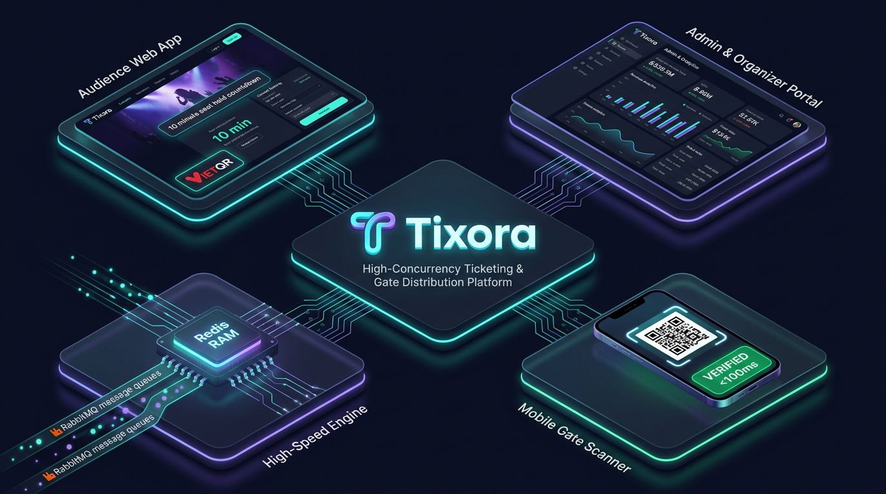
</p>

<p align="center">
  <a href="https://tixora.tvquang.id.vn" target="_blank"></a>
  <a href="https://tixora-admin.tvquang.id.vn" target="_blank"></a>
  <a href="https://supabase.com" target="_blank"></a>
  <a href="https://redis.io" target="_blank"></a>
</p>

<p align="center">
  
  
  
  
  
  
  
  
</p>

> **Tixora** là nền tảng bán vé và kiểm soát sự kiện trực tuyến hoàn chỉnh (mô hình *Ticketbox* / *Ticketmaster*) được xây dựng theo kiến trúc **pnpm Monorepo** hiện đại. Hệ thống giải quyết trọn vẹn **2 bài toán kỹ thuật sống còn** của ngành sự kiện & concert quy mô lớn:
> 1. **Cơn ác mộng mở bán vé "Flash-Sale"**: Hàng chục ngàn người cùng bấm mua trong 1 giây gây nghẽn database và bán vượt quá số lượng vé thực tế (**Race Condition / Overselling**). Giải quyết bằng **Redis Lua Script** nguyên tử trên RAM và **RabbitMQ** đệm ghi CSDL bất đồng bộ.
> 2. **Cơn ác mộng nghẽn sóng sân vận động**: Sóng 4G/Wifi bị tê liệt tại cổng vào có 40.000 khán giả, khiến ứng dụng soát vé quay tròn gây ùn tắc. Giải quyết bằng **Offline-First Mobile Scanner** với cơ chế phân luồng cổng (**Gate Segregation**), đối chiếu danh sách băm vé bảo mật cục bộ **< 100ms** và tự động đồng bộ khi có mạng.

---

## 1. Trải Nghiệm Trực Tiếp Trên Cloud (Instant Live Demo - Zero Setup)

> Bạn có thể truy cập ngay vào 2 cổng độc lập đã được triển khai sẵn sàng trên Cloud:

<p align="center">
  <a href="https://tixora.tvquang.id.vn" target="_blank">
    
  </a>
  &nbsp;&nbsp;&nbsp;&nbsp;
  <a href="https://tixora-admin.tvquang.id.vn" target="_blank">
    
  </a>
</p>

### 5 Tài Khoản Mẫu Nạp Sẵn Dữ Liệu Thực Tế (Mật khẩu chung: `12345678`)

| Vai trò (Role) | Email Đăng Nhập | Mật khẩu | Tính năng chính trải nghiệm |
| :--- | :--- | :--- | :--- |
| **SuperAdmin** | `superadmin@tixora.local` | `12345678` | Quản trị tối cao toàn sàn, giám sát tài chính ký quỹ (Escrow), đối soát giải ngân cho Ban tổ chức và phân quyền RBAC. |
| **Admin** | `admin@tixora.local` | `12345678` | Bảng điều khiển doanh thu tổng quan thời gian thực, duyệt sự kiện, quản lý danh mục và xem Audit Logs. |
| **Organizer** | `organizer@tixora.local` | `12345678` | Tạo concert mới, thiết lập sơ đồ ghế & hạng vé, quản lý khách mời, theo dõi tốc độ bán vé sự kiện. |
| **Audience** | `audience@tixora.local` | `12345678` | Săn vé Flash-Sale tải cao, đếm ngược giữ vé 10 phút trên RAM, thanh toán VietQR PayOS và nhận vé điện tử QR. |
| **Checker** | `checker@tixora.local` | `12345678` | Quét QR vé tại cổng kiểm soát, hỗ trợ hoạt động ngoại tuyến khi mất sóng Internet *(Sử dụng trên Mobile App)*. |

---

## 2. Hướng Dẫn Chạy Mobile Scanner App Cục Bộ (Local Setup)

Phân hệ **Mobile Scanner App** được xây dựng bằng **Expo (React Native)** tối ưu cho nhân viên soát vé tại cổng. Bạn có thể khởi chạy ứng dụng cục bộ chỉ với các bước đơn giản sau:

### Bước 1: Di chuyển vào thư mục Mobile App
```bash
# Từ thư mục gốc dự án Tixora:
cd apps/mobile-app
```

### Bước 2: Cài đặt dependencies (nếu chưa chạy pnpm install ở thư mục gốc)
```bash
pnpm install
```

### Bước 3: Khởi chạy Expo Dev Server
```bash
pnpm start
# Hoặc chạy trực tiếp: npx expo start
```

### Bước 4: Trải nghiệm ứng dụng
- **Cách 1 (Khuyên dùng - Trải nghiệm trên Điện Thoại Thật)**:  
  1. Tải ứng dụng **Expo Go** trên [App Store (iOS)](https://apps.apple.com/app/expo-go/id982107779) hoặc [Google Play (Android)](https://play.google.com/store/apps/details?id=host.exp.exponent).  
  2. Dùng camera điện thoại quét mã QR hiển thị trên Terminal.  
  3. Đăng nhập tài khoản `checker@tixora.local` (mật khẩu `12345678`).  
  4. Chọn sự kiện và Cổng soát vé (ví dụ: *Cổng GA 01*).  
  5. **Bật chế độ Máy bay (Airplane Mode / Tắt Wifi & 4G)** để kiểm thử tính năng **Offline Check-in**: Quét vé QR và chứng kiến kết quả xác thực hợp lệ dưới **100ms**!
- **Cách 2 (Máy ảo / Trình duyệt)**:  
  - Nhấn phím `a` trên Terminal để mở Android Emulator.  
  - Nhấn phím `i` để mở iOS Simulator (trên macOS).  
  - Nhấn phím `w` để mở bản xem trước trên Web Browser.

---

## Sơ Đồ Kiến Trúc Hệ Thống (Enterprise Architecture)

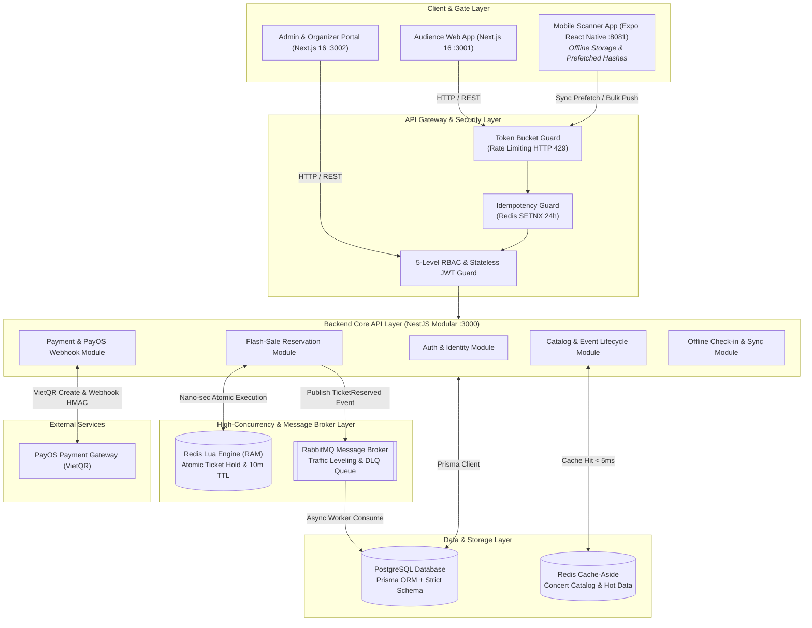
```mermaid
flowchart TD
    subgraph ClientLayer ["Client & Gate Layer"]
        AUDIENCE["Audience Web App (Next.js 16 :3001)"]
        ADMIN["Admin & Organizer Portal (Next.js 16 :3002)"]
        MOBILE["Mobile Scanner App (Expo React Native :8081)<br/><i>Offline Storage & Prefetched Hashes</i>"]
    end

    subgraph GatewayLayer ["API Gateway & Security Layer"]
        TOKEN_BUCKET["Token Bucket Guard<br/>(Rate Limiting HTTP 429)"]
        IDEMPOTENCY["Idempotency Guard<br/>(Redis SETNX 24h)"]
        RBAC["5-Level RBAC & Stateless JWT Guard"]
    end

    subgraph CoreLayer ["Backend Core API Layer (NestJS Modular :3000)"]
        AUTH_MOD["Auth & Identity Module"]
        EVENT_MOD["Catalog & Event Lifecycle Module"]
        TICKET_MOD["Flash-Sale Reservation Module"]
        PAYMENT_MOD["Payment & PayOS Webhook Module"]
        CHECKIN_MOD["Offline Check-in & Sync Module"]
    end

    subgraph ConcurrencyLayer ["High-Concurrency & Message Broker Layer"]
        LUA_ENGINE[("Redis Lua Engine (RAM)<br/>Atomic Ticket Hold & 10m TTL")]
        RABBITMQ[["RabbitMQ Message Broker<br/>Traffic Leveling & DLQ Queue"]]
    end

    subgraph DataLayer ["Data & Storage Layer"]
        POSTGRES[("PostgreSQL Database<br/>Prisma ORM + Strict Schema")]
        CACHE[("Redis Cache-Aside<br/>Concert Catalog & Hot Data")]
    end

    subgraph ExternalLayer ["External Services"]
        PAYOS["PayOS Payment Gateway (VietQR)"]
    end

    AUDIENCE -->|"HTTP / REST"| TOKEN_BUCKET
    ADMIN -->|"HTTP / REST"| RBAC
    MOBILE -->|"Sync Prefetch / Bulk Push"| TOKEN_BUCKET

    TOKEN_BUCKET --> IDEMPOTENCY --> RBAC
    RBAC --> CoreLayer

    TICKET_MOD <-->|"Nano-sec Atomic Execution"| LUA_ENGINE
    TICKET_MOD -->|"Publish TicketReserved Event"| RABBITMQ
    RABBITMQ -->|"Async Worker Consume"| POSTGRES

    EVENT_MOD <-->|"Cache Hit < 5ms"| CACHE
    CoreLayer <-->|"Prisma Client"| POSTGRES
    PAYMENT_MOD <-->|"VietQR Create & Webhook HMAC"| PAYOS
```

---

## Hành Trình Người Dùng Từ Đầu Đến Cuối (End-to-End User Flow)

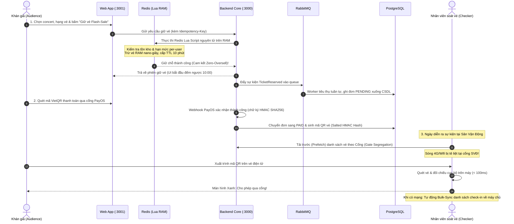
```mermaid
sequenceDiagram
    autonumber
    actor User as Khán giả (Audience)
    participant Web as Web App (:3001)
    participant Redis as Redis (Lua RAM)
    participant API as Backend Core (:3000)
    participant MQ as RabbitMQ
    participant DB as PostgreSQL
    actor Checker as Nhân viên soát vé (Checker)

    User->>Web: 1. Chọn concert, hạng vé & bấm "Giữ vé Flash-Sale"
    Web->>API: Gửi yêu cầu giữ vé (kèm Idempotency-Key)
    API->>Redis: Thực thi Redis Lua Script nguyên tử trên RAM
    Note over Redis: Kiểm tra tồn kho & hạn mức per-user<br/>Trừ vé RAM nano-giây, cấp TTL 10 phút
    Redis-->>API: Giữ chỗ thành công (Cam kết Zero-Oversell)!
    API-->>Web: Trả về phiên giữ vé (UI bắt đầu đếm ngược 10:00)

    API->>MQ: Đẩy sự kiện TicketReserved vào queue
    MQ->>DB: Worker tiêu thụ tuần tự, ghi đơn PENDING xuống CSDL

    User->>Web: 2. Quét mã VietQR thanh toán qua cổng PayOS
    API->>API: Webhook PayOS xác nhận thành công (chữ ký HMAC SHA256)
    API->>DB: Chuyển đơn sang PAID & sinh mã QR vé (Salted HMAC Hash)

    Note over Checker: 3. Ngày diễn ra sự kiện tại Sân Vận Động
    Checker->>API: Tải trước (Prefetch) danh sách vé theo Cổng (Gate Segregation)
    Note over Checker: Sóng 4G/Wifi bị tê liệt tại cổng SVĐ!
    User->>Checker: Xuất trình mã QR trên vé điện tử
    Checker->>Checker: Quét vé & đối chiếu cục bộ trên máy (< 100ms)
    Checker-->>User: Màn hình Xanh: Cho phép qua cổng!
    Note over Checker: Khi có mạng: Tự động Bulk-Sync danh sách check-in về máy chủ
```

---

## Vòng Đời Sự Kiện & Máy Trạng Thái (Event Lifecycle & State Machine)

Trong Tixora, mỗi sự kiện concert vận hành qua một **Máy Trạng Thái (Finite State Machine)** nghiêm ngặt với 8 trạng thái và phân quyền rõ rệt giữa **Quản Trị Sàn (Admin)** và **Ban Tổ Chức (Organizer)**:

### 1. Sơ Đồ Tiến Trình Vòng Đời Sự Kiện (State Machine Flowchart)

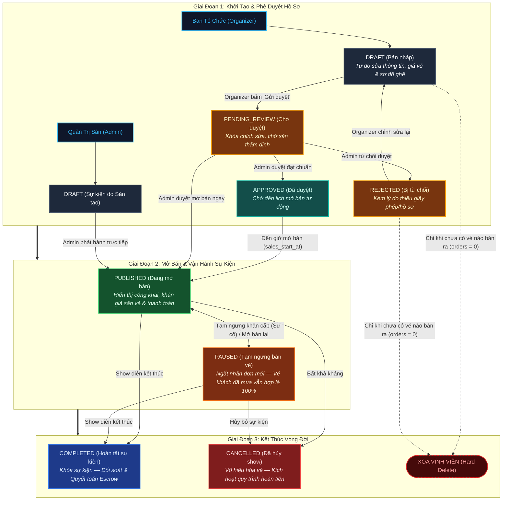
```mermaid
flowchart TD
    %% Giai đoạn 1: Khởi tạo & Kiểm duyệt
    subgraph PHASE1 ["Giai Đoạn 1: Khởi Tạo & Phê Duyệt Hồ Sơ"]
        direction TB
        ORG_ROLE["Ban Tổ Chức (Organizer)"] --> ORG_DRAFT["DRAFT (Bản nháp)<br/><i>Tự do sửa thông tin, giá vé & sơ đồ ghế</i>"]
        ORG_DRAFT -->|"Organizer bấm 'Gửi duyệt'"| PENDING["PENDING_REVIEW (Chờ duyệt)<br/><i>Khóa chỉnh sửa, chờ sàn thẩm định</i>"]
        
        PENDING -->|"Admin duyệt đạt chuẩn"| APPROVED["APPROVED (Đã duyệt)<br/><i>Chờ đến lịch mở bán tự động</i>"]
        PENDING -->|"Admin từ chối duyệt"| REJECTED["REJECTED (Bị từ chối)<br/><i>Kèm lý do thiếu giấy phép/hồ sơ</i>"]
        REJECTED -->|"Organizer chỉnh sửa lại"| ORG_DRAFT

        ADMIN_ROLE["Quản Trị Sàn (Admin)"] --> ADMIN_DRAFT["DRAFT (Sự kiện do Sàn tạo)"]
    end

    %% Giai đoạn 2: Mở bán & Vận hành
    subgraph PHASE2 ["Giai Đoạn 2: Mở Bán & Vận Hành Sự Kiện"]
        direction TB
        APPROVED -->|"Đến giờ mở bán (sales_start_at)"| PUBLISHED["PUBLISHED (Đang mở bán)<br/><i>Hiển thị công khai, khán giả săn vé & thanh toán</i>"]
        PENDING -->|"Admin duyệt mở bán ngay"| PUBLISHED
        ADMIN_DRAFT -->|"Admin phát hành trực tiếp"| PUBLISHED

        PUBLISHED <-->|"Tạm ngưng khẩn cấp (Sự cố) / Mở bán lại"| PAUSED["PAUSED (Tạm ngưng bán vé)<br/><i>Ngắt nhận đơn mới — Vé khách đã mua vẫn hợp lệ 100%</i>"]
    end

    %% Giai đoạn 3: Kết thúc vòng đời
    subgraph PHASE3 ["Giai Đoạn 3: Kết Thúc Vòng Đời"]
        direction TB
        PUBLISHED -->|"Show diễn kết thúc"| COMPLETED["COMPLETED (Hoàn tất sự kiện)<br/><i>Khóa sự kiện — Đối soát & Quyết toán Escrow</i>"]
        PAUSED -->|"Show diễn kết thúc"| COMPLETED

        PUBLISHED -->|"Bất khả kháng"| CANCELLED["CANCELLED (Đã hủy show)<br/><i>Vô hiệu hóa vé — Kích hoạt quy trình hoàn tiền</i>"]
        PAUSED -->|"Hủy bỏ sự kiện"| CANCELLED

        ORG_DRAFT -.->|"Chỉ khi chưa có vé nào bán ra (orders = 0)"| DELETED(["XÓA VĨNH VIỄN (Hard Delete)"])
        REJECTED -.->|"Chỉ khi chưa có vé nào bán ra (orders = 0)"| DELETED
    end

    PHASE1 ==> PHASE2
    PHASE2 ==> PHASE3

    %% Styling
    classDef draft fill:#1e293b,stroke:#475569,stroke-width:2px,color:#f8fafc;
    classDef pending fill:#78350f,stroke:#f59e0b,stroke-width:2px,color:#fef3c7;
    classDef approved fill:#134e4a,stroke:#14b8a6,stroke-width:2px,color:#ccfbf1;
    classDef published fill:#14532d,stroke:#22c55e,stroke-width:2px,color:#dcfce7;
    classDef paused fill:#7c2d12,stroke:#f97316,stroke-width:2px,color:#ffedd5;
    classDef completed fill:#1e3a8a,stroke:#3b82f6,stroke-width:2px,color:#dbeafe;
    classDef cancelled fill:#7f1d1d,stroke:#ef4444,stroke-width:2px,color:#fee2e2;
    classDef deleted fill:#450a0a,stroke:#dc2626,stroke-width:2px,stroke-dasharray: 4 4,color:#fca5a5;
    classDef role fill:#0f172a,stroke:#38bdf8,stroke-width:2px,color:#38bdf8;

    class ORG_DRAFT,ADMIN_DRAFT draft;
    class PENDING,REJECTED pending;
    class APPROVED approved;
    class PUBLISHED published;
    class PAUSED paused;
    class COMPLETED completed;
    class CANCELLED cancelled;
    class DELETED deleted;
    class ORG_ROLE,ADMIN_ROLE role;
```

> **Tóm tắt 2 nhánh vận hành chính:**
> - **Nhánh Ban Tổ Chức (Organizer Flow)**: `DRAFT` ➔ Gửi duyệt `PENDING_REVIEW` ➔ Admin duyệt `APPROVED` (hoặc từ chối `REJECTED` để sửa lại) ➔ Đến giờ mở bán chuyển `PUBLISHED`.
> - **Nhánh Quản Trị Sàn (Admin Direct Flow)**: `DRAFT` ➔ Phát hành mở bán trực tiếp `PUBLISHED` (Bỏ qua bước chờ duyệt).
> - **Quy tắc bảo vệ dữ liệu sống còn**:
>   - `PAUSED` *(Tạm ngưng)*: Vé khách đã mua vẫn giữ nguyên giá trị 100%, chỉ tạm khóa luồng mua mới để xử lý kỹ thuật.
>   - `CANCELLED` *(Hủy show)*: Hủy bỏ toàn bộ sự kiện do bất khả kháng, kích hoạt quy trình hoàn tiền (Refund).
>   - `DELETE` *(Xóa cứng)*: Chỉ khả dụng khi sự kiện chưa phát sinh bất kỳ đơn hàng nào (`orders_count === 0`).

### 2. Bảng Ma Trận Phân Quyền & Vai Trò (Admin vs Organizer)

| Trạng Thái / Thao Tác | Ban Tổ Chức (Organizer) | Quản Trị Sàn (Admin) | Mô Tả Ý Nghĩa & Ràng Buộc Dữ Liệu |
| :--- | :---: | :---: | :--- |
| **Khởi tạo bản nháp (`DRAFT`)** | Cho phép | Cho phép | Soạn thảo thông tin show, poster, sơ đồ ghế, cấu hình các hạng vé. |
| **Gửi duyệt (`PENDING_REVIEW`)** | Cho phép | Không cần | Gửi hồ sơ pháp lý & thông tin show lên sàn để kiểm duyệt. |
| **Phê duyệt (`APPROVED` / `PUBLISHED`)** | Bị chặn | Cho phép | Chỉ Admin mới có quyền phát hành sự kiện công khai ra thị trường. |
| **Từ chối duyệt (`REJECTED`)** | Bị chặn | Cho phép | Admin phản hồi lý do từ chối; Organizer nhận thông báo để sửa đổi. |
| **Đang mở bán (`PUBLISHED`)** | — | — | Sự kiện hiển thị trên Web, khán giả bắt đầu săn vé & giữ chỗ 10 phút. |
| **Tạm ngưng mở bán (`PAUSED`)** | Show của mình | Mọi show | Tạm dừng bán vé khẩn cấp để rà soát kỹ thuật. **Vé khách đã mua vẫn hợp lệ 100%**. |
| **Mở lại bán vé (`PUBLISHED`)** | Chờ Admin | Cho phép | Admin kiểm tra an toàn xong mới được bấm kích hoạt mở bán lại. |
| **Hoàn tất sự kiện (`COMPLETED`)** | Không | Cho phép (hoặc Cron) | Show diễn ra thành công; kích hoạt đối soát dòng tiền và giải ngân Escrow. |
| **Hủy sự kiện (`CANCELLED`)** | Gửi yêu cầu | Cho phép | Show bị hủy do bất khả kháng; tự động vô hiệu hóa vé và kích hoạt quy trình Hoàn tiền. |
| **Xóa vĩnh viễn (`DELETE`)** | Chỉ khi 0 vé | Chỉ khi 0 vé | **Quy tắc bất di bất dịch**: Chỉ được xóa khi chưa có vé nào bán ra (`orders_count === 0`). |

---

## 5 Giải Pháp Kỹ Thuật Đột Phá (Core Engineering Solutions)

### 1. Động Cơ Chống Bán Lố Bằng Redis Lua (Atomic Zero-Oversell Engine)
- **Vấn đề thực tế**: Trong các đợt mở bán concert lớn (*Anh Trai Say Hi*, *BlackPink*), hơn 50.000 khán giả bấm nút "Mua vé" trong cùng 1 giây. Nếu dùng Database Transaction (`SELECT ... FOR UPDATE`), việc khóa hàng dữ liệu sẽ làm cạn kiệt Connection Pool của PostgreSQL, đẩy CPU lên 100% và gây sập hệ thống. Nếu không khóa, Race Condition sẽ bán vượt số lượng vé thực tế (Overselling).
- **Giải pháp của Tixora**: Chuyển toàn bộ quyết định giữ chỗ lên RAM bằng **Redis Lua Script**. Vì Redis thực thi đơn luồng, script đóng gói 3 bước *(Check tồn kho ➔ Check hạn mức per-user ➔ Trừ tồn kho & cấp TTL 10 phút)* thành **1 thao tác nguyên tử (Atomic)** duy nhất. Kết quả: Tốc độ xử lý chỉ tính bằng micro-giây, không lock database và **cam kết 100% Zero-Oversell**.

### 2. Soát Vé Ngoại Tuyến Tại Cổng (Offline-First Gate Check-in)
- **Vấn đề thực tế**: Sân vận động 40.000 người luôn bị nghẽn trạm phát sóng di động (cell tower congestion). Nếu máy quét QR bắt buộc phải gọi API kiểm tra từng vé qua Internet thì cổng vào sẽ kẹt cứng kéo dài hàng cây số.
- **Giải pháp của Tixora**:
  - **Phân luồng cổng (Gate Segregation)**: Mỗi cổng chỉ tải trước danh sách mã băm (`qr_code_hash`) của các vé được phân bổ cho cổng đó.
  - **Đối chiếu tại chỗ < 100ms**: Quét và đánh dấu vé đã dùng ngay trên SQLite/Local Storage của điện thoại mà không cần Internet. Ngăn chặn triệt để vé giả và ảnh chụp màn hình quét lại.
  - **Tự động Bulk-Sync**: Khi kết nối mạng phục hồi, ứng dụng tự động đẩy danh sách check-in lên máy chủ trung tâm với cơ chế chống ghi đè theo mốc thời gian nguyên tử.

### 3. San Phẳng Đỉnh Tải Bằng Hàng Đợi (Event-Driven with RabbitMQ)
- **Vấn đề thực tế**: Nếu 10.000 giao dịch giữ vé thành công cùng lúc ghi trực tiếp thông tin đơn hàng xuống ổ cứng CSDL PostgreSQL, đĩa I/O sẽ bị quá tải tức thì.
- **Giải pháp của Tixora**: Áp dụng mô hình **Traffic Leveling (Peak Shaving)**. Khi Redis Lua trừ vé thành công, backend chỉ đẩy event `TicketReserved` vào **RabbitMQ** và phản hồi ngay cho người dùng với độ trễ < 50ms. Các Worker phía sau sẽ tiêu thụ hàng đợi tuần tự với tốc độ mà PostgreSQL chịu tải ổn định nhất.

### 4. Giao Dịch An Toàn Với PayOS VietQR & Idempotency Key (Redis SETNX)
- **Vấn đề thực tế**: Khán giả sốt ruột bấm đúp nút thanh toán khi mạng chập chờn, hoặc cổng thanh toán gửi trùng lặp Webhook dẫn đến nguy cơ trừ tiền hai lần.
- **Giải pháp của Tixora**:
  - **Idempotency Key**: Mỗi yêu cầu thanh toán được bảo vệ bởi khóa lũy đẳng bằng **Redis `SETNX`** với thời gian sống TTL 24 giờ. Request trùng lặp đến sau sẽ bị từ chối an toàn.
  - **Bảo mật Webhook**: Kiểm tra chữ ký điện tử HMAC-SHA256 nghiêm ngặt, bọc cập nhật trạng thái đơn hàng trong Database Transaction đảm bảo chỉ cập nhật khi đơn ở trạng thái `PENDING`.

### 5. Phòng Thủ Đa Tầng: Token Bucket Rate Limiting & k6 Stress Test
- **Bảo vệ hệ thống**: Triển khai thuật toán **Token Bucket** tại tầng Gateway/Guard, tự động chặn đứng bot cào vé và các hành vi spam F5 bằng mã lỗi `HTTP 429 Too Many Requests`.
- **Bằng chứng kỹ thuật (Proof of Scale)**: Tixora được kiểm chứng qua bộ kịch bản **k6 Stress Test** mô phỏng **1.000 người dùng ảo đồng thời tranh chấp 50 vé**. Kết quả kiểm thử đạt chuẩn tuyệt đối: Bán chính xác 50 vé, 950 yêu cầu bị từ chối an toàn, 0 lỗi bán lố vé (**100% Zero-Oversell**).

---

## Giao Diện & Trải Nghiệm Thực Tế (Visual Showcase)

Toàn bộ hình ảnh thực tế được chụp trực tiếp từ hệ thống Tixora và lưu trữ trong thư mục [`docs/assets/screenshots/`](file:///d:/document/projects/persional-projects/Tixora/docs/assets/screenshots):

### 1. Phân Hệ Khách Hàng & Đặt Vé (Audience Portal — Next.js 16)

| Khám Phá Concert Nổi Bật (Trang Chủ) | Danh Sách & Bộ Lọc Thể Loại Sự Kiện |
| :---: | :---: |
| 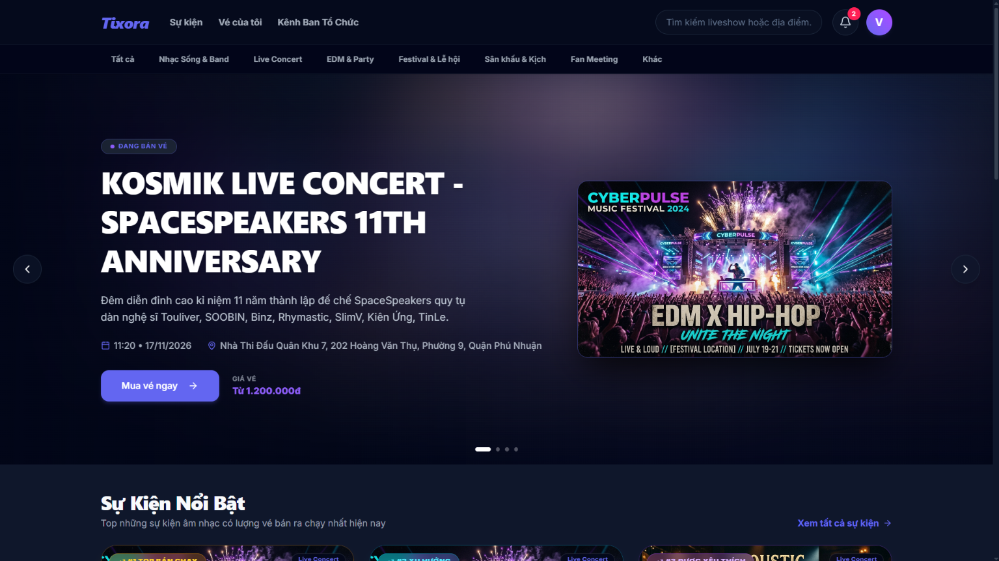 | 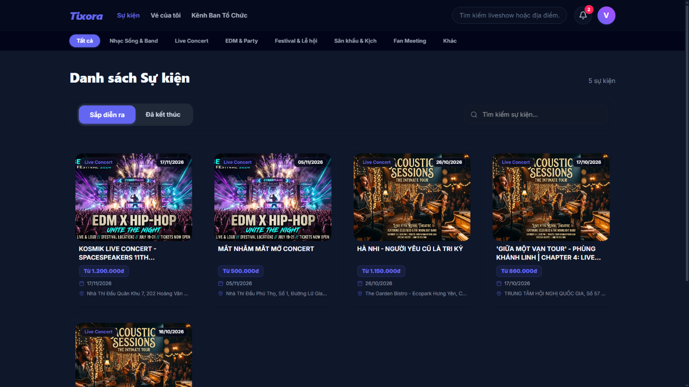 |
| *Trang chủ phong cách Dark Mode, banner KOSMIK Live Concert và sự kiện nổi bật* | *Khám phá danh sách concert, lọc theo nhạc sống, EDM, Festival và tìm kiếm liveshow* |

| Chi Tiết Sự Kiện & Nghệ Sĩ Biểu Diễn | Sơ Đồ Khu Vực Khán Đài & Chọn Hạng Vé |
| :---: | :---: |
| 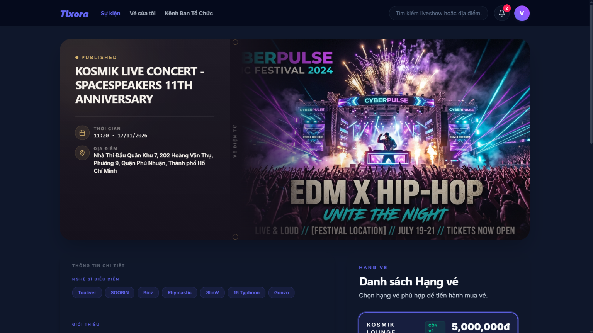 | 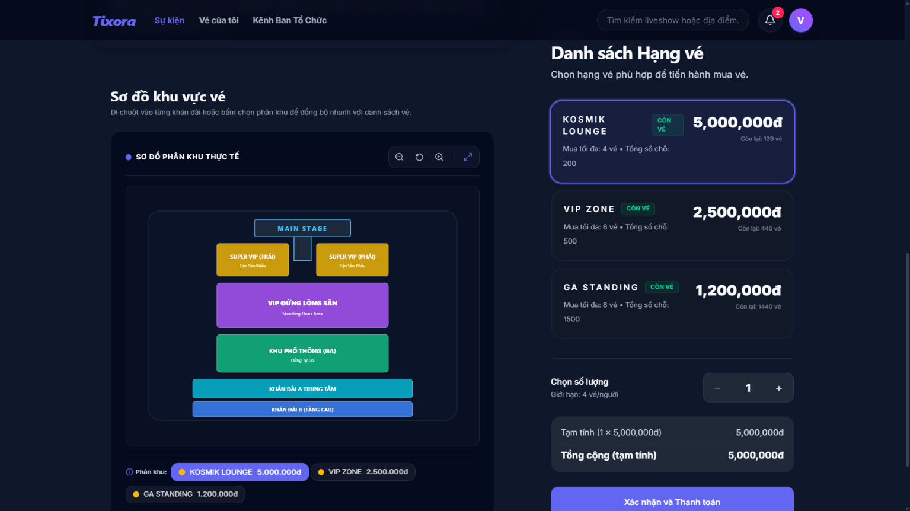 |
| *Thông tin địa điểm, thời gian, dàn nghệ sĩ Spacespeakers và bảng giá hạng vé* | *Sơ đồ phân khu thực tế SVG tương tác, chọn số lượng vé và cập nhật tạm tính* |

| Giữ Vé Flash-Sale (Đếm Ngược 10 Phút) | Thanh Toán Tức Thì Qua VietQR PayOS |
| :---: | :---: |
| 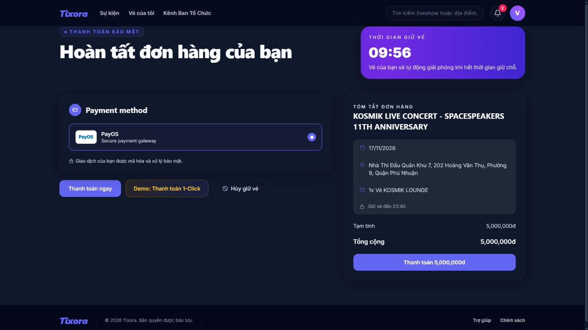 | 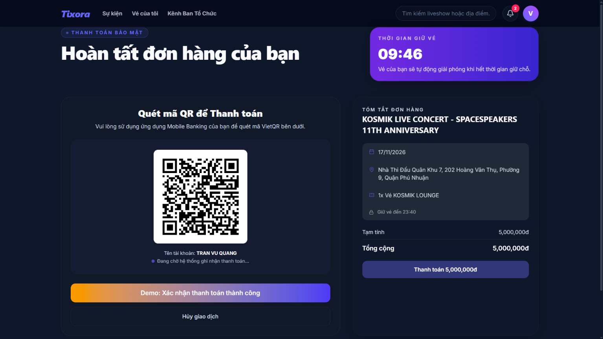 |
| *Đồng hồ đếm ngược 10 phút giữ vé trên RAM Redis, bảo vệ Zero-Oversell* | *Mã VietQR động chứa chính xác số tiền & order code, tự động xác nhận qua webhook* |

| Ví Vé Điện Tử Của Tôi (My Tickets) | Chi Tiết Vé Vào Cổng QR (Salted Hash) |
| :---: | :---: |
| 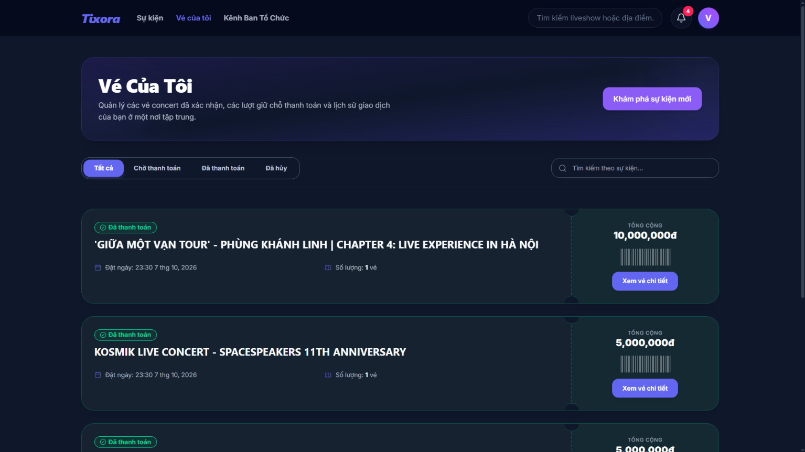 | 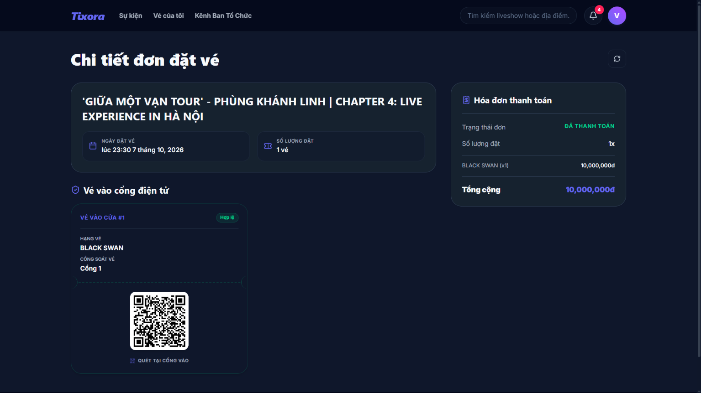 |
| *Quản lý tập trung toàn bộ vé concert đã mua, trạng thái thanh toán và số lượng* | *Vé điện tử hiển thị cửa vào, hạng vé kèm mã QR băm muối HMAC-SHA256 bảo mật* |

| Giao Diện Đăng Nhập (Auth Dark Theme) | Hồ Sơ Tài Khoản & Quyền Hạn Hệ Thống |
| :---: | :---: |
| 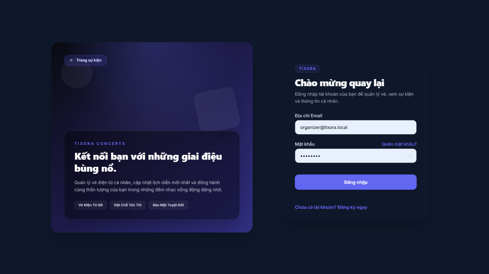 | 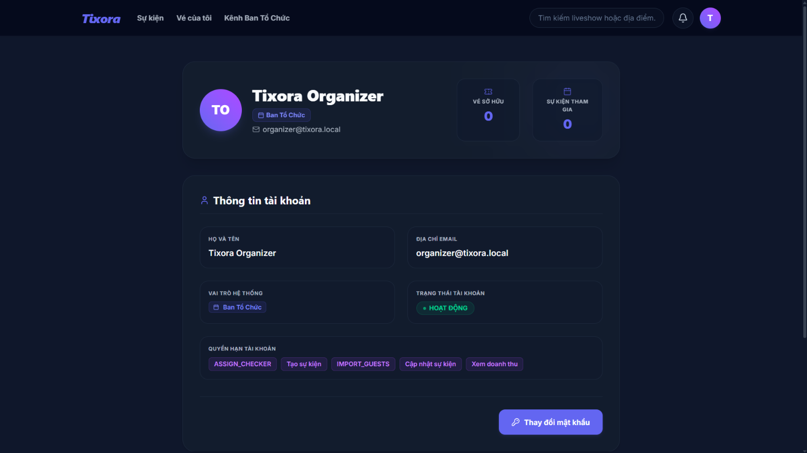 |
| *Trang xác thực tài khoản bảo mật với giao diện tối hiện đại, hỗ trợ nhiều vai trò* | *Quản lý thông tin cá nhân, số vé sở hữu, sự kiện tham gia và quyền hạn tài khoản* |

---

### 2. Phân Hệ Ban Tổ Chức Sự Kiện (Organizer Portal — Next.js 16)

| Không Gian Làm Việc Ban Tổ Chức (Dashboard) | Danh Sách Sự Kiện Đang Quản Lý |
| :---: | :---: |
| 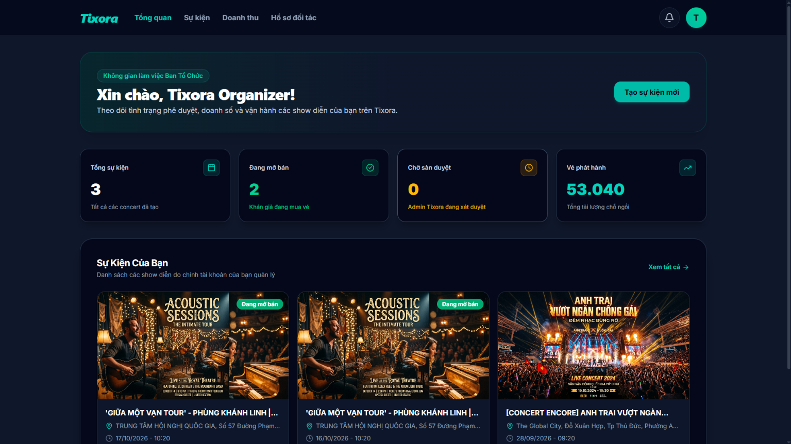 | 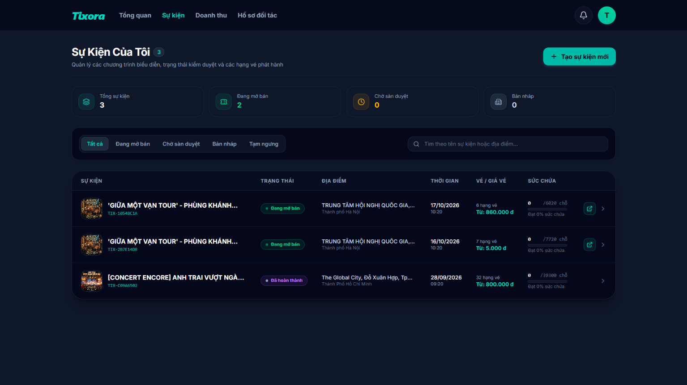 |
| *Tổng quan sự kiện, trạng thái mở bán, chờ duyệt và tổng 53.040 vé phát hành* | *Quản lý chi tiết các show diễn, địa điểm, thời gian, số hạng vé và tỷ lệ lấp đầy* |

| Tạo Sự Kiện Mới & Cấu Hình Lineup | Chi Tiết & Chỉnh Sửa Sự Kiện Đã Tạo |
| :---: | :---: |
| 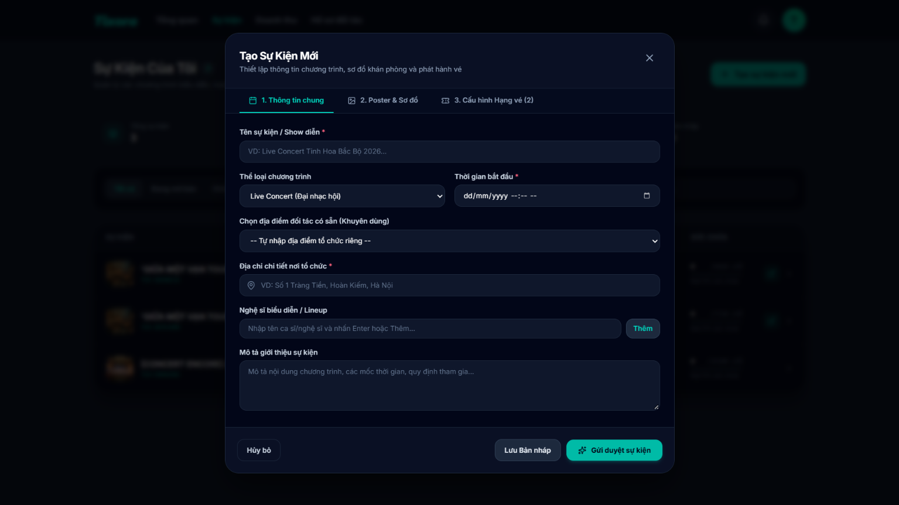 | 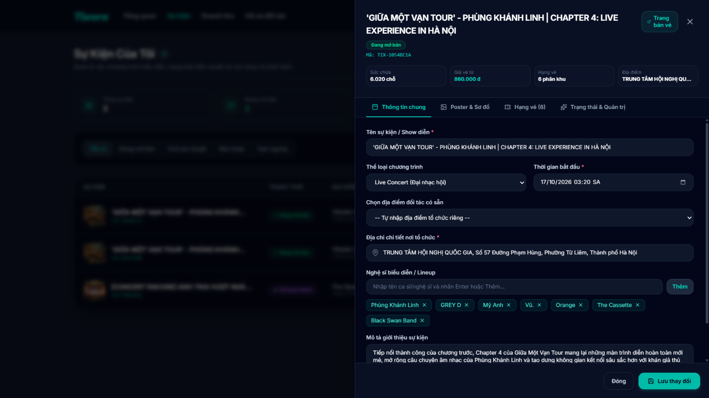 |
| *Thiết lập thông tin show diễn, địa chỉ, dàn nghệ sĩ biểu diễn và mô tả chương trình* | *Chỉnh sửa thông tin, cập nhật poster, sơ đồ ghế và cấu hình các hạng vé mở bán* |

| Báo Cáo Doanh Thu & Dòng Tiền Tạm Giữ | Biểu Đồ Tăng Trưởng Doanh Thu Đa Chiều |
| :---: | :---: |
| 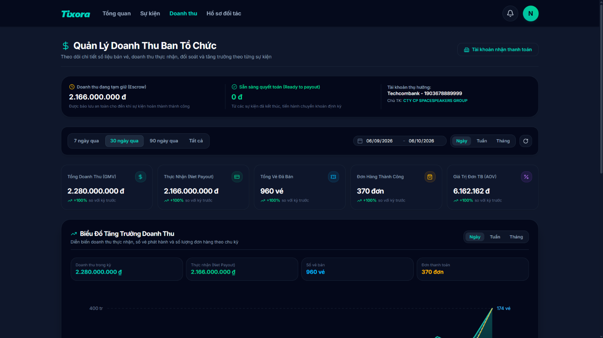 | 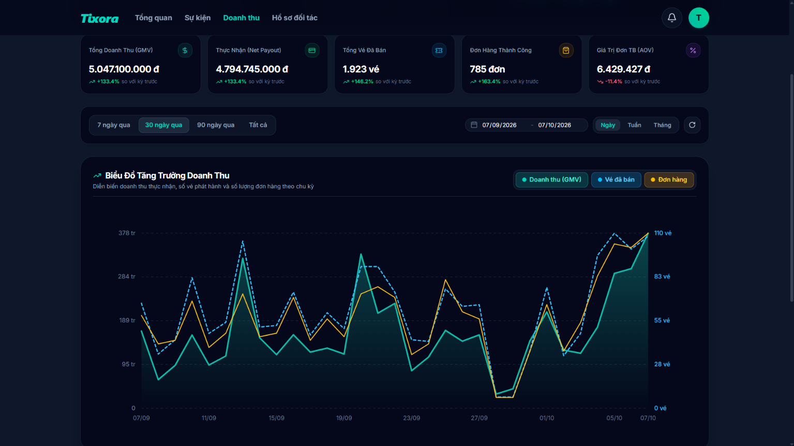 |
| *Quản lý tổng GMV 2,28 tỷ VNĐ, thực nhận 2,16 tỷ VNĐ và tiền tạm giữ Escrow* | *Biểu đồ trực quan hóa doanh thu GMV, số vé bán ra và số lượng đơn hàng theo chu kỳ* |

| Hồ Sơ Doanh Nghiệp & Tài Khoản Thụ Hưởng | Đăng Ký Hợp Tác Phân Phối Vé Với Tixora |
| :---: | :---: |
| 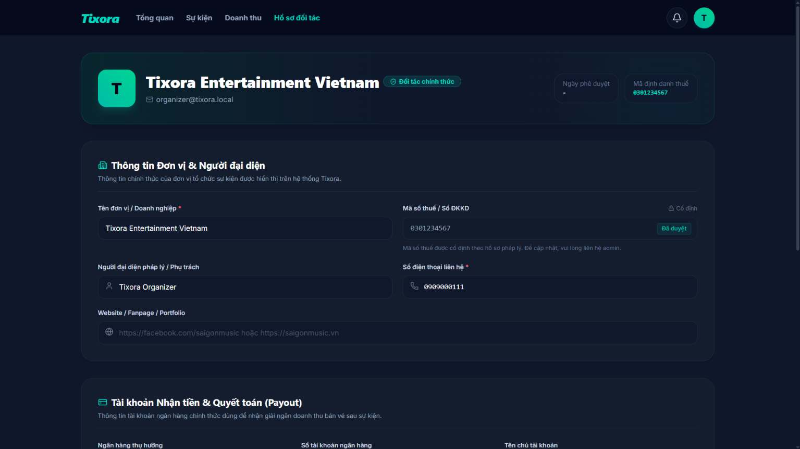 | 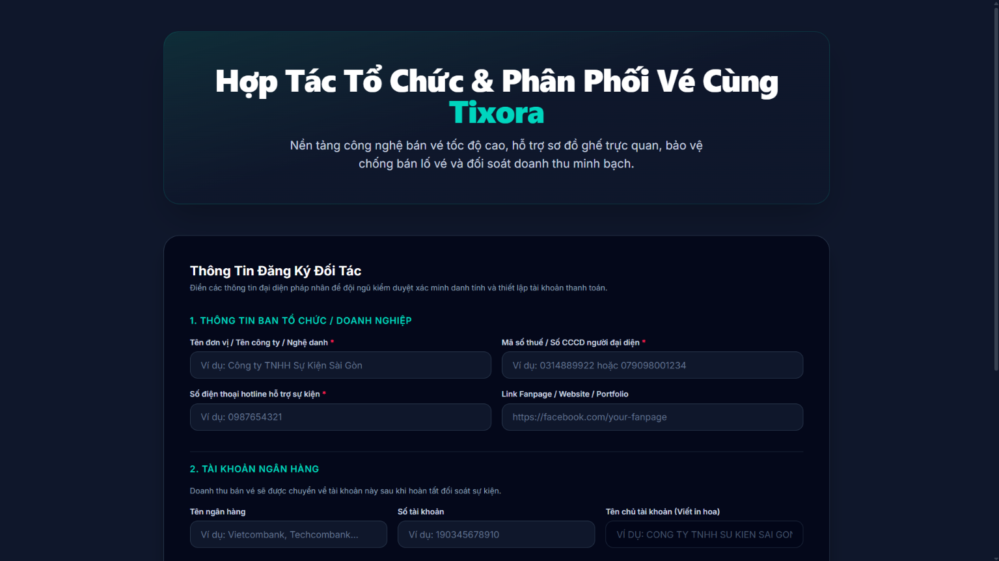 |
| *Thông tin pháp nhân đối tác, mã số thuế đã duyệt và tài khoản ngân hàng nhận tiền* | *Trang tiếp nhận đăng ký đối tác mới, kết nối cổng thanh toán và bảo chứng vé* |

---

### 3. Phân Hệ Quản Trị Hệ Thống Toàn Sàn (SuperAdmin & Admin Portal — Next.js 16)

| Bảng Điều Hành Trung Tâm Hôm Nay | Quản Lý Toàn Bộ Sự Kiện Toàn Sàn |
| :---: | :---: |
| 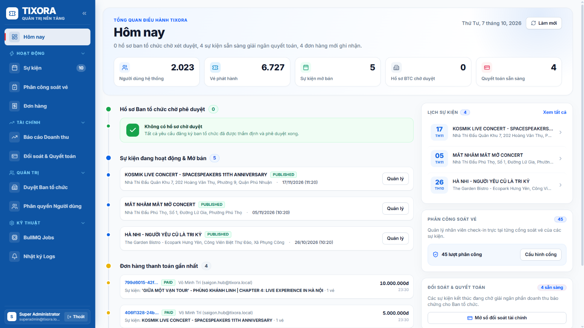 | 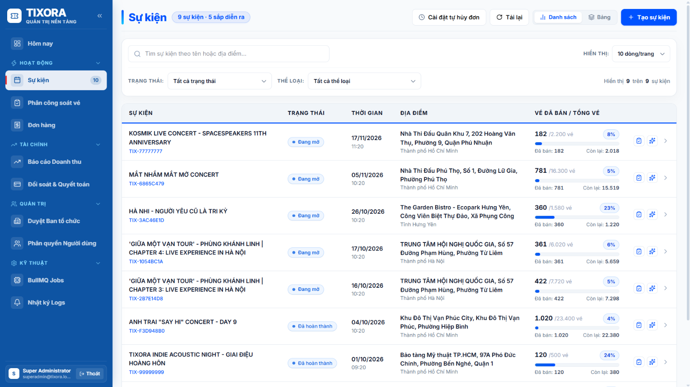 |
| *Tổng quan số người dùng (2.023), 6.727 vé phát hành, sự kiện mở bán và đơn hàng mới* | *Theo dõi 9 sự kiện đang diễn ra, thanh tiến độ bán vé và trạng thái từng show diễn* |

| Quản Trị Viên Tạo & Duyệt Sự Kiện Mới | Quản Lý Chi Tiết Sự Kiện & Sơ Đồ SVĐ |
| :---: | :---: |
| 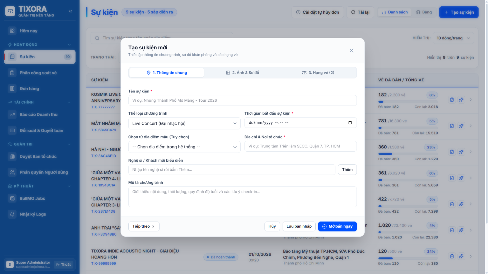 | 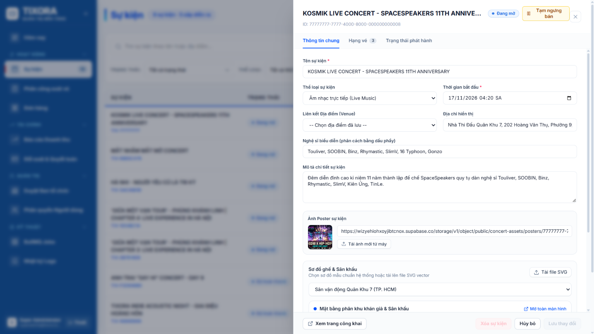 |
| *Modal tạo và mở bán sự kiện trực tiếp với các mẫu địa điểm tích hợp sẵn* | *Cấu hình thông tin, liên kết địa điểm, sơ đồ ghế SVG và nút tạm ngưng mở bán* |

| Phân Công Cổng Soát Vé Cho Nhân Viên (Gate) | Quản Lý 2.354 Đơn Hàng Toàn Hệ Thống |
| :---: | :---: |
| 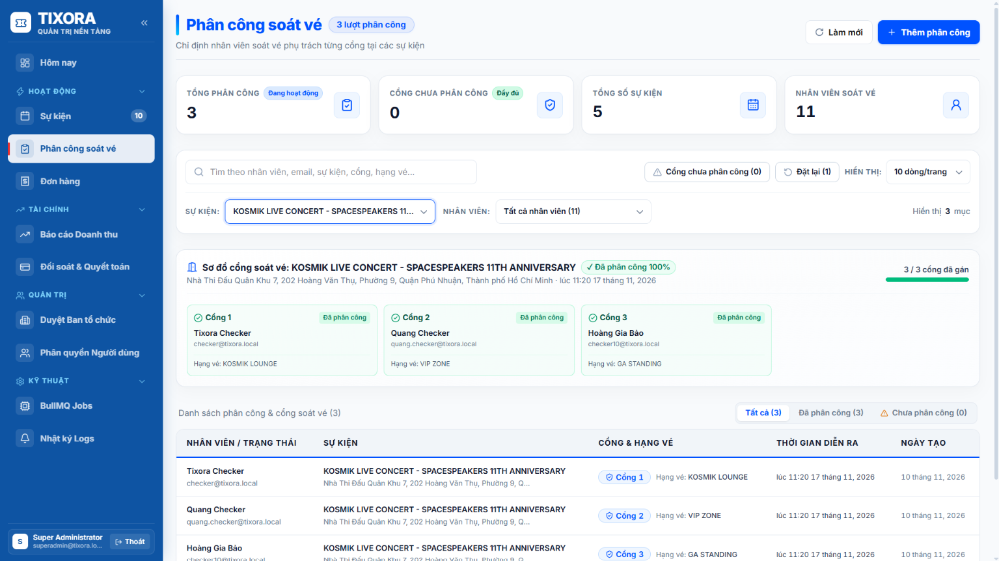 | 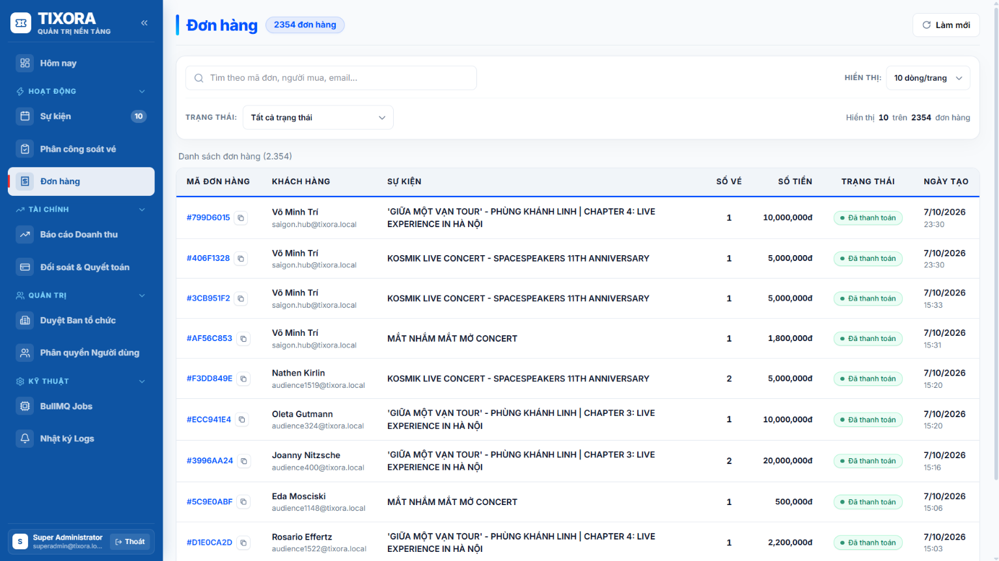 |
| *Sơ đồ phân luồng Cổng 1 (VIP), Cổng 2, Cổng 3 gắn liền với tài khoản Checker* | *Danh sách đơn hàng toàn sàn, tìm kiếm mã đơn, khách hàng, số vé và trạng thái* |

| Chi Tiết Đơn Hàng & Lịch Sử Giao Dịch PayOS | Báo Cáo Doanh Thu & Thị Phần Sàn (5%) |
| :---: | :---: |
| 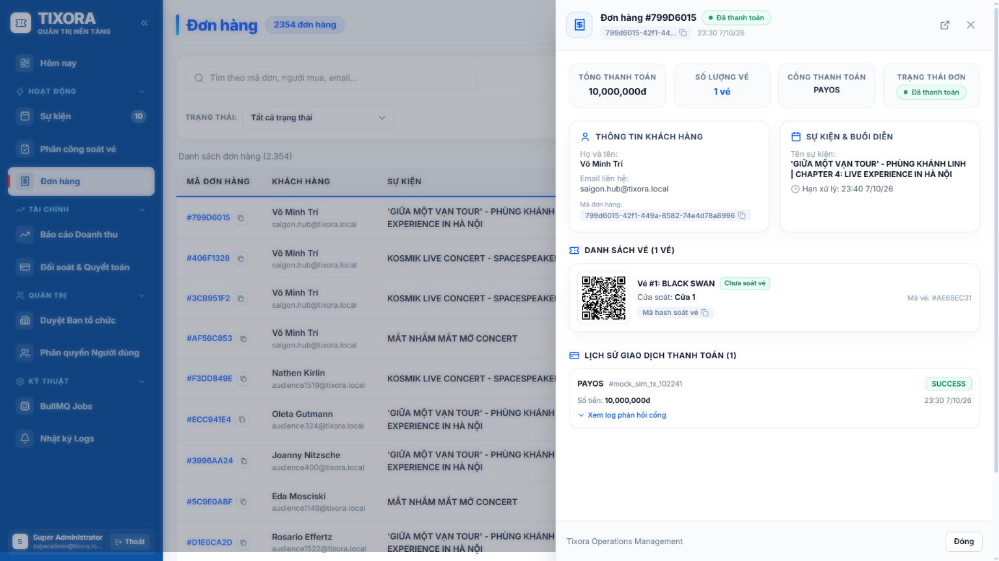 | 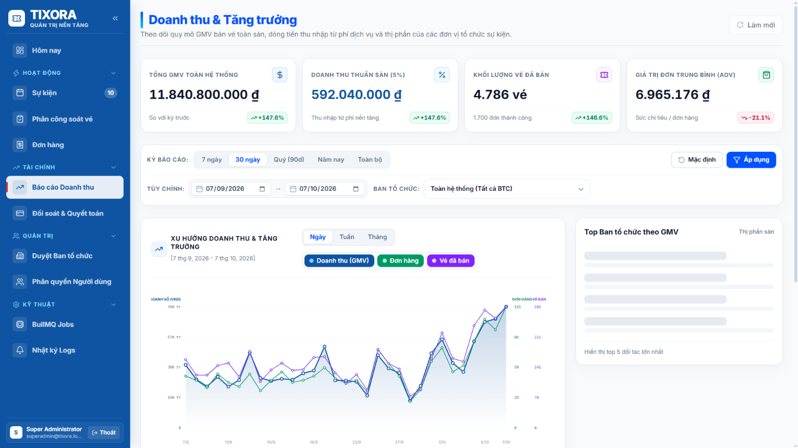 |
| *Truy vết giao dịch PayOS webhook thành công, danh sách vé và mã hash soát vé* | *Tổng GMV toàn hệ thống 11,84 tỷ VNĐ, doanh thu thuần sàn 592 triệu VNĐ (+147%)* |

| Đối Soát & Quyết Toán Ký Quỹ Escrow Cho BTC | Quản Trị 2.023 Người Dùng & Phân Quyền RBAC |
| :---: | :---: |
| 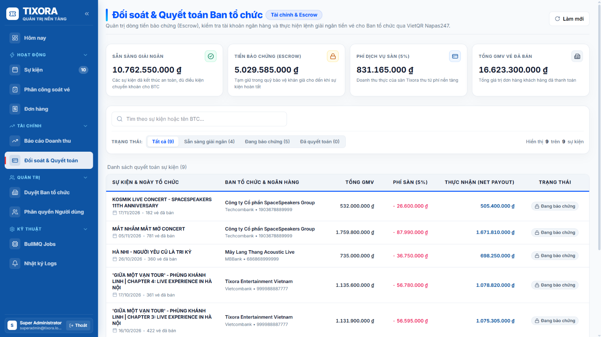 | 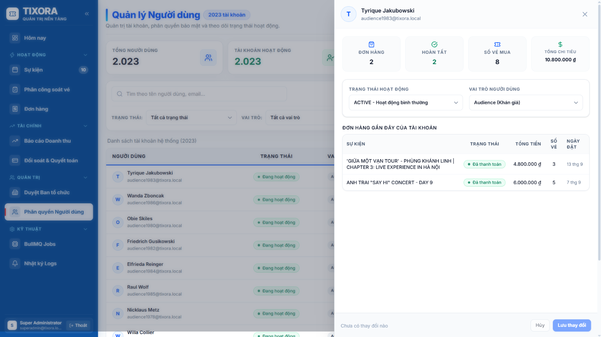 |
| *Quản trị dòng tiền bảo chứng 5 tỷ VNĐ, sẵn sàng giải ngân 10,7 tỷ VNĐ qua Napas247* | *Quản lý 2.023 tài khoản, phân quyền 5 vai trò và xem lịch sử đơn hàng của từng user* |

---

### 4. Phân Hệ Di Động Soát Vé Ngoại Tuyến (Mobile Scanner App — Expo React Native)

> [!NOTE]
> **Video Demo Soát Vé Ngoại Tuyến Tại Cổng Sân Vận Động (< 100ms)**:
>
> *(Khu vực tải lên Video Clip / Ảnh GIF demo trải nghiệm thực tế ứng dụng Mobile Scanner: Bật chế độ máy bay, quét mã QR vé và hiển thị kết quả xác thực tức thì dưới 100ms)*
>
> ```markdown
> [Chèn liên kết Video Demo / Ảnh GIF tại đây: https://youtu.be/your-mobile-demo]
> ```

---

## Kiểm Thử Tự Động & Thử Nghiệm Tải Cao (Quality Gates)

Dự án trang bị bộ công cụ kiểm thử tự động toàn diện từ chuẩn code đến hiệu năng chịu tải:

```powershell
# 1. Kiểm tra chuẩn code, lint và typecheck trước khi commit
pnpm verify:push

# 2. Chạy kiểm thử tự động End-to-End (Playwright) cho Web và Admin
pnpm test:e2e
pnpm test:e2e:ui

# 3. Chạy kiểm thử chịu tải k6: Mô phỏng 1.000 khách hàng tranh chấp 50 vé (Zero-Oversell)
pnpm test:load:oversell

# 4. Chạy kiểm thử chịu tải k6: Kiểm tra cơ chế Token Bucket Rate Limiting (HTTP 429)
pnpm test:load:flow
```

---

## Cấu Trúc Thư Mục Dự Án (Monorepo Directory Structure)

```text
Tixora/
├── apps/
│   ├── backend-api/      # NestJS Core API, Prisma ORM, Redis Lua Scripts, RabbitMQ Workers (:3000)
│   ├── web-app/          # Next.js 16 Client Portal: Khám phá concert, mua vé, thanh toán VietQR (:3001)
│   ├── admin-app/        # Next.js 16 Admin Dashboard: Doanh thu, duyệt vé, phân quyền 5 cấp RBAC (:3002)
│   ├── mobile-app/       # Expo React Native App: Quét vé QR ngoại tuyến tại cổng SVĐ (< 100ms) (:8081)
│   └── mcp-server/       # Model Context Protocol Server tích hợp AI trợ lý phân tích dữ liệu vé
├── infrastructure/       # Docker Compose cấu hình PostgreSQL, Redis và RabbitMQ
├── docs/                 # Trung tâm tài liệu kiến trúc, System Design C4, Module Specs & Interview Guide
│   ├── assets/           # Sơ đồ kiến trúc & Ảnh chụp màn hình hệ thống (docs/assets/screenshots/)
│   ├── interview/        # Cẩm nang phỏng vấn, kịch bản demo, CV text & bộ câu hỏi kỹ thuật chuyên sâu
│   ├── 01-architecture/  # System Design, Database Schema, High Load Defense, Escrow Settlement
│   ├── 02-modules/       # Đặc tả các module: Auth, Ticketing, Payment, Offline Check-in
│   └── 03-testing/       # Hướng dẫn Manual Test, Playwright E2E & k6 Load Testing
├── testing/              # Kịch bản kiểm thử tự động Playwright E2E & k6 Stress Scripts
└── package.json          # Root Monorepo configuration (pnpm workspaces)
```

---

## License & Contact

Bản quyền đồ án được thiết kế và phát triển bởi **Trần Vũ Quang**.
- **Điện thoại / Zalo**: `0357131476`
- **Email**: `tvquang.working@gmail.com`
- **GitHub**: [https://github.com/tvquang0511](https://github.com/tvquang0511)
- **Địa chỉ**: TP. Hồ Chí Minh
