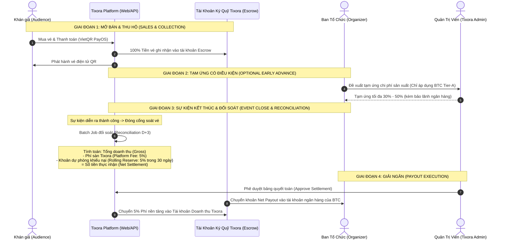

# Thiết Kế Dòng Tiền, Ký Quỹ (Escrow) & Cổng Thanh Toán Tixora

> **Tài liệu tham chiếu kiến trúc tài chính & phân phối dòng tiền (FinTech Ticketing Architecture)**  
> Dựa trên mô hình vận hành thực tế của các sàn bán vé hàng đầu (Ticketbox.vn, Ticketmaster, Eventbrite).

---

## 1. Bối Cảnh Nghiệp Vụ & Bài Toán Dòng Tiền Thực Tế

Tixora hoạt động theo mô hình **Two-Sided Marketplace (Nền tảng hai đầu)**:
- **Bên mua (Audience)**: Mua vé tham dự các sự kiện, concert.
- **Bên bán (Organizer)**: Ban tổ chức sự kiện, nghệ sĩ, đơn vị sản xuất show.
- **Nền tảng (Tixora)**: Cung cấp hạ tầng phân phối vé, giữ chỗ thời gian thực, cổng thanh toán và công cụ soát vé tại cổng.

### 1.1. Các Rủi Ro Tài Chính Lớn Nhất Trong Ngành Bán Vé
1. **Rủi ro hủy sự kiện (Event Cancellation)**: Nếu sự kiện bị hủy vì lý do thời tiết, ca sĩ ốm hoặc giấy phép, 100% khán giả có quyền đòi hoàn tiền. Nếu sàn đã giải ngân hết tiền vé cho Ban tổ chức từ trước, sàn sẽ đối mặt với nguy cơ mất trắng hàng chục tỷ đồng.
2. **Rủi ro Ban tổ chức gian lận (Organizer Default/Fraud)**: Ban tổ chức tạo sự kiện ảo hoặc thu tiền vé xong rồi tuyên bố phá sản, ôm tiền bỏ trốn.
3. **Tranh chấp thanh toán & Phí cổng (Chargebacks & Processing Fees)**: Các khoản thanh toán bằng thẻ tín dụng (Visa/Mastercard) có thể bị chủ thẻ yêu cầu bồi hoàn (Chargeback) trong vòng 30 - 90 ngày.

### 1.2. Nguyên Tắc Cốt Lõi: Mô Hình Ký Quỹ Tạm Giữ (Escrow / Master Merchant Account)
- **Tuyệt đối không để tiền vé từ khán giả chảy thẳng về tài khoản cá nhân của Ban tổ chức**.
- **100% dòng tiền thanh toán từ Audience đổ về Tài khoản Tổng của Tixora (Escrow Account)** được mở tại ngân hàng hoặc đối tác trung gian thanh toán (PayOS / VietQR / VietinBank / Napas).
- Tiền vé chỉ được giải ngân cho Ban tổ chức sau khi sự kiện kết thúc thành công và vượt qua thời gian đối soát khiếu nại (Post-Event Settlement Window).

---

## 2. Vòng Đời Dòng Tiền (Cashflow & Settlement Lifecycle)



---

## 3. Kiến Trúc Thanh Toán Đề Xuất Cho Tixora

Hệ thống được thiết kế theo mô hình **Pluggable Payment Gateway Strategy**, kết hợp giữa Cổng chính thức (PayOS) và Cổng mô phỏng (Mock Simulator Sandbox) để phục vụ kiểm thử, demo và tuyển dụng.

### 3.1. Các Chế Độ Thanh Toán (Payment Modes)

```
                     ┌───────────────────────────────────┐
                     │   PaymentGatewayClient (Facade)   │
                     └─────────────────┬─────────────────┘
                                       │
                ┌──────────────────────┴──────────────────────┐
                ▼                                             ▼
  ┌───────────────────────────┐                 ┌───────────────────────────┐
  │      PayOsStrategy        │                 │    MockSimulatorStrategy  │
  │  (Khi có PayOS Live/Test  │                 │ (Khi ENABLE_MOCK_PAYMENT  │
  │    Credentials hợp lệ)    │                 │  = true hoặc thiếu keys)  │
  └───────────────────────────┘                 └───────────────────────────┘
```

#### Chế độ 1: PayOS Sandbox / Production
- Sử dụng SDK `@payos/node`.
- Kiểm tra tính hợp lệ của bộ 3 khóa: `PAYOS_CLIENT_ID`, `PAYOS_API_KEY`, `PAYOS_CHECKSUM_KEY`.
- Tạo link thanh toán VietQR thật, có thể quét qua ứng dụng ngân hàng hoặc ấn giả lập trên PayOS Dashboard.
- Xác thực chữ ký webhook bằng HMAC SHA256.

#### Chế độ 2: Mock Payment Simulator (Dành Cho Demo Tuyển Dụng & Kiểm Thử)
- **Mục tiêu**: Người dùng/Reviewer truy cập `https://tixora.tvquang.id.vn` có thể hoàn tất trọn vẹn luồng thanh toán mà **không cần nạp tiền thật** và **không bị lỗi thiếu API key**.
- **Cơ chế**:
  1. Khi người dùng bấm *"Thanh toán"* ở trang Checkout, hệ thống sinh ra một trang thanh toán nội bộ mô phỏng: `/checkout/mock-pay?orderCode=...`.
  2. Giao diện hiển thị mã QR VietQR mẫu, số tiền cần trả, đồng hồ đếm ngược giữ chỗ.
  3. Có 2 nút bấm thao tác nhanh:
     - **`[⚡ Giả Lập Thanh Toán Thành Công]`**: Gọi API backend `POST /payments/mock-webhook` kích hoạt đổi trạng thái order sang `PAID`, sinh vé QR và chuyển hướng đến trang `/checkout/success`.
     - **`[❌ Giả Lập Hủy / Hết Hạn]`**: Hủy đơn và trả lại số vé vào kho Redis.

---

## 4. Thiết Kế Cơ Sở Dữ Liệu Quản Lý Dòng Tiền & Quyết Toán

Để thể hiện tư duy thiết kế tài chính chuyên nghiệp như Ticketbox, cần mở rộng Database Schema với các thực thể sau:

### 4.1. Mở rộng Bảng `orders` (Phân Tách Doanh Thu Trên Từng Đơn)
Mỗi đơn hàng cần lưu rõ cấu trúc phí:
- `total_amount`: Tổng số tiền khách hàng thanh toán (Gross Revenue).
- `platform_fee_rate`: Tỷ lệ phí nền tảng Tixora thu (mặc định: `0.05` tức 5%).
- `platform_fee_amount`: Số tiền Tixora giữ lại (`total_amount * platform_fee_rate`).
- `organizer_net_amount`: Số tiền thuộc về Ban tổ chức (`total_amount - platform_fee_amount`).

### 4.2. Bổ sung Bảng `organizer_settlements` (Quyết Toán Ban Tổ Chức)
Lưu trữ thông tin giải ngân cho từng sự kiện sau khi hoàn tất:

```prisma
model OrganizerSettlement {
  id                  String           @id @default(uuid()) @db.Uuid
  concert_id          String           @unique @db.Uuid
  organizer_id        String           @db.Uuid
  total_orders_count  Int              @default(0)
  total_gross_amount  Decimal          @db.Decimal(14, 2) // Tổng tiền vé thu hộ
  platform_fee_amount Decimal          @db.Decimal(14, 2) // Tổng phí Tixora thu
  net_payout_amount   Decimal          @db.Decimal(14, 2) // Tiền thực chuyển cho BTC
  
  // Thông tin ngân hàng thụ hưởng của BTC
  bank_name           String           @db.VarChar(100)
  bank_account_number String           @db.VarChar(50)
  bank_account_name   String           @db.VarChar(255)
  
  status              SettlementStatus @default(PENDING) // PENDING, APPROVED, TRANSFERRED, REJECTED
  settlement_date     DateTime?
  transferred_at      DateTime?
  transfer_ref_code   String?          @db.VarChar(100)
  notes               String?          @db.Text
  created_at          DateTime         @default(now())
  updated_at          DateTime         @updatedAt

  concert Concert @relation(fields: [concert_id], references: [id])
  organizer User   @relation(fields: [organizer_id], references: [id])

  @@map("organizer_settlements")
}

enum SettlementStatus {
  PENDING      // Chờ sự kiện kết thúc & đối soát D+3
  APPROVED     // Admin đã duyệt số liệu đối soát
  TRANSFERRED  // Đã chuyển khoản thực tế cho BTC
  REJECTED     // Tạm giữ do có tranh chấp/khiếu nại
}
```

---

## 5. Kế Hoạch Triển Khai (Implementation Roadmap)

| Giai đoạn | Mục tiêu | Hành động kỹ thuật |
| :--- | :--- | :--- |
| **Phase 1** *(Ưu tiên cao nhất)* | **Mock Payment Simulator cho Demo** | 1. Thêm `MockSimulatorStrategy` hoặc cờ giả lập khi thiếu PayOS credentials.<br/>2. Cung cấp API `POST /payments/mock-webhook` để kích hoạt thanh toán test an toàn.<br/>3. Hiển thị UI giả lập thanh toán 1-Click trên Web Client để nhà tuyển dụng trải nghiệm trọn vẹn từ mua vé đến nhận QR vé. |
| **Phase 2** | **Quản Lý Phí Nền Tảng (Platform Fee)** | 1. Mở rộng bảng `orders` thêm trường `platform_fee_amount` và `organizer_net_amount`.<br/>2. Cập nhật `OrderCreateConsumer` tự động tính 5% phí sàn khi tạo order. |
| **Phase 3** | **Quản Trị Quyết Toán (Settlement Portal)** | 1. Tạo migration bảng `organizer_settlements`.<br/>2. Thêm trang quản lý quyết toán trong Admin Portal (`:3002`) cho phép Admin duyệt giải ngân sau concert. |
