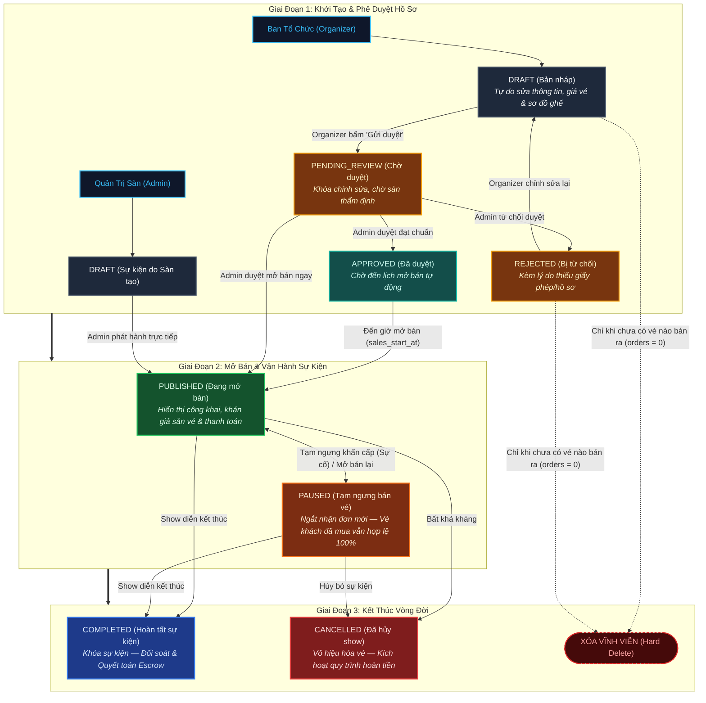

# 📖 Vòng Đời & Luồng Trạng Thái Sự Kiện (Event Lifecycle & Status Guide)

> **Tài liệu tham chiếu chuẩn cho hệ thống bán vé Tixora**  
> Phiên bản: `v2.0` (Cập nhật bổ sung trạng thái `PAUSED` & phân định quy tắc Hủy vs Xóa)

---

## 1. Tổng Quan Về Các Trạng Thái Sự Kiện (`ConcertStatus`)

Trong Tixora, mỗi sự kiện (Concert) vận hành qua máy trạng thái (State Machine) gồm 8 trạng thái được định nghĩa trong enum `ConcertStatus`:

| Trạng thái | Mã định danh (`enum`) | Đối tượng hiển thị | Khả năng mua vé | Mô tả & Mục đích |
| :--- | :--- | :--- | :---: | :--- |
| **Bản nháp** | `DRAFT` | Chỉ Creator (Admin/Organizer) | ❌ | Sự kiện đang trong giai đoạn soạn thảo thông tin, chưa công bố. Tự do sửa đổi mọi trường. |
| **Chờ duyệt** | `PENDING_REVIEW` | Creator & Admin | ❌ | Organizer đã hoàn tất nội dung và gửi yêu cầu phê duyệt lên sàn Tixora. |
| **Đã phê duyệt** | `APPROVED` | Creator & Admin | ❌ | Admin đã duyệt tính hợp lệ, sự kiện sẵn sàng mở bán theo lịch trình (`sales_start_at`). |
| **Bị từ chối** | `REJECTED` | Creator & Admin | ❌ | Admin từ chối duyệt (do thiếu giấy phép, vi phạm bản quyền,...). Organizer cần sửa và gửi duyệt lại. |
| **Đang mở bán** | `PUBLISHED` | Công khai toàn bộ khách hàng | ✅ | Sự kiện hiển thị trên trang chủ/tìm kiếm, cho phép khách hàng chọn ghế và đặt vé qua cổng thanh toán. |
| **Tạm ngưng** | `PAUSED` | Công khai toàn bộ khách hàng | ❌ *(Chặn đặt vé)* | Sự kiện tạm thời ngắt tiếp nhận đơn đặt vé mới (để rà soát kỹ thuật, đổi ca diễn, kiểm tra gian lận...). |
| **Hoàn tất** | `COMPLETED` | Công khai (dạng lưu trữ) | ❌ | Show diễn đã kết thúc thành công. Sẵn sàng đối soát doanh thu và quyết toán cho Organizer. |
| **Đã hủy** | `CANCELLED` | Công khai (gắn nhãn HỦY) | ❌ *(Kích hoạt Refund)* | Show diễn bị hủy bỏ (do thiên tai, nghệ sĩ hủy show,...). Kích hoạt quy trình hoàn tiền cho khách mua. |

---

## 2. Giải Nghĩa Chi Tiết Về Trạng Thái "TẠM NGƯNG" (`PAUSED`)

### 2.1. Tại sao cần `PAUSED` mà không trả về `DRAFT`?
Trong phiên bản cũ, hệ thống từng ép sự kiện `PUBLISHED ➔ DRAFT` khi bấm nút "Tạm ngưng". Đây là **lỗi tư duy nghiệp vụ nghiêm trọng** vì:
1. **Rủi ro phá vỡ dữ liệu đã bán**: Sự kiện đã bán được vé thì không thể quay về "Bản nháp" — nếu trả về nháp, ban tổ chức có thể sửa giá vé, đổi ngày diễn, xóa hạng vé mà hàng trăm khán giả đã thanh toán.
2. **Khách hàng hoang mang**: Vé khách hàng đã mua hiển thị gắn với một sự kiện "bản nháp" biến mất khỏi trang công khai, dẫn đến khiếu nại dịch vụ.
3. **Lỗ hổng kiểm duyệt**: Sự kiện đã duyệt một lần, nếu về `DRAFT` rồi Organizer tự tiện mở lại mà không cần sàn kiểm tra thì rất dễ gian lận.

### 2.2. So sánh bản chất 3 trạng thái dễ gây nhầm lẫn:

| Tiêu chí so sánh | Bản nháp (`DRAFT`) | Tạm ngưng bán vé (`PAUSED`) | Hủy sự kiện (`CANCELLED`) |
| :--- | :--- | :--- | :--- |
| **Thời điểm kích hoạt** | Trước khi sự kiện ra mắt. | Đang bán nhưng gặp sự cố/cần dừng khẩn cấp. | Buộc phải hủy hẳn show diễn. |
| **Số vé đã bán** | Bắt buộc `0` vé. | Thường đã có người mua vé (`orders > 0`). | Thường đã có người mua vé (`orders > 0`). |
| **Hiển thị ngoài sàn** | Ẩn hoàn toàn khỏi người dùng. | Vẫn hiển thị trang sự kiện, nhưng nút mua chuyển thành **"Tạm ngưng bán vé"**. | Hiển thị banner cảnh báo đỏ **"SỰ KIỆN ĐÃ BỊ HỦY"**. |
| **Vé đã mua của khách** | Không có. | **Vẫn hợp lệ 100%**, mã QR vé không đổi, khán giả yên tâm giữ chỗ. | Bị vô hiệu hóa, tự động kích hoạt tiến trình Hoàn tiền (Refund). |
| **Khả năng sửa thông tin** | Toàn quyền sửa (giá vé, ngày, hạng vé). | **Chỉ được sửa mô tả/hình ảnh**, cấm sửa giá và hạng vé đã phát hành. | Khóa toàn bộ dữ liệu, cấm chỉnh sửa. |
| **Hành động mở lại** | Bấm "Gửi duyệt" (`PENDING_REVIEW`). | Bấm "Mở bán lại" (`PUBLISHED`). | Không thể mở lại (trạng thái kết thúc). |

---

## 3. Sơ Đồ Chuyển Đổi Trạng Thái (State Machine Diagram)



---

## 4. Bảng Ma Trận Phân Quyền (RBAC: Admin vs Organizer)

| Quyền hạn & Thao tác | Ban tổ chức (Organizer) | Quản trị sàn (Admin) | Điều kiện & Ràng buộc bảo mật |
| :--- | :---: | :---: | :--- |
| **Tạo sự kiện mới** | ✅ | ✅ | Organizer chỉ tạo cho thương hiệu của mình; Admin có thể tạo show trực tiếp cho sàn. |
| **Sửa đổi bản nháp (`DRAFT`)** | ✅ | ✅ | Sửa thoải mái: tên, mô tả, ảnh poster, sơ đồ ghế, giá vé các hạng. |
| **Gửi duyệt (`PENDING_REVIEW`)** | ✅ | ➖ *(Không cần)* | Organizer gửi hồ sơ hoàn chỉnh lên sàn để được xét duyệt. |
| **Phê duyệt (`PUBLISHED`)** | ❌ *(Bị chặn ở API)* | ✅ | Chỉ Admin mới có quyền cấp phép phát hành sự kiện ra thị trường. |
| **Từ chối duyệt (`REJECTED`)** | ❌ | ✅ | Admin nhập lý do từ chối để ban tổ chức biết cần bổ sung thông tin gì. |
| **Tạm ngưng bán vé (`PAUSED`)** | ✅ *(Chỉ sự kiện của mình)* | ✅ *(Mọi sự kiện)* | Được phép tạm ngưng tức thì để kiểm soát khủng hoảng hoặc nghẽn cổng. |
| **Mở lại bán vé (`PUBLISHED`)** | ❌ *(Chờ Admin)* | ✅ | Admin rà soát xong mới được bấm "Mở bán lại". |
| **Xác nhận hoàn tất (`COMPLETED`)** | ❌ | ✅ *(hoặc Cron)* | Sự kiện đã qua ngày giờ kết thúc, sẵn sàng quyết toán tài chính. |
| **Hủy sự kiện (`CANCELLED`)** | ❌ *(Phải gửi đơn)* | ✅ | Tránh trường hợp ban tổ chức tự ý hủy sự kiện khi đã thu tiền của khách. |
| **Xóa vĩnh viễn (`DELETE`)** | ✅ *(Chỉ khi 0 vé)* | ✅ *(Chỉ khi 0 vé)* | **Tuyệt đối không xóa** nếu đã có phát sinh đơn hàng (`orders_count > 0`). |

---

## 5. Quy Tắc Bất Di Bất Dịch: HỦY vs XÓA

### 5.1. Khi nào được XÓA sự kiện (`Hard Delete`)?
- **Điều kiện duy nhất**: Sự kiện **chưa phát sinh bất kỳ đơn hàng nào (`orders_count === 0`)**.
- **Áp dụng cho**:
  - Sự kiện đang ở `DRAFT` do tạo thử nghiệm, cấu hình lỗi.
  - Sự kiện bị `REJECTED` mà Organizer quyết định bỏ dự án.
- **Tác động**: Xóa bản ghi trong database (bảng `concerts`, `ticket_categories`).

### 5.2. Khi nào CHỈ ĐƯỢC HỦY (`CANCELLED`)?
- **Điều kiện**: Sự kiện **đã phát sinh ít nhất 1 đơn hàng (`orders_count > 0`)** hoặc đã mở bán vé ra công chúng.
- **Lý do kỹ thuật & pháp lý**:
  - **Khóa ngoại Database (Foreign Key Constraint)**: Bảng `orders`, `tickets`, `order_items` đều liên kết `concert_id`. Xóa cứng sẽ gây lỗi Foreign Key hoặc mồ côi dữ liệu tài chính.
  - **Lưu trữ kế toán & Thuế**: Dữ liệu thanh toán phải được lưu trữ tối thiểu 3 - 5 năm phục vụ đối soát ngân hàng và quyết toán thuế.
  - **Quyền lợi khách hàng**: Cần giữ thông tin đơn hàng để khách tra cứu và sàn thực hiện hoàn tiền (Refund).
- **Hành động khi HỦY**:
  1. Cập nhật `status = "CANCELLED"`.
  2. Vô hiệu hóa toàn bộ vé của sự kiện, ngắt mã QR check-in.
  3. Kích hoạt Worker gửi email thông báo hủy và giải ngân hoàn tiền cho người mua qua cổng thanh toán (ZaloPay/VNPAY/Momo).

---

## 6. Triển Khai Kỹ Thuật (Implementation Details)

### 6.1. Backend (`apps/backend-api`)
1. **Enum `ConcertStatus`**:
   - Vị trí: `apps/backend-api/src/modules/catalog/constants/concert-status.enum.ts`
   - Đã cập nhật: Bổ sung `PAUSED = "PAUSED"`.
2. **DTO Query `ConcertListQueryDto`**:
   - Vị trí: `apps/backend-api/src/modules/catalog/dtos/concert-list-query.dto.ts`
   - Bổ sung `PAUSED` và `CANCELLED` vào `ConcertListStatus` enum phục vụ việc lọc danh sách qua API `GET /concerts?status=PAUSED`.
3. **Ticketing Reservation Guard**:
   - Vị trí: `apps/backend-api/src/modules/ticketing/services/ticketing.service.ts`
   - Phương thức: `reserveTicket(userId, dto)`
   - Cơ chế bảo vệ: Khi khách hàng gửi yêu cầu giữ vé/đặt vé, service kiểm tra trạng thái sự kiện:
     ```ts
     if (concert.status === ConcertStatus.PAUSED) {
       throw new BadRequestException("Sự kiện này đang tạm ngưng bán vé.");
     }
     if (concert.status !== ConcertStatus.PUBLISHED) {
       throw new BadRequestException("Sự kiện này hiện không mở bán vé.");
     }
     ```
   - Đảm bảo chặn đứng 100% các request mua vé khi sự kiện đang `PAUSED`, kể cả khi người dùng cố gọi API trực tiếp.
4. **State Transition Guard (`ConcertService.validateStatusTransition`)**:
   - Vị trí: `apps/backend-api/src/modules/catalog/services/concert.service.ts`
   - Chặn đứng các hành vi chuyển trạng thái vi phạm toàn vẹn dữ liệu:
     - Khi sự kiện đang `PUBLISHED` hoặc `PAUSED`: **CẤM tuyệt đối chuyển về `DRAFT`** (ném lỗi `400 Bad Request` nếu cố tình gửi request). Buộc phải chọn `PAUSED` nếu muốn ngưng bán, hoặc `CANCELLED` nếu hủy show.
     - Khi sự kiện đã ở trạng thái kết thúc (`COMPLETED` hoặc `CANCELLED`): **CẤM thay đổi** sang bất kỳ trạng thái nào khác.
     - Khi sự kiện đang `DRAFT`: **CẤM nhảy cóc** trực tiếp sang `COMPLETED`, `CANCELLED` hoặc `PAUSED`.

### 6.2. Frontend Admin (`apps/admin-app`)

1. **Huy hiệu trạng thái `StatusBadge`**:
   - Vị trí: `apps/admin-app/src/app/(admin)/_components/StatusBadge.tsx`
   - Bổ sung màu sắc nhãn dán: `PAUSED` hiển thị thẻ màu cam hổ phách trung tính (`bg-amber-50 text-amber-800 border-amber-300`), nhãn "Tạm ngưng".
2. **Trang Quản lý Sự kiện (`events/page.tsx`)**:
   - Tab bộ lọc: Bổ sung tab "Tạm ngưng" (`PAUSED`) ngay bên cạnh "Đang mở bán".
   - Hành động nhanh:
     - Khi sự kiện đang `PUBLISHED`: Nút thao tác hiển thị **"Tạm ngưng"** ➔ đổi sang `PAUSED` (thay vì ép về `DRAFT` như trước).
     - Khi sự kiện đang `PAUSED`: Nút thao tác hiển thị **"Mở bán lại"** ➔ khôi phục sang `PUBLISHED`.
     - Phê duyệt từ chối: Nút "Yêu cầu sửa" chuyển sang `REJECTED` chuẩn xác.
