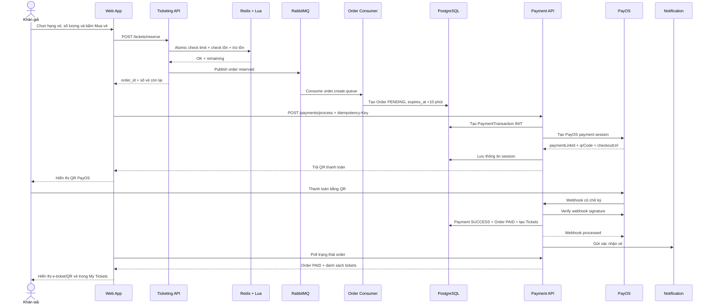

# Đặc tả: Thanh toán, khả năng chịu lỗi và phát hành vé

## Mô tả

Tính năng payment xử lý quá trình chuyển order từ `PENDING` sang `PAID`, tạo phiên thanh toán PayOS, nhận webhook xác nhận và phát hành ticket. Bên cạnh luồng nghiệp vụ chính, module phải đáp ứng yêu cầu cổng thanh toán không ổn định mà không kéo sập toàn bộ dịch vụ và không tạo giao dịch thanh toán lặp.

Phạm vi hiện tại chỉ tích hợp PayOS. VNPAY và MoMo không nằm trong implementation của dự án.

Các yêu cầu được giải quyết:

- Khán giả vẫn xem được concert và số vé còn lại khi PayOS lỗi.
- Payment timeout không để tồn tại hai payment session có thể thanh toán đồng thời cho cùng order.
- Request lặp được kiểm soát bằng `Idempotency-Key`.
- PayOS lỗi liên tục được cô lập bằng Circuit Breaker `CLOSED / OPEN / HALF_OPEN`.
- Khi circuit `OPEN`, hệ thống áp dụng Graceful Degradation: payment trả lỗi nhanh nhưng catalog và inventory vẫn hoạt động.
- Webhook retry không tạo vé trùng.
- Payment đến sau khi order hết hạn không phát hành vé và được đưa vào luồng refund.

### Thành phần chính

- `apps/backend-api/src/modules/payment/controllers/payment.controller.ts`
- `apps/backend-api/src/modules/payment/services/payment.service.ts`
- `apps/backend-api/src/modules/payment/services/gateway/payment-gateway.client.ts`
- `apps/backend-api/src/modules/payment/services/gateway/payos.strategy.ts`
- `apps/backend-api/src/modules/payment/interceptors/payment-idempotency.interceptor.ts`
- `apps/backend-api/src/modules/catalog/services/concert.service.ts`
- `apps/web-app/src/services/payment.service.ts`
- `apps/web-app/src/components/PayNowButton.tsx`
- `prisma/schema.prisma`

### API chính

- `POST /payments/process`
- `POST /payments/webhook`
- `PATCH /payments/transactions/:id/refund`
- `GET /concerts`
- `GET /concerts/:id`

## Mô tả luồng nghiệp vụ quan trọng

### Luồng mua vé: từ khi bấm “Mua vé” đến khi nhận e-ticket

Đây là luồng nghiệp vụ quan trọng nhất của hệ thống. Luồng kết hợp Web App, Ticketing Module, Redis, RabbitMQ, PostgreSQL, Payment Module, PayOS và Notification Module. Vé điện tử chỉ được phát hành sau khi Backend nhận và xác thực webhook thanh toán thành công; việc người dùng quét QR chuyển khoản hoặc quay về từ PayOS không tự tạo e-ticket.

#### Thành phần tham gia

| Thành phần                             | Trách nhiệm                                                          |
| -------------------------------------- | -------------------------------------------------------------------- |
| Khán giả/Web App                       | Chọn hạng vé, số lượng, xác nhận giữ chỗ và thanh toán               |
| `TicketingController/TicketingService` | Kiểm tra mở bán, tồn vé, giới hạn theo tài khoản và giữ vé nguyên tử |
| Redis + Lua Script                     | Trừ tồn vé và tăng số lượng user đã giữ trong một thao tác atomic    |
| RabbitMQ                               | Tách bước giữ vé tải cao khỏi bước ghi order xuống PostgreSQL        |
| `OrderCreateConsumer`                  | Tạo order `PENDING`, tính tổng tiền và thời hạn giữ chỗ 10 phút      |
| `PaymentService`                       | Idempotency, tạo/reconcile payment session và xử lý webhook          |
| PayOS                                  | Tạo QR thanh toán, nhận tiền và gửi webhook                          |
| PostgreSQL                             | Lưu order, payment transaction và ticket chính thức                  |
| `NotificationService`                  | Gửi xác nhận vé sau khi DB transaction thanh toán đã commit          |

#### Sơ đồ luồng tổng quát



#### Bước 1 — Xem concert và chọn vé

1. Khán giả mở danh sách/chi tiết concert bằng `GET /concerts` và `GET /concerts/:id`.
2. `ConcertService` lấy metadata từ Redis hoặc PostgreSQL và overlay số vé còn lại từ `TicketingService`.
3. Component `InteractiveTicketSelector` chỉ hiển thị hạng vé đã đến `sales_start_at`.
4. Số lượng tối đa trên UI được giới hạn bởi giá trị nhỏ hơn giữa `max_per_user` và `remaining_quantity`.
5. Nếu chưa đăng nhập, Web App chuyển người dùng tới trang login kèm `returnUrl` về concert.

#### Bước 2 — Bấm “Mua vé” và giữ tồn

Web App gửi:

```text
POST /tickets/reserve
Authorization: Bearer <access-token>
```

```json
{
  "concert_id": "concert-uuid",
  "items": [
    {
      "category_id": "category-uuid",
      "quantity": 2
    }
  ]
}
```

`TicketingService.reserveTicket()` xử lý:

1. Kiểm tra thời điểm mở bán của từng hạng vé.
2. Nếu inventory Redis chưa được khởi tạo, lazy seed từ PostgreSQL rồi chạy lại.
3. Chạy Lua Script để thực hiện nguyên tử:
   - kiểm tra hạng vé tồn tại;
   - kiểm tra số vé còn lại;
   - kiểm tra giới hạn giữ vé của user;
   - trừ số vé khỏi Redis;
   - tăng số vé user đang giữ.
4. Redis có thể trả `ERR_NOT_INITIALIZED`, `ERR_NO_TICKET`, `ERR_LIMIT_EXCEEDED` hoặc `OK`.
5. Khi `OK`, Backend sinh `orderId` UUID và publish sự kiện lên RabbitMQ.
6. Nếu publish RabbitMQ thất bại, Backend rollback ngay số vé vừa trừ trong Redis và trả `503`; không để tồn vé bị mất mà không có order.
7. API trả `order_id`, số lượng đã giữ và tồn vé còn lại cho Web App.

#### Bước 3 — Tạo order PENDING bất đồng bộ

`OrderCreateConsumer` nhận message từ `order.create.queue`:

1. Kiểm tra idempotency theo `orderId`; nếu order đã tồn tại thì bỏ qua message lặp.
2. Đọc giá từng hạng vé từ PostgreSQL và tính `total_amount` ở Backend.
3. Tạo `ticket_breakdown` gồm category, tên hạng, số lượng và đơn giá.
4. Tạo order:
   - `status = PENDING`;
   - `expires_at = created_at + 10 phút`;
   - chưa tạo bất kỳ dòng `Ticket` nào;
   - lưu breakdown vào `ticket_metadata`.
5. Web App lưu reservation vào session/local checkout state và chuyển tới `/checkout/{orderId}`.

Order được tạo bất đồng bộ qua RabbitMQ, vì vậy bước checkout chỉ hợp lệ khi consumer đã ghi order vào PostgreSQL. Payment API luôn kiểm tra order tồn tại, thuộc đúng user và còn `PENDING` trước khi gọi PayOS.

#### Bước 4 — Khởi tạo thanh toán và hiển thị QR PayOS

1. Khán giả bấm thanh toán trên `CheckoutForm`.
2. FE sinh `Idempotency-Key` UUID v4 và gọi `POST /payments/process`.
3. Backend kiểm tra idempotency, trạng thái order, transaction cũ và Circuit Breaker.
4. Backend tạo `PaymentTransaction INIT`, nhận `provider_order_code` từ DB rồi gọi PayOS.
5. PayOS trả `paymentLinkId`, `qrCode`, `checkoutUrl` và thông tin tài khoản.
6. Backend lưu raw response và trả dữ liệu session cho FE.
7. Nếu có cả `qr_code` và `checkout_url`, `CheckoutForm` dùng thư viện `qrcode` để render `qr_code` thành ảnh QR và hiển thị cho khán giả.
8. Trong lúc QR đang hiển thị, FE poll order mỗi 2 giây. Chỉ khi order chuyển `PAID`, FE mới chuyển sang trang kết quả.

#### Bước 5 — Khán giả thanh toán và PayOS gửi webhook

1. Khán giả dùng ứng dụng ngân hàng quét QR và xác nhận chuyển khoản.
2. PayOS xử lý giao dịch rồi gửi `POST /payments/webhook` tới Backend.
3. Backend bỏ qua ping/confirm payload theo quy ước PayOS, sau đó verify chữ ký webhook bằng SDK.
4. Backend tìm transaction bằng `paymentLinkId`; nếu response tạo session từng bị timeout, fallback bằng `orderCode → provider_order_code`.
5. Redirect/callback trên browser chỉ dùng cho trải nghiệm người dùng; không phải bằng chứng để phát hành vé.

#### Bước 6 — Commit thanh toán và phát hành e-ticket

Với webhook success và order còn `PENDING`, `PaymentService` thực hiện trong PostgreSQL transaction:

1. Cập nhật `PaymentTransaction.status = SUCCESS`.
2. Lưu `transaction_id_3rd_party = paymentLinkId` và webhook telemetry.
3. Cập nhật `Order.status = PAID`.
4. Đọc `ticket_breakdown` đã lưu trong `ticket_metadata`.
5. Với mỗi item, tạo đúng `quantity` dòng `Ticket`.
6. Mỗi ticket có `order_id`, `category_id`, `qr_code_hash` duy nhất và mặc định chưa check-in.
7. Đếm số vé đã bán của category; nếu đạt `total_quantity`, cập nhật hạng vé thành `sold_out`.
8. Commit toàn bộ thay đổi. Nếu transaction DB thất bại, không để order `PAID` mà thiếu ticket.
9. Sau commit, gọi `NotificationService.sendTicketConfirmation()`. Lỗi notification chỉ được ghi log, không rollback payment đã thành công.

#### Bước 7 — Khán giả nhận và xem e-ticket

1. `CheckoutForm` poll order mỗi 2 giây; callback page cũng kiểm tra lại order và có thể poll tối đa 5 lần khi redirect thành công nhưng webhook chưa cập nhật kịp.
2. Khi order là `PAID`, Web App chuyển người dùng tới trang xác nhận/My Tickets.
3. `GET` order detail trả danh sách ticket thuộc order.
4. Trang order/My Tickets render từng `qr_code_hash` thành QR e-ticket.
5. E-ticket này được nhân viên check-in quét tại cổng; nó tách biệt hoàn toàn với QR PayOS dùng để chuyển khoản.
6. Webhook replay trả lại ticket hiện có và không tạo thêm e-ticket.

#### Bước 8 — Hết hạn, hủy hoặc lỗi

- **Hết 10 phút chưa thanh toán:** `PendingOrderCleanupService` chạy mỗi phút, atomic đổi order `PENDING → CANCELLED` và rollback inventory Redis.
- **Delay queue phát message hết hạn:** `OrderExpiredConsumer` cũng chỉ xử lý nếu order vẫn `PENDING`, sau đó hủy và hoàn tồn.
- **Khán giả chủ động hủy:** Orders API chỉ hủy order `PENDING` và hoàn tồn đã giữ.
- **PayOS webhook failure:** transaction thành `FAILED`, order pending bị hủy và inventory được rollback.
- **Thanh toán đến sau khi order đã hủy:** không tạo e-ticket; transaction được ghi nhận và đưa vào luồng refund.
- **Webhook success lặp:** không tạo ticket lần hai.
- **Timeout tạo session:** transaction chuyển `UNKNOWN`; retry thực hiện reconciliation. Link `PENDING` chưa nhận tiền phải được hủy thành công trước khi tạo QR mới.
- **Circuit Breaker OPEN:** payment trả `503` nhanh, không gọi PayOS và không tạo transaction mới; catalog và tồn vé vẫn hoạt động.

#### Trạng thái dữ liệu xuyên suốt

| Thời điểm                                   | Order            | PaymentTransaction              | Ticket                 |
| ------------------------------------------- | ---------------- | ------------------------------- | ---------------------- |
| Redis giữ vé thành công, consumer chưa chạy | Chưa có trong DB | Chưa có                         | Chưa có                |
| Consumer tạo order                          | `PENDING`        | Chưa có                         | Chưa có                |
| Bắt đầu tạo PayOS session                   | `PENDING`        | `INIT`                          | Chưa có                |
| PayOS create timeout                        | `PENDING`        | `UNKNOWN`                       | Chưa có                |
| PayOS create thành công, chờ trả tiền       | `PENDING`        | `INIT`                          | Chưa có                |
| Webhook success commit                      | `PAID`           | `SUCCESS`                       | Được tạo đúng số lượng |
| Hết hạn trước thanh toán                    | `CANCELLED`      | Có thể chưa có/không thành công | Không có               |
| Thanh toán đến sau khi hủy                  | `CANCELLED`      | `SUCCESS`, cần refund           | Không có               |

#### Tiêu chí hoàn tất luồng mua vé

Luồng chỉ được xem là hoàn tất khi:

- order đã `PAID`;
- payment transaction đã `SUCCESS`;
- số dòng ticket đúng bằng tổng quantity trong breakdown;
- mỗi ticket có `qr_code_hash` duy nhất;
- Web App hiển thị được e-ticket trong My Tickets/order detail;
- webhook lặp không làm tăng số lượng ticket.

## Đặc tả: API tạo phiên thanh toán `POST /payments/process`

### Mô tả

API tạo phiên thanh toán PayOS cho order đang `PENDING`, kiểm tra quyền sở hữu, trạng thái order, transaction hiện có và Circuit Breaker trước khi trả QR/checkout data cho Web App.

### Luồng chính

Client gửi:

```text
POST /payments/process
Authorization: Bearer <access-token>
Idempotency-Key: <uuid-v4>
Content-Type: application/json
```

```json
{
  "order_id": "order-uuid",
  "payment_method": "PAYOS"
}
```

Backend xử lý theo thứ tự:

1. `JwtAuthGuard` xác thực người dùng.
2. `PaymentIdempotencyInterceptor` kiểm tra `Idempotency-Key` là UUID v4.
3. Redis được kiểm tra để trả lại response `COMPLETED` nếu request đã được xử lý.
4. `PaymentService` atomic reserve key bằng `SET NX`, trạng thái `IN_PROGRESS`, TTL 24 giờ.
5. Tìm order theo `order_id` và `user_id`; chỉ xử lý order `PENDING`.
6. Kiểm tra transaction active của order với cùng payment method.
7. Nếu transaction cũ đã có checkout URL, trả lại transaction và checkout URL cũ, kể cả request mới dùng UUID khác.
8. Nếu transaction cũ là `INIT` nhưng chưa có checkout URL, trả `409 Conflict` vì request có thể còn đang xử lý.
9. Nếu transaction cũ là `UNKNOWN`, tra cứu PayOS bằng `provider_order_code`. Link `PENDING` chưa nhận tiền được hủy an toàn trước khi tạo session mới để lấy QR mới.
10. Kiểm tra Circuit Breaker. Nếu circuit `OPEN`, trả `503` trước khi tạo transaction.
11. Nếu circuit `CLOSED` hoặc `HALF_OPEN`, tạo `PaymentTransaction` trạng thái `INIT`.
12. PostgreSQL cấp `provider_order_code` duy nhất trước khi gọi PayOS.
13. Gọi PayOS qua `PaymentGatewayClient` để tạo payment session.
14. Khi thành công, lưu `paymentLinkId`, checkout URL và raw response.
15. Cache response trong Redis với trạng thái `COMPLETED`.

Response thành công gồm:

- `payment_transaction_id`
- `order_id`
- `payment_method`
- `status`
- `gateway_status`
- `checkout_url`
- `qr_code`
- `account_name`
- `idempotency_key`
- `circuit_breaker_state`

### Kịch bản lỗi

- Thiếu/sai JWT: `401 Unauthorized`.
- Thiếu/sai `Idempotency-Key`: `400 Bad Request`.
- Order không tồn tại/không thuộc user: `404 Not Found`.
- Order không còn `PENDING`: `400 Bad Request`.
- Transaction `INIT` chưa có session data: `409 Conflict`.
- Circuit `OPEN` hoặc PayOS lỗi: `503 Service Unavailable`.

### Ràng buộc

- Chỉ user sở hữu order và order `PENDING` mới được thanh toán.
- Không tạo session mới nếu session cũ vẫn có thể nhận tiền.
- Circuit `OPEN` phải fast-fail trước khi tạo transaction.

### Tiêu chí chấp nhận

- Order hợp lệ nhận `payment_transaction_id`, `qr_code` và `checkout_url`.
- Session đã tồn tại được tái sử dụng.
- Circuit `OPEN` không tạo transaction mới.

## Đặc tả: Idempotency và chống request thanh toán lặp

### Mô tả

Đặc tả bảo đảm double-click, retry mạng và request đồng thời không tạo nhiều lần xử lý cho cùng payment attempt.

### Luồng chính

FE sinh UUID v4 cho mỗi payment attempt:

```ts
export async function processPayment(
  input: ProcessPaymentInput,
  idempotencyKey?: string,
): Promise<ProcessPaymentResponse> {
  const key = idempotencyKey || generateUUID();

  return fetchClient<ProcessPaymentResponse>("/payments/process", {
    method: "POST",
    headers: { "Idempotency-Key": key },
    body: JSON.stringify(input),
  });
}
```

FE còn chặn double-click trong thời gian request đang chạy:

```ts
if (loading) return;
setLoading(true);
```

Backend mới là lớp bảo đảm correctness. Redis reserve key theo kiểu atomic:

```ts
const reserved = await this.redisService.setIfAbsentJson(
  cacheKey,
  {
    state: "IN_PROGRESS",
    order_id: dto.order_id,
    payment_method: dto.payment_method,
    created_at: new Date().toISOString(),
  },
  this.idempotencyTtlSeconds,
);
```

Hai lớp lưu trữ được sử dụng:

| Lớp        | Vai trò                                                  |
| ---------- | -------------------------------------------------------- |
| Redis      | Atomic reservation, cache response, TTL 24 giờ           |
| PostgreSQL | Unique constraint trên `idempotency_key`, chốt chặn cuối |

Schema liên quan:

```prisma
model PaymentTransaction {
  id                       String @id @default(uuid()) @db.Uuid
  order_id                 String @db.Uuid
  payment_method           String @db.VarChar(50)
  provider_order_code      BigInt @unique @default(autoincrement())
  transaction_id_3rd_party String? @db.VarChar(255)
  status                   String @db.VarChar(50)
  idempotency_key          String @unique @db.VarChar(255)
}
```

Các mã không thay thế nhau:

| Trường                     | Kiểu             | Mục đích                     |
| -------------------------- | ---------------- | ---------------------------- |
| `PaymentTransaction.id`    | UUID             | Định danh nội bộ             |
| `idempotency_key`          | UUID v4          | Chống request lặp            |
| `provider_order_code`      | Số nguyên unique | `orderCode` PayOS yêu cầu    |
| `transaction_id_3rd_party` | Hex 32 ký tự     | `paymentLinkId` PayOS trả về |

### Kịch bản lỗi

- Hai request đồng thời cùng key: chỉ một request thắng Redis `SET NX`.
- Redis cache mất: Backend fallback transaction trong PostgreSQL.
- Key sai UUID v4: `400 Bad Request`.

### Ràng buộc

- Redis key có TTL 24 giờ.
- `payment_transactions.idempotency_key` phải unique.
- FE không được là lớp chống lặp duy nhất.

### Tiêu chí chấp nhận

- Cùng key không tạo transaction/session thứ hai.
- Concurrent request không cùng vượt qua atomic reservation.
- Redis mất cache vẫn còn chốt chặn DB.

## Đặc tả: Xử lý timeout và reconciliation

### Mô tả

Đặc tả xử lý create session bị timeout. Transaction chuyển `UNKNOWN`; retry phải tra cứu và hủy an toàn session cũ chưa nhận tiền trước khi tạo QR mới.

### Luồng chính

Timeout không chứng minh PayOS chưa nhận hoặc chưa xử lý request. Vì vậy, timeout được phân loại là kết quả chưa xác định thay vì lỗi chắc chắn.

```ts
private isGatewayTimeout(error: unknown): boolean {
  if (!(error instanceof Error)) return false;
  const candidate = error as Error & { code?: string };
  return candidate.code === 'ETIMEDOUT'
    || candidate.name === 'TimeoutError'
    || /timed?\s*out|timeout/i.test(candidate.message);
}
```

Khi timeout:

```ts
status: timedOut ? 'UNKNOWN' : 'FAILED',
raw_response: {
  phase: timedOut ? 'PROCESS_TIMEOUT_UNKNOWN' : 'PROCESS_FAILED',
  message: error instanceof Error ? error.message : 'Unknown gateway error',
  requires_reconciliation: timedOut,
}
```

Quy tắc retry:

| Trạng thái transaction | Ý nghĩa                                        | Tạo attempt mới?                 |
| ---------------------- | ---------------------------------------------- | -------------------------------- |
| `INIT`                 | Đã ghi nhận attempt, chưa có kết quả chắc chắn | Không                            |
| `UNKNOWN`              | Gateway timeout, cần tra cứu PayOS/webhook     | Không tạo mới trước khi đối soát |
| `FAILED`               | Có lỗi xác định                                | Có thể                           |
| `SUCCESS`              | Thanh toán thành công                          | Không                            |

Nếu retry khi order có transaction `INIT`, hoặc reconciliation của `UNKNOWN` vẫn chưa cho kết quả, Backend có thể trả:

```json
{
  "message": "Payment status is being confirmed. Do not retry yet.",
  "error": "Conflict",
  "statusCode": 409
}
```

Với transaction `UNKNOWN`, Backend gọi `paymentRequests.get(provider_order_code)`:

- `PENDING` và `amountPaid = 0`: hủy link cũ; sau khi PayOS xác nhận `CANCELLED`, tạo transaction/session mới và trả QR mới.
- `PROCESSING/UNDERPAID` hoặc đã có tiền: không hủy và không tạo session mới; chờ xác nhận.
- `PAID`: không tạo session/vé mới; chờ webhook đã ký để hoàn tất.
- `CANCELLED/EXPIRED/FAILED`: đóng attempt cũ rồi cho phép tạo session mới.
- PayOS tiếp tục timeout hoặc circuit `OPEN`: giữ `UNKNOWN` và trả lỗi tạm thời.

Source code lookup và thay thế QR:

```ts
const lookup = await this.paymentGatewayClient.getPaymentSession(
  paymentMethod,
  Number(transaction.provider_order_code),
);

if (lookup.status === "PENDING" && lookup.amountPaid === 0) {
  const cancelled = await this.paymentGatewayClient.cancelPaymentSession(
    paymentMethod,
    Number(transaction.provider_order_code),
    "Replacing payment session after an inconclusive timeout",
  );

  if (cancelled.status !== "CANCELLED") {
    throw new ConflictException(
      "Previous payment session could not be safely cancelled.",
    );
  }

  await this.prisma.paymentTransaction.update({
    where: { id: transaction.id },
    data: {
      status: "FAILED",
      transaction_id_3rd_party: cancelled.providerTransactionId,
      // raw_response lưu lookup/cancellation telemetry
    },
  });

  // Trả null để processPayment tiếp tục tạo transaction và QR mới.
  return null;
}
```

PayOS lookup/cancel được cấu hình timeout và không tự retry trong SDK:

```ts
await this.payOS.paymentRequests.get(providerOrderCode, {
  timeout: Number(process.env.PAYMENT_GATEWAY_TIMEOUT_MS ?? 3_000),
  maxRetries: 0,
});
```

### Kịch bản lỗi

- Lookup/cancel tiếp tục timeout: giữ `UNKNOWN`, trả `503`.
- Session có `amountPaid > 0`, `PROCESSING`, `UNDERPAID` hoặc `PAID`: không hủy, trả `409` chờ xác nhận.
- PayOS không xác nhận `CANCELLED`: không tạo session thay thế.

### Ràng buộc

- Timeout phải ghi `PROCESS_TIMEOUT_UNKNOWN`, không ghi trực tiếp `FAILED`.
- Chỉ hủy `PENDING` khi `amountPaid = 0`.
- Chỉ tạo QR mới sau khi session cũ được xác nhận `CANCELLED`.

### Tiêu chí chấp nhận

- Timeout tạo transaction `UNKNOWN`.
- Khi PayOS phục hồi, retry nhận được QR mới mà không có hai session active.
- Session có hoạt động tiền không bị hủy.

## Đặc tả: Circuit Breaker và Graceful Degradation

### Mô tả

Đặc tả cô lập lỗi PayOS bằng ba trạng thái `CLOSED/OPEN/HALF_OPEN`; khi payment suy giảm, catalog và tồn vé vẫn hoạt động.

### Luồng chính

`PaymentGatewayClient` sử dụng `opossum`:

```ts
const breaker = new CircuitBreaker(
  async (input: PaymentGatewaySessionInput) =>
    strategy.createPaymentSession(input),
  {
    errorThresholdPercentage: 50,
    resetTimeout: 60_000,
    rollingCountTimeout: 10_000,
    rollingCountBuckets: 10,
    volumeThreshold: 4,
    timeout: Number(process.env.PAYMENT_GATEWAY_TIMEOUT_MS ?? 3_000),
  },
);
```

| Trạng thái  | Hành vi                                        |
| ----------- | ---------------------------------------------- |
| `CLOSED`    | Cho phép gọi PayOS và ghi nhận success/failure |
| `OPEN`      | Từ chối nhanh, không gọi PayOS                 |
| `HALF_OPEN` | Sau 60 giây cho request probe đi qua           |

Điều kiện mở circuit là có tối thiểu 4 request trong cửa sổ 10 giây và tỷ lệ lỗi đạt từ 50%. Việc tạo nhiều order chậm qua UI không nhất thiết mở circuit nếu các failure không nằm trong cùng cửa sổ này.

Khi circuit đã `OPEN`, `PaymentService` kiểm tra trước khi tạo transaction:

```ts
const circuitState = this.paymentGatewayClient.getCircuitState(
  dto.payment_method,
);
if (circuitState === "OPEN") {
  await this.persistIdempotencyFailure(cacheKey, normalizedKey, {
    order_id: order.id,
    payment_method: dto.payment_method,
    message: `${dto.payment_method} payment gateway is temporarily unavailable`,
    circuit_breaker_state: circuitState,
  });
  throw new ServiceUnavailableException({
    message: `${dto.payment_method} payment gateway is temporarily unavailable`,
    circuit_breaker_state: circuitState,
  });
}
```

Do đó, request khi `OPEN` không gọi PayOS và không tạo thêm row `FAILED` chỉ mang lỗi “Breaker is open”. `HALF_OPEN` không bị chặn ở bước này vì Opossum cần request probe để kiểm tra phục hồi.

#### Graceful Degradation

Graceful Degradation là suy giảm có kiểm soát: khi PayOS lỗi, hệ thống chỉ tạm ngừng phần thanh toán thay vì ngừng toàn bộ TicketBox.

| Thành phần              | Khi PayOS bình thường       | Khi circuit `OPEN`            |
| ----------------------- | --------------------------- | ----------------------------- |
| Tạo payment session     | Gọi PayOS, trả checkout URL | Trả `503` nhanh               |
| Network call PayOS      | Có                          | Không                         |
| Payment transaction mới | Tạo trước gateway call      | Không tạo                     |
| Danh sách concert       | Hoạt động                   | Vẫn hoạt động                 |
| Chi tiết concert        | Hoạt động                   | Vẫn hoạt động                 |
| Tồn vé                  | Đọc từ `TicketingService`   | Vẫn đọc từ `TicketingService` |

Ranh giới module:

```text
POST /payments/process
        └── PaymentGatewayClient ── Circuit Breaker ── PayOS

GET /concerts, GET /concerts/:id
        └── ConcertService ── Redis/PostgreSQL ── TicketingService
```

Catalog không gọi `PaymentGatewayClient`. `ConcertService` overlay tồn vé theo từng tier:

```ts
for (const tier of concert.ticketTiers) {
  try {
    const remaining = await this.ticketingService.getOrSeedInventory(tier.id);
    tier.remaining_quantity = remaining;
    if (remaining <= 0) tier.status = "sold_out";
  } catch (err) {
    this.logger.error(
      `Failed to resolve real-time inventory for category ${tier.id}`,
      err,
    );
  }
}
```

FE nhận diện response `503` có circuit `OPEN` và hiển thị:

> Cổng PayOS đang tạm thời gián đoạn, vui lòng thử lại sau.

```ts
const message = isPayOsCircuitOpen(err)
  ? PAYOS_UNAVAILABLE_MESSAGE
  : err instanceof Error
    ? err.message
    : "Unexpected error. Please retry.";
```

FE không disable nút lâu dài vì chưa có health endpoint để biết circuit đã chuyển `HALF_OPEN/CLOSED`; nút chỉ disable trong lúc request đang chạy.

### Kịch bản lỗi

- Chưa đủ sample trong rolling window: circuit vẫn `CLOSED`.
- Đạt ngưỡng lỗi: circuit `OPEN` và request mới fast-fail.
- Probe `HALF_OPEN` thất bại: circuit quay lại `OPEN`.
- FE nhận `503 OPEN`: hiển thị thông báo PayOS tạm gián đoạn.

### Ràng buộc

- Timeout mặc định 3 giây; rolling window 10 giây; volume threshold 4; error threshold 50%; reset 60 giây.
- Circuit chỉ bao quanh PayOS, không chặn catalog.
- State hiện được lưu in-memory theo Backend process.

### Tiêu chí chấp nhận

- Đủ failure làm circuit `OPEN`.
- Request khi `OPEN` không gọi PayOS và không tạo transaction.
- Có probe `HALF_OPEN` sau reset.
- Concert và tồn vé vẫn xem được khi payment lỗi.

## Đặc tả: Webhook PayOS và phát hành e-ticket

### Mô tả

Webhook là nguồn xác nhận để chuyển order sang `PAID` và tạo e-ticket. Redirect phía client không được dùng làm căn cứ phát hành vé.

### Luồng chính

PayOS gọi:

```text
POST /payments/webhook
```

Payload có các trường chính:

```json
{
  "code": "00",
  "desc": "success",
  "success": true,
  "data": {
    "orderCode": 100001,
    "paymentLinkId": "554c0aeaf819472888692f2a5aa8cf88",
    "amount": 1720000
  },
  "signature": "provider-signature"
}
```

Backend:

1. Trả success cho webhook rỗng hoặc confirm/ping theo quy ước PayOS.
2. Verify chữ ký bằng PayOS SDK.
3. Tìm transaction bằng `paymentLinkId`.
4. Nếu Backend timeout trước khi lưu `paymentLinkId`, fallback bằng `orderCode → provider_order_code`.
5. Nếu `code != "00"`, đánh dấu transaction `FAILED`, hủy order pending và rollback inventory.
6. Nếu order đã `CANCELLED`, ghi nhận payment success nhưng không phát hành vé; đánh dấu cần refund.
7. Nếu order đã `PAID` và có ticket, trả kết quả hiện có, không tạo lại vé.
8. Nếu order `PENDING`, trong DB transaction: cập nhật payment `SUCCESS`, order `PAID`, tạo ticket và cập nhật sold-out status nếu có.
9. Sau commit, gửi notification; notification lỗi không rollback payment.

Fallback webhook:

```ts
const providerOrderCode =
  dto.data.orderCode !== undefined ? BigInt(dto.data.orderCode) : undefined;

const transaction = await this.prisma.paymentTransaction.findFirst({
  where: {
    payment_method: PaymentMethod.PAYOS,
    OR: [
      { transaction_id_3rd_party: String(dto.data.paymentLinkId) },
      ...(providerOrderCode !== undefined
        ? [{ provider_order_code: providerOrderCode }]
        : []),
    ],
  },
});
```

#### Phát hành ticket và chống webhook replay

Ticket chỉ được tạo sau webhook success hợp lệ. Mỗi ticket có:

- `order_id`
- `category_id`
- `qr_code_hash`
- `is_scanned = false`

`qr_code_hash` được sinh từ order, transaction, category, index và random UUID rồi băm SHA-256.

Webhook replay được xử lý bằng cách kiểm tra order đã `PAID` và có ticket:

```ts
if (
  transaction.order.status === "PAID" &&
  transaction.order.tickets.length > 0
) {
  return new PaymentWebhookResponseDto({
    order_status: "PAID",
    payment_status: "SUCCESS",
    ticket_count: transaction.order.tickets.length,
    message: "payment webhook processed",
  });
}
```

### Kịch bản lỗi

- Payload confirm/ping: trả xác nhận, không xử lý payment.
- Chữ ký sai: `400 Bad Request`.
- Không tìm thấy transaction: ignored, không tạo ticket.
- Webhook failure: transaction `FAILED`, order bị hủy và inventory rollback.
- Webhook replay: trả ticket hiện có.
- Notification lỗi: ghi log, không rollback payment đã commit.

### Ràng buộc

- Phải verify chữ ký trước khi cập nhật tài chính hoặc vé.
- Tìm transaction bằng `paymentLinkId` hoặc fallback `provider_order_code`.
- Order `PAID` và ticket phải được commit cùng DB transaction.
- Webhook replay phải idempotent.

### Tiêu chí chấp nhận

- Webhook success tạo đúng số ticket và đổi order `PAID`.
- Webhook gửi lại không tăng số ticket.
- Webhook sai chữ ký không thay đổi DB.
- Ticket hiển thị được trong My Tickets/order detail.

## Đặc tả: Late payment và refund

### Mô tả

Đặc tả xử lý tiền đến sau khi order đã hết hạn/hủy. Hệ thống ghi nhận giao dịch nhưng không phát hành vé; admin thực hiện refund và lưu audit trail.

### Luồng chính

Nếu webhook success đến sau khi order `CANCELLED/EXPIRED`:

- transaction được ghi nhận `SUCCESS`;
- order giữ trạng thái đã hủy;
- không tạo ticket;
- lưu cảnh báo `Paid after order expiration/cancellation`;
- trả thông báo cần refund.

Admin xử lý qua:

```text
PATCH /payments/transactions/:id/refund
```

```json
{
  "refund_tx_id": "REF123456",
  "refund_note": "Refunded because payment arrived after expiration"
}
```

Transaction được cập nhật `REFUNDED` và lưu `refund_info` trong `raw_response`.

### Kịch bản lỗi

- Refund transaction không tồn tại: `404 Not Found`.
- Transaction đã refund: `400 Bad Request`.
- Refund payload không hợp lệ: `400 Bad Request`.
- Late payment không được phát hành vé dù refund chưa xử lý ngay.

### Ràng buộc

- Late payment không được phát hành vé khi inventory đã được giải phóng.
- Refund phải lưu mã giao dịch, ghi chú và telemetry để audit.
- Refund không được tạo lại ticket hoặc chuyển order đã hủy sang `PAID`.

### Tiêu chí chấp nhận

- Late payment không phát hành vé và có thể được refund.
- Refund hợp lệ chuyển transaction sang `REFUNDED`.
- `refund_info` được lưu trong `raw_response`.

## Kiểm thử

### Unit test

Các file:

- `apps/backend-api/tests/payment-timeout.unit.ts`
- `apps/backend-api/tests/payment-circuit-breaker.unit.ts`
- `apps/backend-api/tests/payment-duplicate.unit.ts`
- `apps/backend-api/tests/concert-cache-aside.unit.ts`

Các trường hợp đã kiểm tra:

1. Timeout chuyển transaction sang `UNKNOWN`.
2. Retry bằng key khác đối soát transaction `UNKNOWN`, không tạo session thứ hai khi kết quả chưa xác định.
3. Transaction `UNKNOWN + PENDING + amountPaid=0` được hủy và thay bằng session có QR mới.
4. Key mới trả transaction và checkout URL cũ khi session đã tồn tại.
5. Circuit `OPEN` chặn trước khi tạo transaction.
6. Đủ failure làm circuit chuyển `OPEN`; request tiếp theo không gọi PayOS mock.
7. Catalog và tồn vé vẫn hoạt động khi payment circuit mở.
8. Webhook replay không tạo ticket trùng.
9. Webhook lookup sử dụng cả `paymentLinkId` và `provider_order_code`.

Chạy payment tests:

```powershell
node --test --import tsx `
  apps/backend-api/tests/payment-timeout.unit.ts `
  apps/backend-api/tests/payment-circuit-breaker.unit.ts `
  apps/backend-api/tests/payment-duplicate.unit.ts
```

Chạy toàn bộ Backend tests:

```powershell
npm run test:api:unit
```

### Test thực tế trên app

#### Payment bình thường

1. Tạo order có phí và vào checkout.
2. Bấm Pay Now và xác nhận redirect sang PayOS.
3. Thanh toán sandbox.
4. Xác nhận order `PAID` và ticket xuất hiện.

#### Idempotency

1. Copy request `/payments/process` từ DevTools.
2. Gửi lại cùng `Idempotency-Key`.
3. Xác nhận chỉ có một transaction cho key và PayOS link không đổi.
4. Gửi key mới cho cùng order đã có checkout URL; xác nhận trả transaction cũ.

#### Timeout

1. Chỉ trong môi trường test, đặt `PAYMENT_GATEWAY_TIMEOUT_MS=1` và restart Backend.
2. Tạo order mới, gọi payment một lần.
3. Xác nhận transaction `UNKNOWN`, phase `PROCESS_TIMEOUT_UNKNOWN`.
4. Retry cùng order sau khi PayOS phục hồi; xác nhận link cũ bị hủy và response chứa QR của session mới.

#### Circuit Breaker và Graceful Degradation

1. Chuẩn bị tối thiểu 5 order `PENDING` khác nhau.
2. Gửi payment cho ít nhất 4 order trong vòng 10 giây.
3. Xác nhận log `PAYOS circuit breaker opened`.
4. Gửi order tiếp theo; xác nhận `503`, không có transaction mới.
5. Mở `/concerts` và `/concerts/:id`; xác nhận thông tin và tồn vé vẫn hiển thị.
6. Trên FE, xác nhận thông báo PayOS gián đoạn được hiển thị.
7. Sau khi test, trả timeout về `3000` và restart Backend.

#### Half-Open

1. Khi circuit `OPEN`, khôi phục cấu hình/kết nối PayOS.
2. Chờ hơn 60 giây.
3. Gửi payment cho order mới để tạo probe.
4. Xác nhận log `HALF_OPEN`, sau đó `CLOSED` nếu probe thành công.

## Phân tích trade-off

### Idempotency Redis kết hợp unique constraint DB

- Ưu điểm: Redis xử lý concurrent request nhanh; DB bảo vệ khi cache mất.
- Nhược điểm: cần duy trì hai lớp trạng thái và TTL.
- Lý do lựa chọn: payment cần defense in depth thay vì phụ thuộc một storage.

### Timeout chuyển sang UNKNOWN

- Ưu điểm: không tạo session thay thế khi session cũ có thể vẫn nhận tiền; khi PayOS phục hồi, hệ thống có thể hủy link `PENDING` chưa nhận tiền rồi cấp QR mới an toàn.
- Nhược điểm: retry cần thêm hai network call lookup/cancel; nếu PayOS vẫn lỗi hoặc đã có hoạt động tiền, người dùng phải tiếp tục chờ xác nhận.
- Lý do lựa chọn: tính nhất quán tài chính quan trọng hơn việc tạo QR mới ngay khi trạng thái session cũ chưa rõ.

### Provider order code dạng sequence

- Ưu điểm: đúng kiểu số PayOS yêu cầu, unique trong DB và cho phép webhook fallback.
- Nhược điểm: cần migration/sequence và phải đồng bộ seed.
- Lý do lựa chọn: UUID không thể truyền trực tiếp vào trường `orderCode` dạng số.

### Circuit Breaker in-memory

- Ưu điểm: đơn giản, fast-fail ngay trong process, không phụ thuộc thêm hạ tầng.
- Nhược điểm: nhiều replica có circuit state riêng.
- Lý do lựa chọn: phù hợp phạm vi hiện tại; production nhiều replica cần monitoring tập trung.

### Phát hành vé bằng webhook

- Ưu điểm: chỉ tạo vé khi có xác nhận chính thức từ PayOS.
- Nhược điểm: người dùng có thể chờ webhook; FE phải poll trạng thái order.
- Lý do lựa chọn: không phát hành vé dựa trên redirect phía client.

### Late payment chuyển sang refund

- Ưu điểm: không phá inventory khi order đã hết hạn.
- Nhược điểm: cần thao tác hoàn tiền.
- Lý do lựa chọn: đảm bảo inventory không bị bán vượt quá số lượng và nếu thanh toán sau khi order bị hủy thì có thể nhận về tiền thông qua cơ chế refund.
