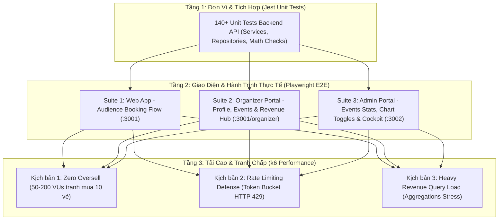

# 🎯 KẾ HOẠCH KIỂM THỬ TOÀN DIỆN VỚI PLAYWRIGHT & K6 (MASTER TESTING PLAN)
## HỆ THỐNG TIXORA — HIGH-CONCURRENCY TICKETING PLATFORM

> **Mục tiêu:** Thiết lập khung kiểm thử tự động hai tầng vững chắc cho Tixora:
> 1. **Playwright E2E:** Kiểm thử chức năng toàn vẹn từ đầu đến cuối (End-to-End), tương tác UI/UX, bảo mật phân quyền (RBAC) trên cả 3 bề mặt (Audience Web, Organizer Hub, Admin Portal).
> 2. **k6 Load & Concurrency:** Kiểm thử khả năng chịu tải cao, phòng thủ tấn công (Rate Limiting), tính toàn vẹn dữ liệu trong môi trường tranh chấp cực đoan (Zero Oversell) và hiệu năng truy vấn báo cáo tài chính.

---

## 🗺️ TỔNG QUAN CHIẾN LƯỢC KIỂM THỬ (TEST PYRAMID)



---

## PHẦN I: KẾ HOẠCH KIỂM THỬ E2E VỚI PLAYWRIGHT

### 1. Phạm Vi Kiểm Thử (Coverage Scope)
Playwright tập trung vào việc mô phỏng hành vi của 3 vai trò người dùng trong đời thực:

| Vai trò | Ứng dụng & Cổng | Tính năng trọng tâm |
| :--- | :--- | :--- |
| **Audience (Khách hàng)** | `apps/web-app` (`:3001`) | Đăng ký, đăng nhập, tìm kiếm sự kiện, chọn hạng vé, giữ vé 10 phút, xác nhận thanh toán, xem danh sách vé đã mua. |
| **Organizer (Ban tổ chức)** | `apps/web-app` (`:3001/organizer`) | Đăng nhập tài khoản BTC, quản lý hồ sơ cá nhân, tạo sự kiện mới, bảng phân bổ doanh thu, biểu đồ xu hướng (tắt/bật các line hiển thị), chi tiết doanh thu từng sự kiện. |
| **Admin (Quản trị viên)** | `apps/admin-app` (`:3002`) | Chặn RBAC người dùng thường, Dashboard Cockpit (KPI người dùng), quản lý sự kiện (thanh tiến độ vé bán/tổng vé), biểu đồ doanh thu GMV đa đường chọn lọc. |

---

### 2. Thiết Kế Các Test Suite Chi Tiết

#### Test Suite 1: Web App — Audience Booking & Discovery (`e2e/web-booking.spec.ts`)
- **TC-WEB-01: Catalog Search & Filter:**
  - Truy cập trang chủ `http://localhost:3001`.
  - Tìm kiếm concert theo từ khóa (VD: "Sơn Tùng", "Hà Anh Tuấn").
  - Lọc theo thể loại/địa điểm. Kỳ vọng: Kết quả trả về đúng danh sách concert tương ứng.
- **TC-WEB-02: Ticket Reservation & Countdown Timer:**
  - Người dùng đăng nhập tài khoản Audience `audience1@tixora.local`.
  - Chọn concert còn vé, chọn số lượng vé (VD: 2 vé VIP).
  - Bấm "Giữ vé / Mua ngay". Kỳ vọng: Chuyển sang màn hình thanh toán, đồng hồ đếm ngược 10 phút kích hoạt.
- **TC-WEB-03: Checkout & Order Confirmation:**
  - Xác nhận thông tin người mua.
  - Sau khi mock webhook thanh toán thành công: Điều hướng tới trang `/my-tickets`, hiển thị mã QR Code hợp lệ của đơn hàng.

#### Test Suite 2: Organizer Hub — Profile, Events & Revenue (`e2e/organizer-portal.spec.ts`)
*(Bao phủ các tính năng mới hoàn thiện)*
- **TC-ORG-01: Organizer Profile Viewing & Updating:**
  - Đăng nhập tài khoản Organizer `organizer@tixora.local`.
  - Truy cập `/organizer/profile`, kiểm tra hiển thị thông tin ban tổ chức (Tên, email, số điện thoại, mô tả).
  - Bấm nút "Chỉnh sửa hồ sơ", mở modal cập nhật số điện thoại và tên đơn vị.
  - Bấm "Lưu thay đổi". Kỳ vọng: Modal đóng lại, toast thông báo thành công và thông tin trên màn hình cập nhật ngay lập tức.
- **TC-ORG-02: Organizer Events List & Create Modal:**
  - Truy cập `/organizer/events`.
  - Bấm "Tạo sự kiện", mở `CreateEventModal` (đồng nhất giao diện với Admin).
  - Điền form tạo sự kiện, bấm tạo.
  - Bấm vào một sự kiện trong danh sách để mở Drawer xem chi tiết cấu hình và hạng vé.
- **TC-ORG-03: Organizer Revenue Dashboard & Multi-line Chart Toggle:**
  - Truy cập `/organizer/revenue`.
  - Kiểm tra hiển thị các thẻ KPI tài chính: Tổng GMV, Thực nhận, Phí sàn, Số vé bán, Đơn thanh toán.
  - Kiểm tra biểu đồ `RevenueTrendChart`:
    - Mặc định cả 3 đường (Doanh thu - Xanh mòng két, Vé bán - Xanh da trời, Đơn hàng - Vàng hổ phách) đều hiển thị.
    - Click toggle "Vé đã bán" để ẩn: Line vé bán và trục bên phải ẩn đi, nút chuyển sang màu mờ (inactive).
    - Hover chuột lên biểu đồ: Tooltip chỉ hiển thị thông tin của các đường đang được kích hoạt.
    - Thử click tắt cả 3 đường: Hệ thống chặn, luôn giữ tối thiểu 1 đường hoạt động.
- **TC-ORG-04: Concert Revenue Breakdown Drawer:**
  - Trong bảng "Doanh thu theo sự kiện", bấm nút "Chi tiết" ở một concert có phát sinh doanh thu.
  - Kỳ vọng: Drawer trượt ra từ bên phải, hiển thị chi tiết doanh thu theo từng hạng vé (VIP, Standard), trạng thái quyết toán và doanh thu thực tế.

#### Test Suite 3: Admin Portal — Management & Cockpit (`e2e/admin-portal.spec.ts`)
- **TC-ADM-01: RBAC Access Protection:**
  - Thử dùng tài khoản Audience hoặc Organizer đăng nhập vào `http://localhost:3002`.
  - Kỳ vọng: Bị từ chối truy cập, thông báo không có thẩm quyền, không thể vào `/dashboard`.
- **TC-ADM-02: Admin Cockpit KPI Verification:**
  - Đăng nhập tài khoản Admin `admin@tixora.local`.
  - Truy cập `/dashboard`.
  - Kiểm tra chip KPI "Người dùng hệ thống" hiển thị số lượng người dùng thực tế và nhấp chuột liên kết chuyển sang `/users`.
- **TC-ADM-03: Events Capacity & Progress Column:**
  - Truy cập `/events`.
  - Kiểm tra bảng dữ liệu: Cột hạng vé chi tiết đã được lược bỏ.
  - Cột `VÉ ĐÃ BÁN / TỔNG VÉ` hiển thị:
    - Text số lượng rõ ràng `{sold} / {total} vé`.
    - Thanh Progress Bar với màu sắc theo tỷ lệ lấp đầy.
    - Badge phần trăm bán vé (%).
- **TC-ADM-04: Admin Revenue Chart Interactive Toggles:**
  - Truy cập `/revenue`.
  - Kiểm tra biểu đồ xu hướng doanh thu của Admin: Bật/tắt linh hoạt 3 đường `Doanh thu (GMV)`, `Đơn hàng`, `Vé đã bán`.

---

## PHẦN II: KẾ HOẠCH KIỂM THỬ CHỊU TẢI VỚI K6

### 1. Kịch Bản 1: Zero Oversell Flash Sale (Atomic Concurrency)
- **Tập tin script:** `testing/load/k6-oversell-check.js`
- **Mục tiêu:** Chứng minh tuyệt đối không bán quá số lượng vé khi hàng chục người dùng cùng click mua vé trong cùng 1 mili-giây.
- **Thông số kỹ thuật:**
  - **Sự kiện test:** Tạo 1 sự kiện mẫu có 1 hạng vé tồn kho đúng **10 vé**.
  - **Virtual Users (VUs):** 50 VUs (chạy song song đồng thời).
  - **Hành vi:** Mỗi VU gửi request giữ chỗ `POST /tickets/reserve` kèm JWT token riêng biệt.
  - **Cơ chế phía sau:** Redis Lua Script thực thi nguyên tử (`HGET` kiểm tra $\to$ `HINCRBY` trừ kho).
- **Tiêu chuẩn nghiệm thu (Thresholds):**
  - Số đơn hàng tạo thành công: **Chính xác 10 đơn (HTTP 201)**.
  - Số lượt bị từ chối: **Chính xác 40 lượt (HTTP 400 hoặc 409)**.
  - Lỗi sập hệ thống (5xx): **0%**.
  - Kiểm tra lại DB sau test: Số lượng vé phát hành $\le 10$, tồn kho không bao giờ âm.

### 2. Kịch Bản 2: Token Bucket Rate Limiting (Phòng Thủ Tấn Công)
- **Tập tin script:** `testing/load/k6-ticketing-flow.js`
- **Mục tiêu:** Kiểm tra cơ chế giới hạn tần suất request (Rate Limiting) bảo vệ server trước đợt bùng nổ lưu lượng hoặc spam bot.
- **Thông số kỹ thuật:**
  - **RPS mục tiêu:** 300 - 500 requests/giây dồn dập vào API Public `/events` và `/tickets/reserve`.
  - **Thời gian chạy:** 60 giây.
- **Tiêu chuẩn nghiệm thu:**
  - Request nằm trong dung lượng token bucket: Phản hồi `HTTP 200` / `201`.
  - Request vượt ngưỡng cho phép: Server tự động trả về `HTTP 429 Too Many Requests`.
  - P95 Latency của các request hợp lệ duy trì $< 250ms$.
  - CPU server NestJS không vượt quá 85%, phục hồi ngay lập tức khi ngắt tải.

### 3. Kịch Bản 3: Stress Test Truy Vấn Doanh Thu Phức Tạp (Revenue Aggregations)
- **Kịch bản mới:** `testing/load/k6-revenue-analytics.js`
- **Mục tiêu:** Kiểm tra hiệu năng tính toán của các API Doanh thu vừa tách module (`/admin/revenue/trend`, `/organizer/revenue/trend`) khi có nhiều Admin và Organizer cùng tra cứu dữ liệu theo ngày/tháng với cơ sở dữ liệu lớn.
- **Thông số kỹ thuật:**
  - **VUs:** 30 VUs gửi truy vấn liên tục các dải ngày khác nhau (7 ngày, 30 ngày, 365 ngày).
  - **Metric đo lường:** Latency p95, p99 và khả năng chịu tải của PostgreSQL Connection Pool.
- **Tiêu chuẩn nghiệm thu:**
  - p95 Response Time $< 500ms$.
  - Không gây nghẽn kết nối (No connection pool timeout).

---

## PHẦN III: QUY TRÌNH THỰC THI KIỂM THỬ (TEST EXECUTION PROTOCOL)

```powershell
# BƯỚC 1: KHỞI ĐỘNG HẠ TẦNG & DỮ LIỆU CHUẨN
cd infrastructure; docker compose up -d; cd ..
pnpm db:seed

# BƯỚC 2: KHỞI ĐỘNG CÁC ỨNG DỤNG TRONG MONOREPO
# Terminal 1: Backend API
pnpm start:api:dev

# Terminal 2: Web App (Audience + Organizer)
pnpm start:web

# Terminal 3: Admin Portal
pnpm start:admin

# BƯỚC 3: THỰC THI TEST E2E PLAYWRIGHT
# 3.1 Chạy toàn bộ test ngầm
pnpm test:e2e

# 3.2 Chạy trực quan giao diện Playwright UI để debug tương tác
pnpm test:e2e:ui

# 3.3 Xem báo cáo kết quả Playwright HTML
pnpm test:e2e:report

# BƯỚC 4: THỰC THI KIỂM THỬ TẢI K6
# 4.1 Chạy kiểm thử chống bán quá số lượng vé (Zero Oversell)
pnpm test:load:oversell

# 4.2 Chạy kiểm thử luồng đặt vé & Rate Limiting
pnpm test:load:flow
```

---

## PHẦN IV: CHECKLIST NGHIỆM THU CHẤT LƯỢNG (QUALITY GATES)

| STT | Hạng mục kiểm tra | Công cụ | Kết quả yêu cầu |
| :---: | :--- | :---: | :--- |
| 1 | Unit Test Backend API | Jest | Đạt 140/140 unit tests, 0 lỗi. |
| 2 | Đăng ký & Giữ vé Web App | Playwright | Đồng hồ đếm ngược 10 phút, không double hold. |
| 3 | Quản lý Profile Organizer | Playwright | Xem và cập nhật hồ sơ thành công tức thì. |
| 4 | Biểu đồ Doanh thu Organizer | Playwright | Bật/tắt linh hoạt 3 đường, tối thiểu giữ 1 đường. |
| 5 | Bảng Sự kiện Admin Portal | Playwright | Hiển thị chuẩn `Vé đã bán / Tổng vé`, bỏ cột giá vé. |
| 6 | Biểu đồ Doanh thu Admin | Playwright | Bật/tắt linh hoạt 3 đường hiển thị. |
| 7 | Flash Sale Concurrency | k6 | Cấp đúng 10 vé, 0 bán lố (Zero Oversell). |
| 8 | Chống Spam / Rate Limiting | k6 | Trả về HTTP 429 khi vượt ngưỡng, bảo vệ server. |
| 9 | Pre-push Verification | Git Hook | Chạy pass `node scripts/verify-push.js`. |
