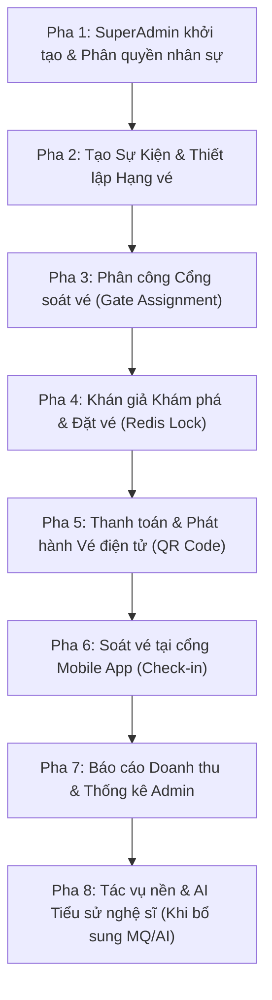

# TÀI LIỆU HƯỚNG DẪN KIỂM THỬ THỦ CÔNG (MANUAL TEST GUIDE)
## HỆ THỐNG ĐẶT VÉ VÀ SOÁT VÉ CONCERT TICKETBOX (PRODUCTION / DEPLOYED ENVIRONMENT)

> **Phiên bản tài liệu:** 2.0.0 (Cập nhật cho Môi trường Cloud Deployed)  
> **Dự án:** TicketBox Monorepo (NestJS + Next.js 16 + React Native Expo)  
> **Mục đích:** Cung cấp lộ trình kiểm thử thủ công tuần tự từ A-Z để bạn nắm bắt trọn vẹn nghiệp vụ thực tế của toàn bộ hệ thống TicketBox trên môi trường đã triển khai (Render, Vercel/Cloudflare, Supabase, Upstash Redis).

---

## 🌐 MỤC LỤC & ĐỊA CHỈ TRUY CẬP HỆ THỐNG

### 1. Bảng Địa chỉ Dịch vụ Đã Triển Khai (Deployed Services)

| Thành phần | Địa chỉ Truy cập (URL) | Công nghệ & Môi trường | Ghi chú tài khoản |
| :--- | :--- | :--- | :--- |
| **Admin Portal** | [https://ticketbox-admin.tvquang.id.vn](https://ticketbox-admin.tvquang.id.vn) | Next.js 16 App Router | Dành cho `SuperAdmin`, `Admin`, `Organizer` |
| **Client Web App** | [https://ticketbox-web.tvquang.id.vn](https://ticketbox-web.tvquang.id.vn) | Next.js 16 App Router | Dành cho khán giả (`Audience`) mua vé |
| **Backend Core API** | [https://ticketbox-api-gewh.onrender.com](https://ticketbox-api-gewh.onrender.com) | NestJS (Deploy trên Render) | REST API trung tâm |
| **Swagger API Docs** | [https://ticketbox-api-gewh.onrender.com/api/docs](https://ticketbox-api-gewh.onrender.com/api/docs) | Swagger OpenAPI | Tra cứu & test API trực tiếp |
| **Database Cloud** | Supabase PostgreSQL (AWS ap-south-1) | PgBouncer + Direct URL | Lưu trữ dữ liệu quan hệ |
| **Redis Cache & Lock**| Upstash Redis Cloud | Redis TLS (`rediss://...`) | Giữ chỗ vé chống bán lố, Cache catalog, Rate limit |
| **Mobile Scanner App** | React Native Expo (Port `8081` / Expo Go) | Expo React Native | Dành riêng cho nhân viên `Checker` soát vé |

---

### 2. Trạng thái Cấu hình Tích hợp (Integration Prerequisites)

| Dịch vụ tích hợp | Trạng thái hiện tại | Ảnh hưởng kiểm thử & Hướng dẫn bổ sung |
| :--- | :--- | :--- |
| **Supabase Storage** | ✅ Đã cấu hình (`SUPABASE_KEY`, `SUPABASE_BUCKET`) | Upload ảnh poster sự kiện hoạt động bình thường. |
| **Upstash Redis** | ✅ Đã cấu hình (`REDIS_URL`) | Giữ vé 15 phút, chống bán lố bằng Lua script chạy tốt. |
| **Resend Email** | ✅ Đã cấu hình (`RESEND_API_KEY`) | Gửi email thông báo, vé điện tử hoạt động. |
| **Cổng PayOS** | ⏳ *Chưa cấu hình (Đang dùng Dummy Key)* | Luồng thanh toán quét mã QR VietQR sẽ ở chế độ chờ. Bạn có thể test thanh toán qua giả lập webhook hoặc bổ sung Client ID/Key từ [payos.vn](https://payos.vn). |
| **RabbitMQ Worker** | ⏳ *Chưa cấu hình* | Tính năng trích xuất tiểu sử nghệ sĩ bằng AI Gemini trong nền sẽ tạm hoãn cho đến khi bổ sung `RABBITMQ_URL` (ví dụ CloudAMQP) và `GEMINI_API_KEY`. |

---

## 🚀 LỘ TRÌNH 8 PHA KIỂM THỬ NGHIỆP VỤ THỰC TẾ (CHẠY TỪ A ĐẾN Z)



---

## 📌 PHA 1: THIẾT LẬP NHÂN SỰ & KIỂM TRA PHÂN QUYỀN (AUTH & RBAC)

> **Mục tiêu:** Bắt đầu từ tài khoản `SuperAdmin` duy nhất được tạo từ máy chủ, bạn tiến hành cấp tài khoản cho các bộ phận vận hành và kiểm tra hàng rào an ninh 5 vai trò.

### Kịch bản 1.1: Đăng nhập SuperAdmin trên Admin Portal
- **Địa chỉ:** [https://ticketbox-admin.tvquang.id.vn/login](https://ticketbox-admin.tvquang.id.vn/login)
- **Tài khoản:** `superadmin@ticketbox.local` / `Ticketbox@123`
- **Các bước:**
  1. Nhập email và mật khẩu SuperAdmin.
  2. Bấm **"Đăng nhập"**.
- **Kết quả mong đợi:**
  - Đăng nhập thành công, chuyển hướng vào `/dashboard`.
  - Góc trên hiển thị tên tài khoản kèm huy hiệu **`SuperAdmin`** (màu tím fuchsia nổi bật).
  - Sidebar hiển thị đầy đủ 8 menu: Tổng quan, Đơn hàng, Sự kiện, Doanh thu, Người dùng, Phân công, Thông báo, Tác vụ nền.

### Kịch bản 1.2: Tạo tài khoản các vai trò cấp dưới
- **Địa chỉ:** [https://ticketbox-admin.tvquang.id.vn/users](https://ticketbox-admin.tvquang.id.vn/users)
- **Các bước:**
  1. Bấm nút **"+ Tạo người dùng"**.
  2. Tạo tài khoản **Ban tổ chức (Organizer)**:
     - Họ tên: `Nguyễn Văn Tuấn`
     - Email: `tuan.organizer@ticketbox.vn`
     - Mật khẩu: `Organizer@123`
     - Vai trò: Tích chọn **`Organizer`**.
     - Bấm **"Tạo người dùng"**.
  3. Tạo tài khoản **Quản trị viên vận hành (Admin)**:
     - Họ tên: `Trần Thị Vy`
     - Email: `vy.admin@ticketbox.vn`
     - Mật khẩu: `Admin@123`
     - Vai trò: Tích chọn **`Admin`**.
  4. Tạo tài khoản **Nhân viên soát vé (Checker)**:
     - Họ tên: `Lê Văn Quang`
     - Email: `quang.checker@ticketbox.vn`
     - Mật khẩu: `Checker@123`
     - Vai trò: Tích chọn **`Checker`**.
- **Kết quả mong đợi:**
  - Danh sách người dùng hiển thị đầy đủ 4 tài khoản với các nhãn Role tương ứng.
  - Không có lỗi xung đột database.

### Kịch bản 1.3: Kiểm tra Hàng rào Bảo vệ Đặc quyền (Privilege Barriers)
- **Mục tiêu:** Chứng minh tài khoản `Admin` thường không thể leo quyền hoặc can thiệp `SuperAdmin`.
- **Các bước:**
  1. Đăng xuất `SuperAdmin`.
  2. Đăng nhập bằng tài khoản `vy.admin@ticketbox.vn` / `Admin@123`.
  3. Vào mục **"Người dùng" (`/users`)**:
     - Bấm **"+ Tạo người dùng"**: Quan sát danh sách checkbox vai trò ➔ **Tùy chọn `SuperAdmin` và `Admin` bị ẩn hoàn toàn**, Admin thường chỉ được tạo `Organizer`, `Checker`, `Audience`.
     - Bấm vào tài khoản `superadmin@ticketbox.local` trên bảng: Các nút "Khóa tài khoản" hoặc "Đổi vai trò" bị vô hiệu hóa (Cơ chế Bất khả xâm phạm - SuperAdmin Immunity).

### Kịch bản 1.4: Kiểm tra Rào chắn Checker (Checker Block)
- **Mục tiêu:** Đảm bảo nhân viên soát vé không thể đăng nhập vào Admin Web.
- **Các bước:**
  1. Đăng xuất tài khoản Admin.
  2. Thử đăng nhập bằng tài khoản Checker: `quang.checker@ticketbox.vn` / `Checker@123`.
- **Kết quả mong đợi:**
  - Hệ thống từ chối đăng nhập và hiển thị thông báo rõ ràng:  
    *"Truy cập bị từ chối: Tài khoản Soát vé (Checker) chỉ được sử dụng trên ứng dụng di động Mobile App."*
  - Ngăn chặn hoàn toàn việc vào trang quản trị.

---

## 📌 PHA 2: TẠO SỰ KIỆN & THIẾT LẬP HẠNG VÉ (CONCERT MANAGEMENT)

> **Mục tiêu:** Tạo một concert âm nhạc hoàn chỉnh, cấu hình các hạng vé, giá bán, sức chứa, số cổng và xuất bản (Publish) để mở bán ra thị trường.

### Kịch bản 2.1: Khởi tạo Sự kiện Mới
- **Người thực hiện:** Đăng nhập bằng `tuan.organizer@ticketbox.vn` hoặc `superadmin@ticketbox.local`.
- **Địa chỉ:** [https://ticketbox-admin.tvquang.id.vn/events](https://ticketbox-admin.tvquang.id.vn/events) ➔ Bấm **"Tạo sự kiện"** (hoặc truy cập `/create-event`).
- **Nhập thông tin:**
  - **Tên sự kiện:** `Live Concert Anh Trai Vượt Ngàn Chông Gai 2026`
  - **Địa điểm:** `The Global City, TP. Thủ Đức, TP. Hồ Chí Minh`
  - **Thời gian diễn ra:** Chọn ngày trong tương lai (ví dụ: ngày 15 tháng sau, từ 18:00 đến 23:00).
  - **Mô tả:** `Đêm nhạc hội ngộ đỉnh cao quy tụ 33 anh tài âm nhạc Việt Nam.`
  - **Ảnh Poster:** Tải lên một file ảnh bất kỳ (JPEG/PNG) ➔ Hệ thống tự động upload lên Supabase Storage và trả về URL ảnh.
- **Bấm "Lưu bản nháp" (Save as Draft).**
- **Kết quả mong đợi:** Sự kiện được tạo thành công với trạng thái **`DRAFT`**.

### Kịch bản 2.2: Cấu hình các Hạng vé (Ticket Categories)
- **Các bước:**
  1. Tại trang chi tiết sự kiện vừa tạo, tìm mục **"Hạng vé" (Ticket Categories)** ➔ Bấm **"+ Thêm hạng vé"**.
  2. Thêm **Hạng vé 1 (VIP)**:
     - Tên hạng vé: `S-VIP - Trọng Điểm`
     - Giá vé: `1,500,000` VND
     - Tổng số lượng phát hành: `50` vé
     - Số vé tối đa 1 người được mua: `4` vé
     - Cổng soát vé mặc định: `Gate 1`
  3. Thêm **Hạng vé 2 (Standard)**:
     - Tên hạng vé: `GA - Sân Cỏ Đa Sắc`
     - Giá vé: `600,000` VND
     - Tổng số lượng phát hành: `100` vé
     - Số vé tối đa 1 người được mua: `6` vé
     - Cổng soát vé mặc định: `Gate 2`
  4. Bấm **"Lưu hạng vé"**.
- **Kết quả mong đợi:** 2 hạng vé xuất hiện trên danh mục với tổng số lượng là 150 vé.

### Kịch bản 2.3: Xuất bản Sự kiện (Publish Event)
- **Các bước:**
  1. Bấm nút **"Xuất bản sự kiện" (Publish)**.
  2. Xác nhận hộp thoại thông báo.
- **Kết quả mong đợi:**
  - Trạng thái sự kiện đổi thành **`PUBLISHED`**.
  - Cache trên Upstash Redis tự động được làm mới (Invalided / Seeded).
  - Sự kiện đã sẵn sàng mở bán trên trang web khách hàng.

---

## 📌 PHA 3: PHÂN CÔNG CỔNG SOÁT VÉ (CHECKER ASSIGNMENT)

> **Mục tiêu:** Điều phối nhân viên soát vé phụ trách từng cổng cụ thể trước giờ diễn ra sự kiện.

### Kịch bản 3.1: Phân công Checker vào Cổng sự kiện
- **Địa chỉ:** [https://ticketbox-admin.tvquang.id.vn/assignments](https://ticketbox-admin.tvquang.id.vn/assignments)
- **Các bước:**
  1. Bấm nút **"+ Phân công mới"**.
  2. Chọn Sự kiện: `Live Concert Anh Trai Vượt Ngàn Chông Gai 2026`.
  3. Chọn Nhân viên: `Lê Văn Quang (quang.checker@ticketbox.vn)`.
  4. Chọn Cổng soát vé: Chọn `Gate 1`.
  5. Bấm **"Xác nhận phân công"**.
- **Kết quả mong đợi:**
  - Bản ghi phân công xuất hiện trong bảng: Nhân viên `Lê Văn Quang` ➔ Trực `Gate 1` ➔ Sự kiện `Anh Trai Vượt Ngàn Chông Gai`.

### Kịch bản 3.2: Kiểm tra Quy tắc Chống Phân công Xung đột (Conflict Prevention)
- **Các bước:**
  1. Bấm **"+ Phân công mới"** lần nữa.
  2. Chọn cùng Sự kiện: `Anh Trai Vượt Ngàn Chông Gai`.
  3. Chọn cùng Nhân viên: `Lê Văn Quang`.
  4. Thử chọn `Gate 2`.
  5. Bấm **"Xác nhận phân công"**.
- **Kết quả mong đợi:**
  - Hệ thống báo lỗi và từ chối: *"Nhân viên này đã được phân công trực tại Cổng 1 trong cùng sự kiện. Không thể phân công 2 cổng khác nhau."*

---

## 📌 PHA 4: KHÁN GIẢ KHÁM PHÁ & ĐẶT VÉ (AUDIENCE WEB FLOW)

> **Mục tiêu:** Mở Web khách hàng, đăng ký tài khoản khán giả, tìm kiếm concert và tiến hành giữ vé chống bán lố (Redis Atomic Lock).

### Kịch bản 4.1: Đăng ký & Đăng nhập Khán giả Mới
- **Địa chỉ:** [https://ticketbox-web.tvquang.id.vn/register](https://ticketbox-web.tvquang.id.vn/register)
- **Các bước:**
  1. Họ tên: `Khán Giả Demo`
  2. Email: `khangia.test@gmail.com`
  3. Mật khẩu: `Khangia@123`
  4. Bấm **"Đăng ký"**.
  5. Chuyển sang trang đăng nhập [https://ticketbox-web.tvquang.id.vn/login](https://ticketbox-web.tvquang.id.vn/login) và đăng nhập bằng tài khoản này.
- **Kết quả mong đợi:**
  - Đăng nhập thành công, thanh tiêu đề hiển thị tên người dùng và mục **"Vé của tôi" (`/my-tickets`)**.

### Kịch bản 4.2: Khám phá Sự kiện & Kiểm tra Cache
- **Địa chỉ:** [https://ticketbox-web.tvquang.id.vn](https://ticketbox-web.tvquang.id.vn)
- **Các bước:**
  1. Kiểm tra trang chủ: Sự kiện `Live Concert Anh Trai Vượt Ngàn Chông Gai 2026` vừa xuất bản ở Pha 2 hiển thị rõ nét với ảnh poster và mức giá từ `600,000đ`.
  2. Thử ô tìm kiếm: Gõ từ khóa `Chông Gai` ➔ Sự kiện lọc chính xác.
  3. Bấm vào card sự kiện để mở trang Chi tiết sự kiện (`/concerts/:id`).
- **Kết quả mong đợi:**
  - Trang chi tiết tải nhanh (dữ liệu được cache qua Upstash Redis).
  - Hiển thị đầy đủ thông tin: Địa điểm, ngày giờ, mô tả, và danh sách 2 hạng vé (`S-VIP` 1.500.000đ và `GA` 600.000đ).

### Kịch bản 4.3: Đặt vé & Cơ chế Giữ vé Chống Bán Lố (Hold Inventory)
- **Các bước:**
  1. Tại hạng vé `S-VIP`, chọn số lượng: `2` vé.
  2. Thử bấm tăng số lượng vượt quá 4 vé (giới hạn `max_per_user`) ➔ Nút cộng bị vô hiệu hóa hoặc cảnh báo giới hạn.
  3. Giữ nguyên số lượng `2` vé, bấm nút **"Đặt vé ngay"** (hoặc "Mua vé").
- **Kết quả mong đợi:**
  - Backend thực thi **Redis Lua Script nguyên tử** trên Upstash:
    1. Kiểm tra tồn kho của hạng vé `S-VIP` (50 vé > 2 vé).
    2. Trừ tồn kho tạm thời (50 ➔ 48 vé).
    3. Tạo khóa giữ chỗ tạm thời (TTL = 15 phút).
  - Trình duyệt tự động chuyển hướng sang màn hình Thanh toán Đơn hàng (`/checkout` hoặc `/orders/:id`).
  - Màn hình hiển thị:
    - **Mã đơn hàng** (Order Code)
    - **Thời gian giữ vé đếm ngược:** `14:59`, `14:58`...
    - Tổng tiền: `3,000,000` VND (2 x 1,500,000đ).

---

## 📌 PHA 5: THANH TOÁN & PHÁT HÀNH VÉ ĐIỆN TỬ (PAYMENT & ISSUANCE)

> **Mục tiêu:** Hoàn tất đơn hàng và phát hành vé điện tử kèm mã QR soát vé.

### ⚠️ Lưu ý Trạng thái Cổng PayOS:
- Trong file `.env` trên Render, các biến PayOS hiện đang là dummy (`PAYOS_CLIENT_ID=dummy-payos-client-id`).
- **Khi chưa gắn Key PayOS thật:** Trang thanh toán có thể báo lỗi hoặc hiển thị thông tin chuyển khoản mẫu.
- **Khi bạn bổ sung Key PayOS thật:**
  1. Đăng ký tài khoản miễn phí tại [payos.vn](https://payos.vn).
  2. Lấy 3 thông số: `PAYOS_CLIENT_ID`, `PAYOS_API_KEY`, `PAYOS_CHECKSUM_KEY`.
  3. Dán vào mục Environment trên Render ➔ Render tự động redeploy trong 1 phút.

### Kịch bản 5.1: Hiển thị Mã QR Chuyển khoản (VietQR)
- **Tiền điều kiện:** Đơn hàng đang ở trạng thái `PENDING` kèm thời gian giữ chỗ.
- **Kết quả mong đợi:**
  - Giao diện thanh toán hiển thị mã QR VietQR chuẩn NAPAS 24/7.
  - Có đầy đủ: Tên ngân hàng nhận, Số tài khoản, Số tiền chính xác (`3,000,000đ`), Nội dung chuyển khoản duy nhất (ví dụ: `TBX12345`).

### Kịch bản 5.2: Xác nhận Thanh toán Thành công (Payment Webhook)
- **Trường hợp A (Có PayOS thật):** Quét mã QR bằng ứng dụng ngân hàng và chuyển khoản số tiền thử nghiệm ➔ PayOS bắn Webhook về backend ➔ Đơn hàng tự động đổi sang `PAID`.
- **Trường hợp B (Test giả lập qua Swagger khi chưa có PayOS):**
  1. Mở [https://ticketbox-api-gewh.onrender.com/api/docs](https://ticketbox-api-gewh.onrender.com/api/docs).
  2. Tìm mục `POST /payments/webhook` hoặc API cập nhật trạng thái đơn hàng.
  3. Gửi payload xác nhận đơn hàng `PAID`.
- **Kết quả sau khi Đơn hàng `PAID`:**
  - Trạng thái đơn hàng chuyển thành **`PAID` (Đã thanh toán)**.
  - Tồn kho Redis chính thức được chốt thành công.
  - Hệ thống tạo ra **2 Vé điện tử** (Tickets) tương ứng với 2 vé vừa mua trong CSDL Supabase.
  - Mỗi vé có 1 chuỗi `qr_code_hash` duy nhất (chuỗi băm bảo mật chống làm giả).

### Kịch bản 5.3: Kiểm tra Vé Điện Tử tại "Vé Của Tôi" (My Tickets)
- **Địa chỉ:** [https://ticketbox-web.tvquang.id.vn/my-tickets](https://ticketbox-web.tvquang.id.vn/my-tickets)
- **Các bước:**
  1. Truy cập menu **"Vé của tôi"**.
  2. Bấm vào đơn hàng vừa thanh toán.
- **Kết quả mong đợi:**
  - Hiển thị danh sách vé: Hạng vé `S-VIP`, Cổng vào: `Gate 1`.
  - Mỗi vé hiển thị **Mã QR code sắc nét** để phục vụ soát vé tại cổng.
  - Trạng thái vé: **`VALID` (Hợp lệ / Chưa sử dụng)**.

---

## 📌 PHA 6: SOÁT VÉ TẠI CỔNG MOBILE APP (CHECK-IN FLOW)

> **Mục tiêu:** Nhân viên soát vé sử dụng Mobile App để kiểm tra tính hợp lệ của mã QR vé khi khán giả đến cổng.

### Cấu hình Mobile App:
- Đảm bảo file cấu hình mobile (`apps/mobile-app/.env` hoặc biến cấu hình) có:
  ```env
  EXPO_PUBLIC_API_URL=https://ticketbox-api-gewh.onrender.com
  ```
- Chạy lệnh khởi động: `pnpm start:mobile` (quét QR qua ứng dụng Expo Go trên điện thoại thật).

### Kịch bản 6.1: Checker Đăng nhập & Tải dữ liệu vé về máy (Prefetch)
- **Các bước:**
  1. Mở Mobile App.
  2. Đăng nhập bằng tài khoản: `quang.checker@ticketbox.vn` / `Checker@123`.
- **Kết quả mong đợi:**
  - Đăng nhập thành công.
  - Màn hình hiển thị đúng ca trực được phân công ở Pha 3:
    - Sự kiện: `Live Concert Anh Trai Vượt Ngàn Chông Gai 2026`
    - Cổng soát vé: **`Gate 1`**.
  - Ứng dụng tự động tải trước (Prefetch) danh sách hash vé hợp lệ của Gate 1 về bộ nhớ điện thoại (hỗ trợ soát vé siêu tốc và quét offline khi mất mạng).

### Kịch bản 6.2: Quét vé Hợp lệ (Check-in Thành công)
- **Các bước:**
  1. Trên Mobile App, bấm nút **"Bắt đầu quét vé"** (Camera scanner bật lên).
  2. Hướng camera vào Mã QR của vé `S-VIP` (Gate 1) của khán giả ở Pha 5.
- **Kết quả mong đợi:**
  - Màn hình mobile chuyển màu **Xanh lá (Success)**:  
    *"VÉ HỢP LỆ - Chào mừng quý khách vào Gate 1"*.
  - Trạng thái vé trên hệ thống được cập nhật thành **`USED`** kèm thời gian check-in.

### Kịch bản 6.3: Quét lại Vé Đã Sử Dụng (Chống vé gian lận / Quay vòng)
- **Các bước:**
  1. Giữ nguyên màn hình camera, quét lại chính mã QR vừa quét ở Bước 6.2.
- **Kết quả mong đợi:**
  - Màn hình mobile lập tức chuyển màu **Đỏ (Warning / Error)**:  
    *"CẢNH BÁO: Vé đã được sử dụng lúc [giờ:phút]"*.
  - Từ chối cho khán giả vào cổng lần 2.

### Kịch bản 6.4: Quét Vé Sai Cổng (Wrong Gate Barrier)
- **Mục tiêu:** Khán giả cầm vé Hạng GA (Gate 2) nhưng đi nhầm vào Cổng VIP (Gate 1).
- **Các bước:**
  1. Dùng một mã QR của vé Gate 2 quét vào camera của Checker Gate 1.
- **Kết quả mong đợi:**
  - Màn hình mobile báo màu **Vàng / Đỏ**:  
    *"SAI CỔNG: Vé này thuộc Cổng 2 (Gate 2). Vui lòng hướng dẫn khách sang đúng cổng!"*.

---

## 📌 PHA 7: BÁO CÁO DOANH THU & QUẢN TRỊ ADMIN (REVENUE & ANALYTICS)

> **Mục tiêu:** Kiểm tra các con số thống kê tài chính, số lượng vé đã bán và tỷ lệ khán giả đã check-in vào sân.

### Kịch bản 7.1: Báo cáo Doanh thu Thời gian Thực
- **Địa chỉ:** [https://ticketbox-admin.tvquang.id.vn/revenue](https://ticketbox-admin.tvquang.id.vn/revenue)
- **Người thực hiện:** Đăng nhập bằng `superadmin@ticketbox.local` hoặc `vy.admin@ticketbox.vn`.
- **Kết quả mong đợi:**
  - Tổng doanh thu hiển thị đúng số tiền đã thanh toán: `3,000,000 VND`.
  - Biểu đồ phân bổ theo hạng vé hiển thị tỷ lệ: `S-VIP` chiếm 100% doanh thu đợt này.
  - Danh sách giao dịch hiển thị mã đơn hàng tương ứng với thời gian thanh toán chính xác.

### Kịch bản 7.2: Quản lý Đơn hàng & Chi tiết
- **Địa chỉ:** [https://ticketbox-admin.tvquang.id.vn/orders](https://ticketbox-admin.tvquang.id.vn/orders)
- **Kết quả mong đợi:**
  - Bảng đơn hàng hiển thị đơn hàng của `Khán Giả Demo` với trạng thái nhãn xanh **`PAID`**.
  - Bấm xem chi tiết: Hiển thị đầy đủ thông tin người mua, email, số điện thoại, danh sách 2 mã vé và lịch sử check-in tại Gate 1.

---

## 📌 PHA 8: TÁC VỤ NỀN & AI TIỂU SỬ NGHỆ SĨ (BACKGROUND JOBS & GEMINI)

> **Lưu ý:** Phần này dành cho khi bạn đã thiết lập thêm 2 biến môi trường trên Render:
> 1. `RABBITMQ_URL`: URL kết nối hàng đợi (ví dụ: tạo tài khoản miễn phí trên CloudAMQP `amqps://...`).
> 2. `GEMINI_API_KEY`: API Key lấy miễn phí từ [Google AI Studio](https://aistudio.google.com/).

### Kịch bản 8.1: Tạo Tác vụ Nền Tạo Tiểu Sử AI (AI Artist Bio)
- **Địa chỉ:** [https://ticketbox-admin.tvquang.id.vn/events](https://ticketbox-admin.tvquang.id.vn/events)
- **Các bước:**
  1. Tại chi tiết sự kiện, tải lên file tài liệu / press kit nghệ sĩ (file PDF/Text).
  2. Bấm nút **"Tạo tiểu sử bằng AI" (Generate Bio)**.
- **Kết quả mong đợi:**
  - Backend bắn một thông điệp vào hàng đợi RabbitMQ `ai.bio.queue`.
  - Người dùng không phải chờ đơ màn hình (thao tác bất đồng bộ).
  - Vào mục **"Tác vụ nền" (`/jobs`)**: Trạng thái job hiển thị `PENDING` ➔ `PROCESSING` ➔ `COMPLETED`.
  - Worker tiêu thụ message, gọi Gemini 3.5 Flash để tổng hợp tiểu sử nghệ sĩ và tự động lưu vào trường `artist_biography` của Concert trong CSDL Supabase.

---

## 📊 BẢNG CHECKLIST NGHIỆM THU MANUAL (SIGN-OFF MATRIX)

Bạn có thể đánh dấu tick `[x]` vào bảng dưới đây khi hoàn tất kiểm tra từng kịch bản:

- [ ] **Pha 1: Auth & RBAC**
  - [ ] Đăng nhập thành công tài khoản SuperAdmin (`superadmin@ticketbox.local`).
  - [ ] Tạo đủ 3 tài khoản Admin, Organizer, Checker.
  - [ ] Xác nhận Admin thường không thể tạo SuperAdmin (403 Forbidden).
  - [ ] Xác nhận Checker bị chặn hoàn toàn khỏi Admin Portal.
- [ ] **Pha 2: Quản lý Sự kiện**
  - [ ] Tạo sự kiện mới tải ảnh poster thành công lên Supabase Storage.
  - [ ] Cấu hình đủ các hạng vé VIP và Standard kèm giá tiền.
  - [ ] Chuyển trạng thái sang `PUBLISHED` thành công.
- [ ] **Pha 3: Phân công Cổng**
  - [ ] Phân công Checker vào Cổng 1 thành công.
  - [ ] Xác nhận hệ thống chặn phân công trùng 1 người vào 2 cổng.
- [ ] **Pha 4: Khách hàng & Đặt vé**
  - [ ] Khán giả đăng ký và đăng nhập trên Web App thành công.
  - [ ] Sự kiện hiển thị đẹp mắt trên trang chủ và tìm kiếm chính xác.
  - [ ] Bấm đặt vé kích hoạt Redis Lua script giữ tồn kho và đếm ngược 15 phút.
- [ ] **Pha 5: Thanh toán**
  - [ ] Màn hình thanh toán hiển thị đúng thông tin đơn hàng và mã giữ chỗ.
  - [ ] Chuyển trạng thái đơn hàng sang `PAID` phát hành vé kèm mã QR.
  - [ ] Khán giả xem được vé điện tử trong mục "Vé của tôi".
- [ ] **Pha 6: Soát vé Mobile**
  - [ ] Checker đăng nhập mobile thấy đúng ca trực Cổng 1.
  - [ ] Quét mã QR vé hợp lệ báo thành công và chuyển trạng thái vé sang `USED`.
  - [ ] Quét lại vé đã dùng báo cảnh báo trùng vé.
  - [ ] Quét vé sai cổng báo cảnh báo sai cổng.
- [ ] **Pha 7: Báo cáo Doanh thu**
  - [ ] Doanh thu và số lượng vé bán hiển thị chính xác trên Dashboard Admin.
