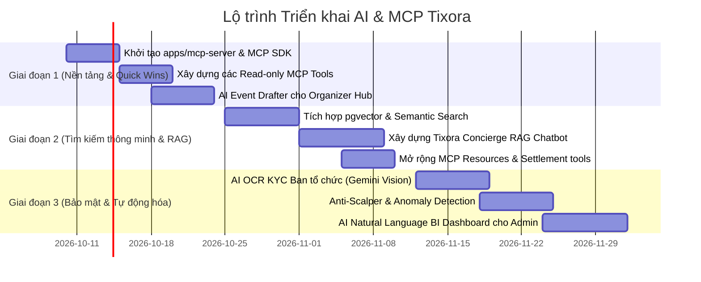

# 🤖 Kế Hoạch Triển Khai Toàn Diện: AI & Model Context Protocol (MCP) — Tixora

> **Phiên bản:** 1.0  
> **Trạng thái:** Bản thảo kế hoạch kỹ thuật (Engineering Master Plan)  
> **Dự án:** Tixora — High-concurrency Event Ticketing & Management Platform  
> **Mục tiêu:** Biến Tixora thành nền tảng bán vé thế hệ mới có khả năng tương tác trực tiếp với các mô hình ngôn ngữ lớn (LLM) và các AI Client (Claude Desktop, Cursor, Antigravity, Telegram/Discord Agents) thông qua chuẩn **Model Context Protocol (MCP)** và hệ sinh thái **Google Gemini AI**.

---

## 1. Tầm Nhìn & Kiến Trúc Tổng Thể

```mermaid
flowchart TB
    subgraph ExternalClients ["AI Clients & External Hosts"]
        Claude["Claude Desktop / Cursor"]
        IDEAgent["Antigravity / Coding Agents"]
        ChatbotHost["Customer Support Agents / Bots"]
    end

    subgraph MCPLayer ["Tixora MCP Gateway (apps/mcp-server)"]
        Transport["Stdio & SSE Transport"]
        Protocol["@modelcontextprotocol/sdk"]
        
        subgraph MCPRegistry ["MCP Registry"]
            Tools["MCP Tools (search, reserve, revenue, verify)"]
            Resources["MCP Resources (tixora://concerts, tixora://venues)"]
            Prompts["MCP Prompts (event_audit, settlement_summary)"]
        end
        
        SecurityGate["Auth & Scope Guard (API Keys / Scopes)"]
    end

    subgraph BackendAPI ["Tixora Core API (apps/backend-api)"]
        RestGateway["REST Endpoints (/catalog, /organizer, /revenue, /checkin)"]
        
        subgraph AIServices ["AI Engine Subsystem"]
            GeminiLLM["Gemini 1.5 Flash / Pro (LlmService)"]
            Embeddings["Gemini Embedding 004"]
            OCRService["Gemini Multimodal Vision (KYC & Ticket OCR)"]
            AnomalyDetector["Anti-Scalper & Bot Detector"]
        end

        subgraph CoreServices ["Core Ticketing Engine"]
            CatalogSvc["Catalog & Venue Service"]
            TicketingSvc["Ticketing Service (Atomic Redis Lua)"]
            RevenueSvc["Admin & Organizer Revenue Services"]
            CheckinSvc["Checkin & Gate Service"]
        end
    end

    subgraph DataTier ["Data & Infrastructure"]
        Postgres[("PostgreSQL (pgvector enabled)")]
        RedisDB[("Redis (Inventory Locks & Caches)")]
        RMQ[("RabbitMQ Background Job Queues")]
    end

    ExternalClients <-->|MCP Protocol (JSON-RPC 2.0)| Transport
    Transport <--> Protocol
    Protocol <--> SecurityGate
    SecurityGate <--> MCPRegistry
    MCPRegistry -->|HTTP / Internal Client| RestGateway

    RestGateway --> CoreServices
    RestGateway --> AIServices
    AIServices --> RMQ
    CoreServices --> Postgres
    CoreServices --> RedisDB
    AIServices --> Postgres
```

---

## 2. Phân Hệ Tính Năng AI (Trí Tuệ Nhân Tạo)

Tixora đã xây dựng nền móng ban đầu là `LlmService` (sử dụng Google Gemini qua RabbitMQ để trích xuất tiểu sử nghệ sĩ từ PDF/văn bản). Kế hoạch mở rộng AI sẽ tập trung vào 3 trụ cột người dùng:

### 2.1. Dành cho Khán Giả (User / Fan)
| Tính năng | Nghiệp vụ giải quyết | Giải pháp kỹ thuật |
| :--- | :--- | :--- |
| **1. Semantic Search (Tìm kiếm ngữ nghĩa)** | Khán giả tìm kiếm bằng văn ngữ tự nhiên: *"Show acoustic cuối tuần ở Q1 dưới 500k"*, *"Concert có Phùng Khánh Linh hát ballad"*. | Kích hoạt extension `pgvector` trên PostgreSQL, vector hóa tên, mô tả, nghệ sĩ và thể loại qua Gemini Embedding `text-embedding-004`. |
| **2. Tixora Concierge (Trợ lý hỗ trợ 24/7)** | Hỗ trợ giải đáp chính sách vé, cách tải vé offline, quy định độ tuổi, sơ đồ khán phòng và hướng dẫn di chuyển đến cổng soát vé. | RAG (Retrieval-Augmented Generation) kết hợp Gemini 1.5 Flash, chỉ dẫn theo dữ liệu sự kiện thời gian thực. |
| **3. Smart Ticket Digest (Cẩm nang trước sự kiện)** | Gửi thông báo tóm tắt 24h trước giờ diễn: thời gian mở cổng khuyến nghị, dự báo thời tiết, lưu ý vật dụng cấm và vị trí gửi xe. | Cron worker job tự động tổng hợp qua Gemini và dispatch qua `NotificationModule`. |

### 2.2. Dành cho Ban Tổ Chức (Organizer)
| Tính năng | Nghiệp vụ giải quyết | Giải pháp kỹ thuật |
| :--- | :--- | :--- |
| **1. Event Copilot (Tự động soạn sự kiện)** | Điền nhanh thông tin sự kiện từ tên tour hoặc ảnh poster: sinh mô tả chuyên nghiệp, gợi ý dàn line-up, danh sách FAQ và quy định vé. | Tích hợp nút *"Tạo bằng AI"* trong `CreateEventModal`, gọi `POST /organizer/ai/generate-event-draft`. |
| **2. Đề xuất giá vé & Phân bổ hạng vé** | Gợi ý mức giá hợp lý và tỷ lệ số lượng ghế theo từng hạng vé dựa trên thể loại âm nhạc, độ nổi tiếng nghệ sĩ và sức chứa khán phòng (`capacity`). | Heuristic ML kết hợp dữ liệu lịch sử concert tương đương trên sàn. |
| **3. Báo cáo phân tích tốc độ bán (Sales Velocity)** | Đưa ra nhận xét tự động về biểu đồ doanh thu: hạng vé nào bán chạy/bán chậm, thời điểm đỉnh điểm giao dịch, gợi ý chiến dịch flash sale. | Gemini 1.5 Flash phân tích dữ liệu mảng `trendItems` từ `OrganizerRevenueService`. |

### 2.3. Dành cho Quản Trị Viên (Admin)
| Tính năng | Nghiệp vụ giải quyết | Giải pháp kỹ thuật |
| :--- | :--- | :--- |
| **1. Thẩm định hồ sơ BTC bằng OCR (KYC)** | Tự động đọc giấy phép kinh doanh, mã số thuế, căn cước người đại diện, đối soát tính hợp lệ trước khi Admin duyệt hồ sơ. | Gemini 1.5 Flash Multimodal Vision xử lý ảnh đính kèm trong `OrganizerProfile`. |
| **2. Chống đầu cơ & Bot gom vé (Anti-Scalper)** | Phát hiện hành vi bot gom vé, cày transaction, bất thường về IP/thiết bị trước khi đơn thanh toán hoàn tất. | Redis rate-limiter rules kết hợp Anomaly Detection chấm điểm rủi ro giao dịch. |
| **3. Natural Language BI (Báo cáo điều hành qua ngôn ngữ tự nhiên)** | Admin có thể hỏi: *"Doanh thu tuần này của Spacespeakers ra sao?", "Sự kiện nào đang có tỷ lệ check-in dưới 50%?"* và nhận kết quả tức thì. | Text-to-SQL an toàn với Read-only Replica Database. |

---

## 3. Kiến Trúc Model Context Protocol (MCP) Server

Tixora xây dựng một MCP Server độc lập tại `apps/mcp-server` (hoặc `packages/mcp-server`), sử dụng gói chuẩn `@modelcontextprotocol/sdk`.

### 3.1. Danh mục MCP Tools (Công cụ thực thi)

| Tên Tool | Tham số đầu vào | Mô tả chức năng | Quyền hạn yêu cầu |
| :--- | :--- | :--- | :--- |
| `tixora_search_concerts` | `keyword?: string, city?: string, category?: string, limit?: number` | Tìm kiếm danh sách sự kiện đang mở bán trên sàn. | `public` |
| `tixora_get_concert_details` | `concertId: string` | Xem chi tiết thông tin, sơ đồ chỗ ngồi, nghệ sĩ, lịch biểu diễn. | `public` |
| `tixora_check_inventory` | `concertId: string, categoryId?: string` | Kiểm tra tồn kho thời gian thực từng hạng vé từ Redis Cache. | `public` |
| `tixora_get_organizer_revenue` | `organizerId: string, from?: string, to?: string, groupBy?: string` | Lấy báo cáo GMV, thực nhận, số đơn, vé bán và số dư Escrow. | `organizer` |
| `tixora_verify_ticket_qr` | `qrCodeHash: string` | Kiểm tra tính hợp lệ của vé, cổng soát vé và lịch sử quét. | `checker` / `admin` |
| `tixora_get_system_health` | Không có | Kiểm tra tình trạng kết nối PostgreSQL, Redis, RabbitMQ. | `admin` |
| `tixora_hold_ticket_intent` | `concertId: string, categoryId: string, quantity: number` | Khởi tạo phiên giữ vé tạm thời và trả về link thanh toán an toàn. | `user` (yêu cầu xác thực) |

### 3.2. Danh mục MCP Resources (Dữ liệu thời gian thực)
- `tixora://concerts/{id}`: Trả về trạng thái thời gian thực của sự kiện và danh sách hạng vé.
- `tixora://venues/{id}`: Trả về sơ đồ khán phòng và tọa độ các Zone ghế.
- `tixora://settlements/{organizerId}`: Trả về tình trạng thanh quyết toán và số dư khả dụng của đối tác.

### 3.3. Cơ chế Bảo mật MCP
1. **Phân quyền Scopes**: Mỗi AI Host kết nối qua MCP phải cung cấp API Key định danh kèm Scope (`tixora:read`, `tixora:organizer`, `tixora:admin`).
2. **Nguyên tắc Read-only mặc định**: Các công cụ đọc dữ liệu được tự do thực thi; các công cụ có tác động tài chính (đặt vé, giải ngân) bắt buộc phải có bước xác nhận từ con người (**Human-in-the-loop**).

---

## 4. Lộ Trình Triển Khai (Roadmap 3 Giai Đoạn)



### Chi tiết từng giai đoạn:

#### 🔹 Giai Đoạn 1: Quick Wins & MCP Foundation (1 – 2 Tuần)
1. **Khởi tạo `apps/mcp-server`**:
   - Sử dụng `@modelcontextprotocol/sdk`.
   - Kết nối với REST API hoặc Direct Service của backend qua HTTP/gRPC.
   - Triển khai 3 tool: `tixora_search_concerts`, `tixora_get_concert_details`, `tixora_check_inventory`.
   - Cung cấp file hướng dẫn kết nối MCP vào Claude Desktop / Cursor.
2. **AI Event Assistant cho Organizer (`web-app`)**:
   - Thêm nút *"Gợi ý nội dung bằng AI"* tại modal tạo sự kiện của Organizer.
   - Endpoint backend: `POST /organizer/ai/draft-event` tận dụng `LlmService` hiện có.

#### 🔹 Giai Đoạn 2: Semantic Search & AI Support (2 – 3 Tuần)
1. **Semantic Search với `pgvector`**:
   - Migration bảng cơ sở dữ liệu để thêm cột `embedding vector(768)`.
   - Tự động sinh embedding khi Concert được tạo hoặc xuất bản (`PUBLISHED`).
   - Cung cấp API tìm kiếm ngữ nghĩa cho khán giả trên `web-app`.
2. **Tixora Concierge**:
   - Chatbot hỗ trợ thông minh giải đáp thắc mắc người xem trước khi mua vé.

#### 🔹 Giai Đoạn 3: Quản Trị Thông Minh & Giám Sát Tự Hành (3 – 4 Tuần)
1. **AI OCR Thẩm định Ban tổ chức**:
   - Tự động đọc và đối soát Giấy phép kinh doanh, CCCD người đại diện, MST để phát hiện hồ sơ giả mạo trước khi Admin bấm duyệt.
2. **Anti-Scalper & Bot Detection**:
   - Chấm điểm hành vi mua vé để ngăn chặn nạn vé chợ đen.
3. **Natural Language BI**:
   - Trợ lý hỏi đáp số liệu doanh thu và vận hành cho Admin.

---

## 5. Quy Trình Kiểm Thử (Testing Strategy)

Trước khi kích hoạt các tính năng trên môi trường production, toàn bộ các module phải vượt qua bộ kiểm thử nghiêm ngặt:

1. **Unit Testing (`node:test`)**:
   - Kiểm thử toàn bộ hàm gọi LLM với mock mode (`LLM_MOCK_ENABLED=true`).
   - Đảm bảo timeout, retry logic và fallback prompt xử lý đúng khi Gemini gặp sự cố.
2. **MCP Inspector Testing**:
   - Sử dụng công cụ chính thức `@modelcontextprotocol/inspector` để kiểm thử tương tác JSON-RPC, kiểm tra schema tham số của từng tool.
3. **E2E Integration Testing (Playwright)**:
   - Kiểm thử tương tác nút AI tạo mô tả sự kiện trên giao diện Organizer Hub.
   - Kiểm thử luồng chat của Concierge chatbot trên `web-app`.
4. **Security & Data Isolation Testing**:
   - Đảm bảo MCP Tools khi truy vấn số liệu doanh thu bắt buộc phải lọc theo đúng tenant (`organizer_id`), ngăn chặn rò rỉ chéo dữ liệu giữa các ban tổ chức.
