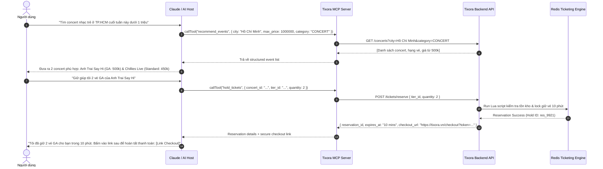
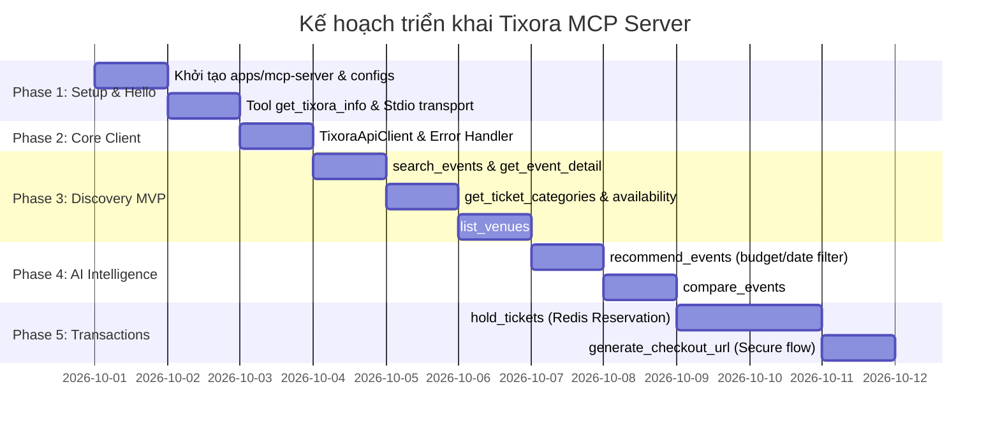

# Tixora Model Context Protocol (MCP) Server — Kiến Trúc & Kế Hoạch Triển Khai

> **Mục tiêu chiến lược:** Biến Tixora từ nền tảng bán vé truyền thống thành một **AI-Accessible Ticketing Platform**, cho phép các AI Assistant (Claude, Cursor, ChatGPT, Antigravity) chủ động tra cứu sự kiện, tư vấn vé theo ngân sách và khởi tạo phiên đặt vé an toàn.

---

## 1. Tổng Quan Kiến Trúc (Architecture Blueprint)

### 1.1. Sơ đồ tương tác tổng thể

```mermaid
flowchart TD
    subgraph AI_Host ["AI Host Environment"]
        Claude["Claude Desktop / Cursor / Web Agent"]
        MCPClient["MCP Client Engine"]
        Claude <--> MCPClient
    end

    subgraph MCP_Server ["apps/mcp-server (Node.js / TypeScript)"]
        Transport["Stdio Transport (Local) / SSE Transport (Remote)"]
        MCPSDK["@modelcontextprotocol/sdk"]
        
        subgraph ToolSet ["Tool Registry"]
            T_Info["get_tixora_info"]
            T_Search["search_events"]
            T_Detail["get_event_detail"]
            T_Avail["check_availability"]
            T_Compare["compare_events"]
            T_Recom["recommend_events"]
            T_Hold["hold_tickets (Phase 5)"]
        end

        APIClient["Tixora API Client (Fetch / Axios)"]
        
        Transport <--> MCPSDK
        MCPSDK --> ToolSet
        ToolSet --> APIClient
    end

    subgraph Backend ["apps/backend-api (NestJS Core)"]
        Gateway["REST API Endpoints"]
        ConcertSvc["ConcertService (Catalog)"]
        VenueSvc["VenueService (Locations)"]
        TicketingSvc["TicketingService (Booking)"]
        Redis[(Redis: Inventory & Lua Locks)]
        DB[(PostgreSQL Database)]

        Gateway --> ConcertSvc
        Gateway --> VenueSvc
        Gateway --> TicketingSvc
        ConcertSvc --> DB
        VenueSvc --> DB
        TicketingSvc --> Redis
        TicketingSvc --> DB
    end

    MCPClient <-->|JSON-RPC 2.0 (stdio)| Transport
    APIClient -->|HTTP / JSON| Gateway
```

---

### 1.2. Quyết định kỹ thuật cốt lõi (Design Decisions)

1. **Vị trí Monorepo:** Đặt tại `apps/mcp-server` để tận dụng TypeScript tooling, pnpm workspace chung với toàn bộ hệ thống Tixora.
2. **Giao thức kết nối Backend:**
   - **KHÔNG** kết nối trực tiếp PostgreSQL DB: Tránh làm vỡ logic concurrency (bán vượt vé/oversell) được kiểm soát nghiêm ngặt bằng Redis Lua script trong `TicketingService`.
   - **GỌI HTTP API:** `apps/mcp-server` giao tiếp với `apps/backend-api` qua HTTP Client. Nhờ đó, lập trình viên hay người dùng có thể chạy MCP Server cục bộ trỏ tới Production (`https://tixora-api-xkf5.onrender.com`) hoặc Dev (`http://localhost:8000`) mà không cần cài đặt DB/Redis ở máy cá nhân.
3. **Transport Protocol:**
   - **`stdio`:** Mặc định cho Claude Desktop, Cursor, Antigravity (giao tiếp qua standard input/output).
   - **`sse` (Server-Sent Events):** Dành cho remote deployment nếu cần host MCP lên Cloud trong tương lai.

---

## 2. Kịch Bản Tương Tác Của Người Dùng (Sequence Flow)



---

## 3. Bản Đồ Công Việc & Lộ Trình Triển Khai (Roadmap WBS)



---

### Phase 1: Khởi Tạo Dự Án & Tool Đầu Tiên (Hello World)
*Thời gian ước tính: ~20 - 30 phút*

- [ ] **1.1. Setup Package:**
  - Tạo thư mục `apps/mcp-server/`.
  - Khởi tạo `package.json` với tên `@tixora/mcp-server`.
  - Cài đặt dependencies:
    ```bash
    pnpm add @modelcontextprotocol/sdk zod dotenv
    pnpm add -D typescript @types/node tsx
    ```
- [ ] **1.2. Khởi tạo MCP Server Instance:**
  - Viết `src/index.ts` khởi tạo `McpServer({ name: "tixora-mcp", version: "1.0.0" })`.
  - Kết nối với `StdioServerTransport`.
- [ ] **1.3. Viết Tool kiểm tra `get_tixora_info`:**
  - Trả về thông tin giới thiệu Tixora, phiên bản API, các thành phố đang mở bán vé.
- [ ] **1.4. Kiểm thử với MCP Inspector hoặc Claude Desktop:**
  - Chạy `npx @modelcontextprotocol/inspector tsx src/index.ts` để kiểm tra tool gọi thành công.

---

### Phase 2: Xây Dựng Tixora API Client
*Thời gian ước tính: ~20 phút*

- [ ] **2.1. Module `TixoraApiClient` (`src/client/tixora-client.ts`):**
  - Đọc `TIXORA_API_BASE_URL` từ biến môi trường (mặc định `http://localhost:8000`).
  - Cung cấp các hàm gọi API chuẩn:
    - `getConcerts(params)`
    - `getConcertById(id)`
    - `getVenues()`
- [ ] **2.2. Xử lý lỗi an toàn (Resilient Error Handling):**
  - Bắt các lỗi HTTP 404, 500, network timeout và chuyển hoá thành thông báo lỗi thân thiện để LLM tự giải thích cho người dùng thay vì crash tiến trình.

---

### Phase 3: Bộ Công Cụ Tra Cứu Sự Kiện (Discovery Core MVP)
*Thời gian ước tính: ~40 - 50 phút*

- [ ] **3.1. `search_events`:**
  - **Schema:**
    ```typescript
    {
      query?: z.string().describe("Từ khóa tìm kiếm (tên ca sĩ, tên concert)"),
      city?: z.string().describe("Thành phố (ví dụ: Hà Nội, TP. Hồ Chí Minh)"),
      category?: z.enum(["CONCERT", "FESTIVAL", "THEATER"]).describe("Phân loại sự kiện"),
      limit?: z.number().default(10).describe("Số lượng kết quả tối đa")
    }
    ```
- [ ] **3.2. `get_event_detail`:**
  - Trả về toàn bộ thông tin chi tiết của 1 sự kiện: nghệ sĩ tham gia, thời gian bắt đầu, sơ đồ chỗ ngồi, địa chỉ diễn ra.
- [ ] **3.3. `get_ticket_categories`:**
  - Trả về danh sách hạng vé (`VIP`, `GA`, `Early Bird`), giá tiền từng hạng, số lượng vé tối đa được mua trên mỗi tài khoản.
- [ ] **3.4. `check_availability`:**
  - Kiểm tra xem sự kiện còn vé không, hạng nào còn vé (`AVAILABLE`), hạng nào đã cháy vé (`SOLD_OUT`).
- [ ] **3.5. `list_venues`:**
  - Tra cứu danh sách sân vận động / nhà hát, sức chứa và địa chỉ.

---

### Phase 4: Tính Năng Khám Phá Thông Minh (AI Intelligence Tools)
*Thời gian ước tính: ~30 - 45 phút*

- [ ] **4.1. `recommend_events`:**
  - Nhận vào: Ngân sách tối đa (`max_budget`), thời gian dự kiến (ví dụ: `next_weekend`), sở thích âm nhạc.
  - Phân tích và chọn lọc ra các show diễn có hạng vé nằm trong ngân sách cho phép.
- [ ] **4.2. `compare_events`:**
  - Nhận vào danh sách `event_ids`.
  - Trả về bảng đối sánh có cấu trúc: Tên show, Nghệ sĩ biểu diễn, Mức giá rẻ nhất / đắt nhất, Địa điểm, Tình trạng vé.

---

### Phase 5: Luồng Đặt Vé & Thanh Toán An Toàn (Transaction Workflow)
*Thời gian ước tính: ~1 - 2 ngày (Làm sau khi MVP ổn định)*

> [!CAUTION]
> **Nguyên tắc an toàn (Security Principle):**
> AI không được tự động rút tiền hoặc trừ thẻ ngân hàng của người dùng. Luồng giao dịch phải luôn áp dụng cơ chế **Human-In-The-Loop**.

- [ ] **5.1. Authentication Header Support:**
  - Cho phép người dùng truyền User Bearer Token hoặc API Key thông qua MCP client/environment.
- [ ] **5.2. `hold_tickets`:**
  - Gọi endpoint giữ vé tạm thời trên Redis Lua Engine (`TicketingService.reserveTicket`).
  - Vé được giữ trong 10 phút để người dùng hoàn tất thanh toán.
- [ ] **5.3. `generate_checkout_url`:**
  - Sinh đường dẫn thanh toán an toàn tới giao diện Web App: `https://tixora.vn/checkout?session=...`.
  - AI gửi link này cho người dùng tự click vào xác nhận và thanh toán qua VNPay/MoMo/ZaloPay.
- [ ] **5.4. `get_order_status`:**
  - Người dùng có thể hỏi: *"Vé của tôi đã thanh toán thành công chưa?"*. AI kiểm tra trạng thái vé và trả về thông tin xác nhận.

---

## 4. Hướng Dẫn Cấu Hình Kết Nối Với Các AI Client

### 4.1. Cấu hình Claude Desktop
Tạo hoặc mở file `%APPDATA%\Claude\claude_desktop_config.json` (trên Windows) hoặc `~/Library/Application Support/Claude/claude_desktop_config.json` (trên macOS):

```json
{
  "mcpServers": {
    "tixora": {
      "command": "node",
      "args": [
        "d:/document/projects/persional-projects/Tixora/apps/mcp-server/dist/index.js"
      ],
      "env": {
        "TIXORA_API_BASE_URL": "http://localhost:8000"
      }
    }
  }
}
```

### 4.2. Cấu hình Cursor / Windsurf
Tạo file `.cursor/mcp.json` tại thư mục gốc của project:

```json
{
  "mcpServers": {
    "tixora": {
      "command": "node",
      "args": [
        "./apps/mcp-server/dist/index.js"
      ],
      "env": {
        "TIXORA_API_BASE_URL": "http://localhost:8000"
      }
    }
  }
}
```

---

## 5. Bảng Checklist Tiến Độ Thực Tế (Execution Checklist)

| Phase | Hạng mục công việc | Trạng thái | Ghi chú kỹ thuật |
| :--- | :--- | :---: | :--- |
| **P1** | Tạo thư mục `apps/mcp-server` & cài đặt `@modelcontextprotocol/sdk` | ⬜ Chưa làm | Cần config `tsconfig.json` module resolution |
| **P1** | Viết `src/index.ts` và tool `get_tixora_info` | ⬜ Chưa làm | Dùng `StdioServerTransport` |
| **P2** | Xây dựng `TixoraApiClient` | ⬜ Chưa làm | Bọc native `fetch` hoặc `axios` |
| **P3** | Tool `search_events` | ⬜ Chưa làm | Tận dụng `GET /concerts` |
| **P3** | Tool `get_event_detail` | ⬜ Chưa làm | Tận dụng `GET /concerts/:id` |
| **P3** | Tool `check_availability` | ⬜ Chưa làm | Phân tích `ticketTiers` và số ghế còn |
| **P3** | Tool `list_venues` | ⬜ Chưa làm | Tận dụng `GET /venues` |
| **P4** | Tool `recommend_events` & `compare_events` | ⬜ Chưa làm | Logic tổng hợp dữ liệu cho LLM |
| **P5** | Tool `hold_tickets` & `generate_checkout_url` | ⬜ Đang chờ | Yêu cầu xác thực tài khoản & Redis Lock |
