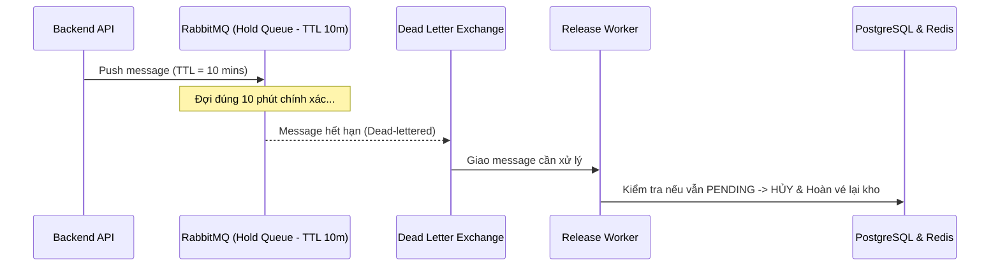
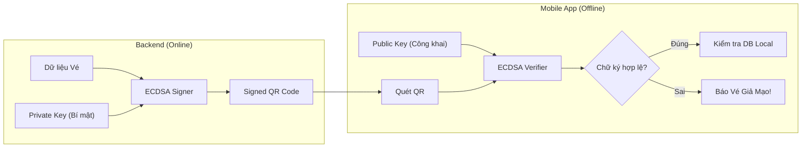

# ĐỀ XUẤT NÂNG CẤP HỆ THỐNG TICKETBOX (UPGRADE PROPOSALS)
## KIẾN TRÚC, HIỆU NĂNG, BẢO MẬT & TRẢI NGHIỆM NGƯỜI DÙNG

> **Tài liệu:** Đề xuất nâng cấp kiến trúc & tính năng TicketBox  
> **Tác giả:** Antigravity AI & Technical Architecture Team  
> **Mục tiêu:** Rà soát các điểm hạn chế trong kiến trúc hiện tại, đề xuất các giải pháp kỹ thuật nâng cao và vạch ra lộ trình hiện đại hóa hệ thống để sẵn sàng chịu tải hàng trăm nghìn người dùng đồng thời (Production-grade).

---

## MỤC LỤC
1. [Đánh Giá Hiện Trạng & Phân Tích Khoảng Trống (Gap Analysis)](#1-đánh-giá-hiện-trạng--phân-tích-khoảng-trống-gap-analysis)
2. [Chi Tiết 9 Đề Xuất Nâng Cấp Trọng Yếu](#2-chi-tiết-9-đề-xuất-nâng-cấp-trọng-yếu)
   - [Đề xuất 1: Giải Phóng Vé Chính Xác Bằng RabbitMQ Delayed Message / DLX](#đề-xuất-1-giải-phóng-vé-chính-xác-bằng-rabbitmq-delayed-message--dlx)
   - [Đề xuất 2: Cập Nhật Trạng Thái Thời Gian Thực Bằng WebSocket / SSE](#đề-xuất-2-cập-nhật-trạng-thái-thời-gian-thực-bằng-websocket--sse)
   - [Đề xuất 3: Bản Đồ Chỗ Ngồi Tương Tác Trực Quan (Interactive SVG Seatmap)](#đề-xuất-3-bản-đồ-chỗ-ngồi-tương-tác-trực-quan-interactive-svg-seatmap)
   - [Đề xuất 4: Chữ Ký Số Bất Đối Xứng Cho QR Code (ECDSA / Ed25519 PKI)](#đề-xuất-4-chữ-ký-số-bất-đối-xứng-cho-qr-code-ecdsa--ed25519-pki)
   - [Đề xuất 5: Phòng Chờ Ảo (Virtual Waiting Room / Queue-it Pattern)](#đề-xuất-5-phòng-chờ-ảo-virtual-waiting-room--queue-it-pattern)
   - [Đề xuất 6: Đa Cổng Thanh Toán & Quản Lý Hoàn Tiền (Multi-Gateway & Refund Engine)](#đề-xuất-6-đa-cổng-thanh-toán--quản-lý-hoàn-tiền-multi-gateway--refund-engine)
   - [Đề xuất 7: Tích Hợp Apple Wallet (.pkpass) & Google Wallet](#đề-xuất-7-tích-hợp-apple-wallet-pkpass--google-wallet)
   - [Đề xuất 8: Nâng Cấp Trải Nghiệm Ứng Dụng Soát Vé (Mobile Checker 2.0)](#đề-xuất-8-nâng-cấp-trải-nghiệm-ứng-dụng-soát-vé-mobile-checker-20)
   - [Đề xuất 9: Hệ Thống Giám Sát & Tracing Phân Tán (Observability & APM)](#đề-xuất-9-hệ-thống-giám-sát--tracing-phân-tán-observability--apm)
3. [Ma Trận Đánh Giá Ưu Tiên (Impact vs Effort Matrix)](#3-ma-trận-đánh-giá-ưu-tiên-impact-vs-effort-matrix)
4. [Lộ Trình Triển Khai Thực Tế (Implementation Roadmap)](#4-lộ-trình-triển-khai-thực-tế-implementation-roadmap)

---

## 1. Đánh Giá Hiện Trạng & Phân Tích Khoảng Trống (Gap Analysis)

TicketBox hiện tại đã xây dựng được một nền móng rất vững chắc với kiến trúc **Modular Monolith + Event-Driven**:
- **Điểm mạnh đã đạt được:**
  1. Sử dụng **Redis Lua Script** xử lý nguyên tử kiểm tra tồn kho & trừ vé chống Oversell cực kỳ hiệu quả dưới tải cao (được chứng minh qua script k6).
  2. Rate Limiting theo thuật toán **Token Bucket** chặn spam request ở tầng NestJS Guard.
  3. Cơ chế **Idempotency-Key** bảo vệ chống trừ tiền kép (Double Charging).
  4. Phân luồng cổng soát vé (**Gate Segregation**) giúp ứng dụng di động có thể soát vé ngoại tuyến mà không bị xung đột.
  5. UI hiện đại với Next.js 16 App Router, Tailwind CSS v4 và Framer Motion.

- **Các khoảng trống và hạn chế kỹ thuật cần nâng cấp:**

| Thành phần | Hiện trạng hiện tại | Hạn chế / Rủi ro tiềm ẩn | Hướng giải quyết đề xuất |
| :--- | :--- | :--- | :--- |
| **Order Expiration** | Dùng Cron Job quét định kỳ tìm `Order` quá hạn để hủy vé | Trễ từ 1 - 5 phút; quét toàn bộ bảng DB gây I/O cao khi số lượng đơn lớn | RabbitMQ Dead Letter Exchange (DLX) hoặc Redis Keyspace Notifications |
| **Data Synchronization** | Polling HTTP hoặc người dùng phải F5 để xem số vé còn lại | Trải nghiệm người dùng bị động; gây tải lãng phí cho Backend | WebSocket / SSE (Server-Sent Events) đẩy realtime |
| **Sơ đồ chỗ ngồi** | Hiển thị ảnh SVG tĩnh, người dùng chọn mua theo số lượng hạng vé | Khán giả không được chọn vị trí ghế cụ thể (A1, A2...) như rạp chiếu phim hay concert lớn | Interactive SVG Seatmap với tọa độ ghế động |
| **Bảo mật Offline QR** | Lưu `qr_code_hash` dạng băm SHA256/Salt | Mobile App phải tải toàn bộ danh sách hash về máy; rủi ro rò rỉ dữ liệu hoặc giả mạo hash | Ký điện tử QR bằng ECDSA / Ed25519 (Asymmetric Crypto) |
| **Chống Nghẽn Mở Bán** | Token Bucket Guard (drop request với mã 429) | Khi có 80.000 người vào cùng lúc, hàng chục nghìn người bị văng lỗi 429 gây ức chế | Virtual Waiting Room (Phòng chờ ảo xếp hàng công bằng) |
| **Thanh toán** | Tích hợp PayOS đơn kênh | Phụ thuộc vào 1 cổng; chưa có luồng hủy vé/hoàn tiền tự động | Đa cổng thanh toán (VNPay, MoMo) & Refund Workflow |
| **Mobile App Storage** | AsyncStorage cơ bản | Chậm khi danh sách vé lên đến 10.000 - 50.000 bản ghi; không hỗ trợ transaction ACID local | Nâng cấp sang SQLite (Expo SQLite / WatermelonDB) |
| **Giám sát hệ thống** | Console logs truyền thống | Thiếu metric trực quan về Latency p99, Queue Depth, DB Connection Pool | Prometheus + Grafana Dashboards + Sentry APM |

---

## 2. Chi Tiết 9 Đề Xuất Nâng Cấp Trọng Yếu

### Đề xuất 1: Giải Phóng Vé Chính Xác Bằng RabbitMQ Delayed Message / DLX

#### Bối cảnh & Vấn đề
Hiện tại, khi người dùng giữ chỗ vé, đơn hàng có thời gian sống 10 - 15 phút. Nếu người dùng không thanh toán, hệ thống phải giải phóng vé trả lại kho. Hiện tại cơ chế này phụ thuộc vào Cron job định kỳ. Nhược điểm: Nếu Cron chạy mỗi 2 phút, đơn hàng hết hạn lúc phút thứ 10:01 sẽ phải chờ đến phút thứ 12:00 mới được giải phóng (lệch gần 2 phút), làm lãng phí cơ hội mua vé của khán giả khác.

#### Giải pháp Kỹ thuật
Sử dụng **RabbitMQ Dead Letter Exchange (DLX)** hoặc plugin `rabbitmq_delayed_message_exchange`:
1. Khi đơn hàng được tạo: Đẩy một message `{ order_id, category_id, quantity }` vào hàng đợi `orders.holding.queue` với cấu hình `x-message-ttl = 600000` (10 phút).
2. Hàng đợi này không có consumer trực tiếp.
3. Sau đúng 10 phút, message tự động hết hạn và bị đẩy sang Dead Letter Exchange `orders.expired.exchange` -> đi vào `orders.release.queue`.
4. Worker lắng nghe `orders.release.queue`, kiểm tra nếu đơn hàng vẫn ở trạng thái `PENDING`:
   - Chuyển trạng thái Order sang `CANCELLED`.
   - Gọi Redis Lua script để cộng ngược số lượng vé vào kho nguyên tử:
     ```lua
     redis.call('HINCRBY', KEYS[1], 'available_quantity', ARGV[1])
     ```
   - Bắn thông báo giải phóng vé tới Web frontend.



---

### Đề xuất 2: Cập Nhật Trạng Thái Thời Gian Thực Bằng WebSocket / SSE

#### Bối cảnh & Vấn đề
Trong những phút đầu mở bán vé concert nóng, số lượng vé thay đổi liên tục từng giây. Nếu khán giả không biết vé đã hết, họ tiếp tục bấm chọn và gặp thông báo lỗi, tạo ra trải nghiệm không tốt.

#### Giải pháp Kỹ thuật
Tích hợp **Server-Sent Events (SSE)** hoặc **WebSocket (Socket.io/NestJS Gateway)**:
- **Kênh 1: Live Ticket Availability:**
  - Khi có bất kỳ event `TicketReserved` hoặc `TicketReleased` từ Redis/RabbitMQ: Server broadcast số lượng vé còn lại của từng hạng vé tới phòng `concert_{concertId}`.
  - Phía Web App (Next.js): Cập nhật badge số vé còn lại tức thì với animation chuyển số mượt mà (Framer Motion).
- **Kênh 2: Order Payment Status:**
  - Tại trang thanh toán (`/checkout` hoặc `/orders/:id`), client kết nối tới phòng `order_{orderId}`.
  - Ngay khi Webhook PayOS xác nhận tiền về, server đẩy event `PaymentConfirmed` xuống. Giao diện người dùng lập tức nhảy sang màn hình "Thanh toán thành công" mà không cần bấm reload trang.

---

### Đề xuất 3: Bản Đồ Chỗ Ngồi Tương Tác Trực Quan (Interactive SVG Seatmap)

#### Bối cảnh & Vấn đề
Hiện tại, mô hình mới hỗ trợ bán vé theo **Hạng vé chung (General Admission / Tiered)**. Với các concert lớn, khán giả có nhu cầu **chọn từng ghế cụ thể** (hàng A, ghế số 12...).

#### Giải pháp Kỹ thuật
1. **Dữ liệu sơ đồ ghế (Seat Grid Schema):**
   - Mở rộng CSDL với bảng `seats`:
     ```sql
     CREATE TABLE seats (
       id UUID PRIMARY KEY,
       category_id UUID REFERENCES ticket_categories(id),
       section VARCHAR(50),  -- Khán đài A, Sân khấu...
       row VARCHAR(10),      -- Hàng A, B, C...
       seat_number INT,      -- Ghế số 1, 2...
       svg_element_id VARCHAR(100), -- ID tương ứng trong file SVG
       status VARCHAR(20)    -- AVAILABLE, HELD, BOOKED
     );
     ```
2. **Frontend Interactive SVG Renderer:**
   - Dùng file SVG vector có gắn thuộc tính `id` cho từng ghế (ví dụ `id="seat-A-12"`).
   - Component Next.js đọc SVG, render với khả năng Zoom / Pan (sử dụng thư viện `react-zoom-pan-pinch`).
   - Ghế trống: Màu xanh lá.
   - Ghế đang có người giữ chỗ: Màu cam (kèm tooltip "Đang có người giữ").
   - Ghế đã bán: Màu xám đậm (disabled).
   - Ghế người dùng đang chọn: Màu vàng phát sáng (Glow effect).

---

### Đề xuất 4: Chữ Ký Số Bất Đối Xứng Cho QR Code (ECDSA / Ed25519 PKI)

#### Bối cảnh & Vấn đề
Hiện tại, cơ chế soát vé offline dựa vào việc tải trước một danh sách `qr_code_hash`. Rủi ro:
- Nếu danh sách vé tại một cổng lên tới 20.000 vé, file tải về nặng.
- Nếu ai đó biết được thuật toán băm và salt, họ có thể sinh QR giả mạo.

#### Giải pháp Kỹ thuật: Hạ Tầng Khóa Công Khai (Public Key Infrastructure - PKI)
1. **Tạo Cặp Khóa:**
   - Backend nắm giữ **Private Key** (Bảo mật tuyệt đối trên server hoặc AWS KMS).
   - Mobile App chỉ cần lưu duy nhất một chuỗi **Public Key** nhỏ gọn.
2. **Ký Số Khi Phát Hành Vé (Issuance):**
   - Khi thanh toán thành công, Backend tạo payload vé:
     ```json
     {
       "tid": "ticket-uuid",
       "cid": "concert-uuid",
       "gate": 1,
       "cat": "S-VIP"
     }
     ```
   - Dùng Private Key ký ECDSA (thuật toán P-256 hoặc Ed25519) lên payload, tạo ra chuỗi Signature:
     $$\text{QR Payload} = \text{Base64Url}(\text{Data}) + "." + \text{Base64Url}(\text{Signature})$$
3. **Xác Thực Ngoại Tuyến Siêu Tốc (Offline Verification):**
   - Mobile App khi quét QR: Dùng Public Key có sẵn để giải mã và kiểm tra chữ ký số bằng thuật toán mã hóa (chạy trong 2 mili-giây).
   - Nếu chữ ký hợp lệ: Chắc chắn 100% vé này do TicketBox phát hành (không thể làm giả dù kẻ gian biết rõ cấu trúc).
   - Sau đó app chỉ cần đối chiếu `tid` vào bảng SQLite local để kiểm tra xem vé này đã quét hay chưa.



---

### Đề xuất 5: Phòng Chờ Ảo (Virtual Waiting Room / Queue-it Pattern)

#### Bối cảnh & Vấn đề
Khi một nghệ sĩ đình đám mở bán vé, 50.000 - 100.000 người cùng nhấn F5 vào đúng 10:00:00. Nếu để tất cả cùng chạm vào hệ thống backend, Database sẽ quá tải, dù có Redis cũng sẽ gặp nghẽn mạng (Network I/O).

#### Giải pháp Kỹ thuật
Xây dựng lớp **Virtual Waiting Room** dựa trên Redis Sorted Set (`ZSET`):
1. Khi người dùng bấm "Mua vé" trong khung giờ cao điểm: Họ được chuyển vào trang Phòng chờ ảo.
2. Server cấp một mã xếp hàng với timestamp:
   ```bash
   ZADD waiting_room:concert_id <timestamp> <user_id>
   ```
3. Màn hình người dùng hiển thị:
   - "Vị trí của bạn trong hàng đợi: #1.450"
   - "Thời gian ước tính: 2 phút"
   - Thanh tiến trình chuyển động thời gian thực.
4. Một Background Worker giải phóng từng đợt (ví dụ 500 người mỗi 30 giây) bằng cách cấp một `Access-Token` có thời hạn 10 phút để người dùng chính thức bước vào màn hình chọn ghế.
5. Giải pháp này giúp bảo vệ hoàn toàn Core Engine của TicketBox, loại bỏ hiện tượng Crash server 100%.

---

### Đề xuất 6: Đa Cổng Thanh Toán & Quản Lý Hoàn Tiền (Multi-Gateway & Refund Engine)

#### Bối cảnh & Vấn đề
Hiện tại hệ thống chỉ tích hợp PayOS. Tại Việt Nam, nhiều người dùng ưa chuộng MoMo, ZaloPay, VNPay QR hoặc thẻ tín dụng quốc tế (Visa/Mastercard qua Stripe). Ngoài ra, chưa có cơ chế hoàn vé (Refund) khi có sự cố bất khả kháng.

#### Giải pháp Kỹ thuật
1. **Áp dụng Strategy Pattern cho Payment:**
   - Xây dựng interface `PaymentGatewayStrategy`:
     - `createPaymentUrl(order: Order): Promise<PaymentSession>`
     - `verifyWebhook(payload: any, signature: string): Promise<PaymentResult>`
     - `refund(transactionId: string, amount: number): Promise<RefundResult>`
   - Các class triển khai cụ thể: `PayOSStrategy`, `VNPayStrategy`, `MoMoStrategy`, `StripeStrategy`.
2. **Module Hoàn Tiền (Refund Module):**
   - Thêm trạng thái đơn hàng: `REFUND_REQUESTED`, `REFUNDED`.
   - Admin có quyền duyệt hoàn tiền trong Admin Portal. Khi duyệt, hệ thống tự động gọi API hoàn tiền của cổng thanh toán, vô hiệu hóa mã QR của vé và nhả lại suất vé nếu cần.

---

### Đề xuất 7: Tích Hợp Apple Wallet (.pkpass) & Google Wallet

#### Bối cảnh & Vấn đề
Khách hàng mua vé concert rất thích việc thêm vé trực tiếp vào ví Apple Wallet hoặc Google Wallet trên điện thoại để mở nhanh bằng 2 lần bấm nút nguồn, nhận thông báo đẩy khi sắp đến giờ diễn hoặc khi đến gần địa điểm tổ chức (Geofence Notification).

#### Giải pháp Kỹ thuật
- **Apple Wallet (.pkpass):**
  - Sử dụng thư viện `passkit-generator` trên Node.js.
  - Tạo template vé concert chuẩn: Background poster, QR code, Thời gian bắt đầu, Vị trí ghế, Tọa độ GPS của sân vận động (để điện thoại tự bật vé lên màn hình khóa khi khán giả đến sân).
  - Cung cấp nút **"Add to Apple Wallet"** trên trang My Tickets.
- **Google Wallet Passes:**
  - Tích hợp Google Wallet REST API sinh Generic/Event Pass.
  - Cung cấp nút **"Save to Google Pay"**.

---

### Đề xuất 8: Nâng Cấp Trải Nghiệm Ứng Dụng Soát Vé (Mobile Checker 2.0)

#### Bối cảnh & Vấn đề
Môi trường thực tế tại cửa soát vé concert: Ánh sáng mờ tối, mạng 4G chập chờn, hàng nghìn khán giả chen lấn, nhân viên soát vé cần tốc độ xử lý nhanh nhất có thể.

#### Giải pháp Kỹ thuật
1. **Thư Viện Quét Tốc Độ Cao:** Nâng cấp từ BarCodeScanner cũ sang `react-native-vision-camera` kết hợp plugin quét mã C++ native (Frame Processor), cho tốc độ nhận diện QR < 50ms ngay cả khi camera lia nhanh hoặc mã bị mờ.
2. **Bộ Nhớ Cục Bộ Chuyên Dụng:** Thay thế `AsyncStorage` bằng **Expo SQLite** hoặc **WatermelonDB** giúp xử lý 50.000 bản ghi cực nhanh, có đánh chỉ mục (Index) trên trường `qr_code_hash`.
3. **Phản Hồi Đa Giác Quan (Haptic & Audio):**
   - Vé hợp lệ: Âm thanh vui tai (Chime ding) + Rung ngắn (Success Haptic).
   - Vé trùng/Vé sai cổng: Âm thanh cảnh báo to (Buzzer alarm) + Rung giật liên tục (Warning Haptic).
   - Hỗ trợ chế độ Flashlight (bật đèn flash camera khi trời tối) trực tiếp trên màn hình soát vé.

---

### Đề xuất 9: Hệ Thống Giám Sát & Tracing Phân Tán (Observability & APM)

#### Bối cảnh & Vấn đề
Khi hệ thống chạy thực tế, rất khó phát hiện nguyên nhân nghẽn nếu không có số liệu đo lường cụ thể (Redis chậm, DB query chậm hay RabbitMQ bị ứ đọng queue).

#### Giải pháp Kỹ thuật
1. **Metrics với Prometheus & Grafana:**
   - Cài đặt `@willsoto/nestjs-prometheus` để xuất metric tại `/metrics`:
     - Tỷ lệ HTTP 429 / 500.
     - Thời gian phản hồi API (p50, p95, p99).
     - Số lượng vé giữ chỗ thành công / thất bại qua Lua script.
     - Số lượng message tồn đọng trong RabbitMQ.
2. **Distributed Tracing với OpenTelemetry:**
   - Gắn `trace_id` từ Web request -> Backend API -> RabbitMQ Message -> Background Worker.
   - Khi có đơn hàng bị lỗi, kỹ sư chỉ cần tìm theo `trace_id` để thấy toàn bộ lịch sử thực thi xuyên suốt các tầng.
3. **Giám sát Lỗi Tức Thì:** Tích hợp Sentry cho cả Frontend (Next.js) và Backend (NestJS).

---

## 3. Ma Trận Đánh Giá Ưu Tiên (Impact vs Effort Matrix)

```
Cao ▲
    │  [Đề xuất 1] RabbitMQ DLX         [Đề xuất 2] Realtime SSE
    │  [Đề xuất 4] ECDSA QR Code        [Đề xuất 5] Waiting Room
TÁC │
ĐỘNG│
    │  [Đề xuất 8] Mobile Checker 2.0   [Đề xuất 3] Interactive Seatmap
    │  [Đề xuất 9] Grafana Metrics      [Đề xuất 6] Multi-Gateway
    │  [Đề xuất 7] Apple/Google Wallet
    └──────────────────────────────────────────────────────────►
     Thấp                       ĐỘ PHỨC TẠP / CÔNG SỨC           Cao
```

---

## 4. Lộ Trình Triển Khai Thực Tế (Implementation Roadmap)

### Giai đoạn 1: Quick Wins & Ổn Định Cốt Lõi (Tuần 1 - 2)
- [ ] Triển khai **Đề xuất 1**: Thay thế Cron polling bằng RabbitMQ Dead Letter Exchange (DLX) để giải phóng vé chính xác đến từng giây.
- [ ] Nâng cấp bảo mật **Đề xuất 4**: Ký số QR Code bằng ECDSA/Ed25519 PKI.
- [ ] Nâng cấp Mobile App **Đề xuất 8**: Thêm âm thanh, rung Haptic feedback và chuyển sang SQLite.

### Giai đoạn 2: Tương Tác Thời Gian Thực & Bản Đồ Chỗ Ngồi (Tuần 3 - 4)
- [ ] Triển khai **Đề xuất 2**: Cài đặt Server-Sent Events (SSE) để cập nhật số vé còn lại và trạng thái thanh toán realtime.
- [ ] Triển khai **Đề xuất 3**: Xây dựng component Interactive SVG Seatmap cho phép chọn từng ghế trên sơ đồ.
- [ ] Cài đặt Prometheus metrics và Grafana Dashboard (**Đề xuất 9**).

### Giai đoạn 3: Quy Mô Lớn & Trải Nghiệm Khách Hàng Cao Cấp (Tháng thứ 2)
- [ ] Triển khai **Đề xuất 5**: Hệ thống phòng chờ ảo (Virtual Waiting Room) phục vụ các concert quy mô > 50.000 khán giả.
- [ ] Triển khai **Đề xuất 6**: Mở rộng thêm cổng VNPay, MoMo và module duyệt hoàn vé (Refunds).
- [ ] Triển khai **Đề xuất 7**: Xuất vé vào Apple Wallet (.pkpass) và Google Wallet.

---
*Báo cáo đề xuất nâng cấp được thiết kế đồng bộ với kiến trúc TicketBox, mang tính khả thi cao và sẵn sàng triển khai từng phần.*
