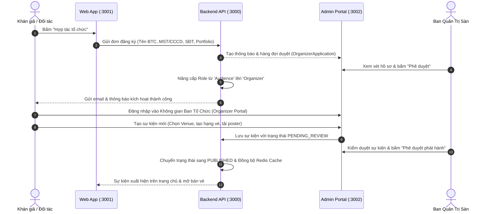

# Kiến Trúc Nền Tảng Ban Tổ Chức Tự Quản (Self-Service Organizer Platform)

Tài liệu thiết kế kiến trúc và đề xuất giải pháp mở rộng hệ thống Tixora từ mô hình bán vé nội bộ (In-house Curated) sang **Nền tảng phân phối vé đa bên (Open Multi-Tenant Ticketing Platform)** tương tự Ticketbox.vn và Eventbrite.

---

## 1. Bối cảnh & So sánh thực tế (Market Benchmark)

### 1.1. Hiện trạng của Tixora
- Hiện tại, vai trò `Organizer` đã tồn tại trong hệ sinh thái phân quyền (RBAC) của Backend (`Role` & `Permission`), nhưng:
  - Chưa có luồng công khai cho khán giả/đối tác tự đăng ký trở thành Ban tổ chức.
  - Việc tạo tài khoản `Organizer` phải do `Admin`/`SuperAdmin` thực hiện thủ công trong Admin Portal (`:3002`).
  - Bảng `Concert` chưa gắn `organizer_id`, dẫn đến việc các concert chưa được cô lập quyền sở hữu theo từng đơn vị tổ chức.

### 1.2. Mô hình của Ticketbox & Eventbrite
- **Ticketbox**:
  - Cung cấp nút *"Tạo sự kiện"* / *"Hợp tác tổ chức"* trực tiếp tại Header của Web Khách hàng.
  - Cho phép người dùng đăng ký thông tin đối tác (Doanh nghiệp hoặc Cá nhân).
  - Cung cấp cổng làm việc riêng (Organizer Center) để tạo sự kiện, cấu hình hạng vé, tải sơ đồ phân khu và theo dõi doanh thu thực tế.
  - **Cơ chế kiểm duyệt (Event Review Gate)**: Sự kiện sau khi tạo không mở bán ngay lập tức mà trải qua vòng duyệt nội dung, giấy phép biểu diễn và pháp lý trước khi chính thức `PUBLISHED`.

---

## 2. Luồng Nghiệp Vụ Tổng Thể (End-to-End Workflow)



---

## 3. Thiết Kế Cơ Sở Dữ Liệu (Database Schema)

### 3.1. Bổ sung trường sở hữu cho `model Concert`
Gắn kết mỗi sự kiện với một tài khoản Ban tổ chức duy nhất:

```prisma
model Concert {
  id               String       @id @default(dbgenerated("gen_random_uuid()")) @db.Uuid
  name             String       @db.VarChar(255)
  description      String       @db.Text
  location         String       @db.VarChar(255)
  venue_id         String?      @db.Uuid
  organizer_id     String?      @db.Uuid     // <-- ID của User có role 'Organizer'
  created_by_id    String?      @db.Uuid     // <-- Người tạo ban đầu (Admin hoặc Organizer)
  status           ConcertStatus @default(DRAFT)
  // ... các trường hiện có
  
  venue            Venue?       @relation(fields: [venue_id], references: [id], onDelete: SetNull)
  organizer        User?        @relation("OrganizerConcerts", fields: [organizer_id], references: [id], onDelete: SetNull)

  @@index([venue_id])
  @@index([organizer_id])
}
```

### 3.2. Mở rộng Trạng thái Sự Kiện (`enum ConcertStatus`)
```prisma
enum ConcertStatus {
  DRAFT             // Bản nháp nội bộ của Organizer
  PENDING_REVIEW    // Đã gửi duyệt lên Sàn, chờ kiểm duyệt giấy tờ/nội dung
  APPROVED          // Đã được duyệt, chờ đến ngày giờ mở bán
  REJECTED          // Bị từ chối (kèm lý do ghi chú từ Admin sàn)
  PUBLISHED         // Đang mở bán công khai trên sàn
  COMPLETED         // Đã kết thúc show diễn
  CANCELLED         // Đã hủy show (kích hoạt quy trình hoàn tiền tự động)
}
```

### 3.3. Bảng Hồ Sơ Ban Tổ Chức & Đơn Đăng Ký (`model OrganizerProfile`)
```prisma
enum ApplicationStatus {
  PENDING
  APPROVED
  REJECTED
}

model OrganizerProfile {
  id                   String            @id @default(dbgenerated("gen_random_uuid()")) @db.Uuid
  user_id              String            @unique @db.Uuid
  organization_name    String            @db.VarChar(255)
  tax_code_or_id       String            @db.VarChar(50)
  phone_number         String            @db.VarChar(20)
  business_license_url String?           @db.VarChar(500)
  portfolio_url        String?           @db.VarChar(500)
  bank_account_name    String?           @db.VarChar(100)
  bank_account_number  String?           @db.VarChar(50)
  bank_name            String?           @db.VarChar(100)
  status               ApplicationStatus @default(PENDING)
  rejection_reason     String?           @db.Text
  approved_at          DateTime?         @db.Timestamptz
  created_at           DateTime          @default(now()) @db.Timestamptz
  updated_at           DateTime          @updatedAt @db.Timestamptz

  user                 User              @relation(fields: [user_id], references: [id], onDelete: Cascade)
}
```

---

## 4. Cô Lập Dữ Liệu & Phân Quyền (Data Isolation & RBAC)

| Thành phần | SuperAdmin / Admin sàn | Organizer (Ban tổ chức) | Audience (Khán giả) |
| :--- | :--- | :--- | :--- |
| **Danh sách Concert** | Xem & quản lý toàn bộ sự kiện của mọi đối tác | Chỉ xem & quản lý sự kiện do chính mình tạo (`where: { organizer_id: user.id }`) | Chỉ xem sự kiện có trạng thái `PUBLISHED` |
| **Tạo / Cập nhật sự kiện** | Toàn quyền, có thể chọn trực tiếp trạng thái `PUBLISHED` | Tạo sự kiện ở trạng thái `DRAFT` hoặc gửi duyệt `PENDING_REVIEW` | Không có quyền (403) |
| **Kiểm duyệt sự kiện** | Quyền duyệt (`APPROVE`) hoặc từ chối (`REJECT`) kèm lý do | Không có quyền | Không có quyền |
| **Báo cáo Doanh thu** | Toàn sàn (Tổng GMV, Phí sàn, Lợi nhuận gộp) | Chỉ xem GMV & số vé bán của các sự kiện thuộc quyền sở hữu | Không có quyền |
| **Phân công Soát vé (Checker)** | Có thể gán checker cho bất kỳ show nào | Chỉ được gán checker cho sự kiện của mình | Không có quyền |
| **Quản trị Tài khoản (Users)** | Toàn quyền tạo/khóa User | Bị chặn hoàn toàn khỏi màn hình Quản lý User | Không có quyền |

---

## 5. Quy Trình Trải Nghiệm Người Dùng (UX Flow)

### 5.1. Khán giả nâng cấp thành Ban tổ chức (Web App `:3001`)
1. Khán giả bấm **"Hợp tác tổ chức"** trên thanh Header.
2. Nếu chưa đăng nhập: Chuyển tới trang `/login?returnUrl=/organizer/apply`.
3. Nếu đã đăng nhập: Hiển thị form đăng ký trang trọng:
   - Thông tin cá nhân/doanh nghiệp: Tên đơn vị tổ chức, Mã số thuế/CCCD, Hotline.
   - Tài khoản nhận quyết toán: Ngân hàng, Số tài khoản, Chủ tài khoản.
   - Giấy tờ xác minh (Upload ảnh Đăng ký kinh doanh / CCCD).
4. Sau khi gửi: Hiển thị thông báo *"Hồ sơ đang được Ban quản trị Tixora thẩm định trong vòng 24 giờ làm việc"*.

### 5.2. Admin duyệt hồ sơ đối tác (Admin App `:3002`)
1. Thêm tab **"Yêu cầu đối tác"** (`/organizer-requests`) trong Admin Portal.
2. Hiển thị danh sách hồ sơ kèm nút xem giấy tờ đính kèm.
3. Thao tác:
   - **Phê duyệt**: Hệ thống cập nhật bảng `UserRole` cấp thêm role `Organizer`, gửi email thông báo kèm liên kết truy cập Cổng Ban Tổ Chức.
   - **Từ chối**: Nhập lý do (ví dụ: *Ảnh CCCD bị mờ*, *Mã số thuế không hợp lệ*) để gửi phản hồi cho người nộp.

### 5.3. Không gian làm việc của Ban Tổ Chức (Organizer Workspace)
Khi tài khoản có role `Organizer` đăng nhập vào Admin App (`:3002`):
- Hệ thống tự động ẩn các menu không thuộc phạm vi: *Quản lý Quản trị viên*, *Quản trị Người dùng*, *Cấu hình hệ thống*.
- Menu hiển thị chỉ bao gồm:
  1. 🎪 **Sự kiện của tôi**: Danh sách show, trạng thái duyệt, nút "Tạo sự kiện mới".
  2. 📊 **Báo cáo doanh số**: Biểu đồ doanh thu vé, tỉ lệ lấp đầy ghế theo thời gian thực của sự kiện mình.
  3. 🎫 **Quản lý vé & Khách mời**: Cấp mã vé mời (Complimentary tickets), quản lý danh sách khán giả.
  4. 📱 **Cổng soát vé (Check-in)**: Gán nhân viên Checker, cấp mã QR đăng nhập cho Mobile App tại cổng.
  5. ⚙️ **Hồ sơ Ban tổ chức**: Cập nhật thông tin liên hệ, tài khoản ngân hàng.

---

## 6. Mô Hình Tài Chính & Phí Nền Tảng (Platform Fee & Settlement)

```
[Tổng doanh thu bán vé (GMV)]
       │
       ├───► [Phí cổng thanh toán (Payment Gateway Fee: 1.5% - 2%)]
       ├───► [Phí dịch vụ nền tảng Tixora (Platform Fee: 5%)]
       └───► [Số dư khả dụng thanh toán cho Organizer: 93% - 93.5%]
```

- **Cơ chế Ký quỹ (Escrow Model)**: Toàn bộ tiền bán vé được giữ trong tài khoản Escrow của Tixora nhằm bảo vệ khán giả khỏi rủi ro bùng show.
- **Giải ngân đối soát**:
  - Đợt 1 (Tùy chọn): Tạm ứng 30% - 50% trước show dựa trên hợp đồng bảo lãnh.
  - Đợt 2: Quyết toán toàn bộ phần còn lại sau khi sự kiện diễn ra thành công trong vòng 3 - 5 ngày làm việc.

---

## 7. Lộ Trình Triển Khai (Phased Roadmap)

1. **Phase 1: Foundation & Data Isolation (Backend Core)**
   - Migration Prisma: Thêm `organizer_id` vào `Concert`, cập nhật `ConcertStatus`.
   - Cập nhật Concert Repository & Service: Lọc `where: { organizer_id: userId }` khi request đến từ role `Organizer`.
   - Viết Unit Tests bảo đảm tính cô lập dữ liệu.

2. **Phase 2: Organizer Onboarding & Admin Approval**
   - Web App: Xây dựng trang `/organizer/apply` với form thông tin chuyên nghiệp.
   - Admin App: Xây dựng trang Quản lý yêu cầu đối tác (`/organizer-requests`) kèm tính năng Duyệt/Từ chối.

3. **Phase 3: Event Approval Lifecycle & Portal Polish**
   - Hỗ trợ trạng thái `PENDING_REVIEW` và giao diện phê duyệt sự kiện trong Admin Portal.
   - Tối ưu hóa UI/UX Admin Portal theo vai trò (Role-based Sidebar & Widgets).
