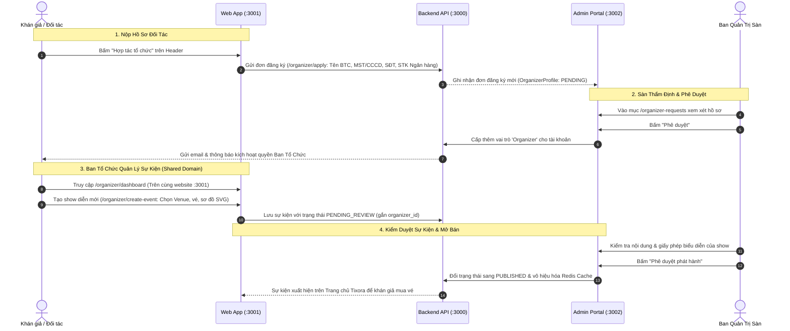

# Kiến Trúc Nền Tảng Ban Tổ Chức Tự Quản (Self-Service Organizer Platform)

Tài liệu thiết kế kiến trúc và giải pháp mở rộng hệ thống Tixora từ mô hình bán vé nội bộ (In-house Curated) sang **Nền tảng phân phối vé đa bên (Open Multi-Tenant Platform)** theo mô hình Shared-Domain (dùng chung website chính như Eventbrite, Luma và Airbnb).

---

## 1. Bối cảnh & So sánh thực tế (Market Benchmark)

### 1.1. Hiện trạng của Tixora
- Vai trò `Organizer` đã tồn tại trong hệ thống phân quyền (RBAC) của Backend, nhưng:
  - Chưa có luồng cho khán giả/đối tác tự đăng ký trở thành Ban tổ chức.
  - Cổng Quản trị sàn (`apps/admin-app`, `:3002`) là cổng điều hành nội bộ của sàn (`SuperAdmin` & `Admin`), vừa được siết chặt để chặn hoàn toàn `Audience`, `Checker` và `Organizer` khỏi bước đăng nhập.
  - Bảng `Concert` chưa gắn `organizer_id`, dẫn đến việc các concert chưa được cô lập quyền sở hữu theo từng đơn vị tổ chức.

### 1.2. Mô hình Shared-Domain (Eventbrite / Luma / Airbnb)
- **Cổng Quản Trị Sàn Nội Bộ (`apps/admin-app`, port `:3002`)**:
  - Chỉ dành riêng cho nhân sự vận hành sàn (`SuperAdmin`, `Admin`).
  - Quản lý tài khoản toàn sàn, duyệt hồ sơ đối tác (`/organizer-requests`), kiểm duyệt sự kiện trước khi mở bán, theo dõi hàng đợi tác vụ nền (Queue/Workers).
- **Cổng Web & Phân Hệ Đối Tác (`apps/web-app`, port `:3001`)**:
  - Dùng chung domain duy nhất cho Khán giả và Ban tổ chức.
  - Khán giả đăng nhập 1 lần (Single Sign-On). Khi được cấp quyền `Organizer`, thanh điều hướng hoặc menu avatar mở thêm phân hệ **Trung tâm Ban Tổ Chức (`/organizer/*`)**.
  - Không bị sự cố mất session hay cookie giữa các subdomain (vấn đề Safari/iOS hay chặn third-party cookies).

---

## 2. Luồng Nghiệp Vụ Tổng Thể (End-to-End Workflow)



---

## 3. Thiết Kế Cơ Sở Dữ Liệu (Database Schema)

### 3.1. Bổ sung quyền sở hữu cho `model Concert`
Gắn kết mỗi sự kiện với một tài khoản Ban tổ chức duy nhất để phục vụ cơ chế **Data Isolation**:

```prisma
model Concert {
  id               String        @id @default(dbgenerated("gen_random_uuid()")) @db.Uuid
  name             String        @db.VarChar(255)
  description      String        @db.Text
  location         String        @db.VarChar(255)
  venue_id         String?       @db.Uuid
  organizer_id     String?       @db.Uuid     // <-- ID của User có vai trò 'Organizer'
  created_by_id    String?       @db.Uuid     // <-- Người tạo (Admin sàn hoặc Organizer)
  status           ConcertStatus @default(DRAFT)
  // ... các trường hiện tại
  
  venue            Venue?        @relation(fields: [venue_id], references: [id], onDelete: SetNull)
  organizer        User?         @relation("OrganizerConcerts", fields: [organizer_id], references: [id], onDelete: SetNull)

  @@index([venue_id])
  @@index([organizer_id])
}
```

### 3.2. Mở rộng Trạng thái Sự Kiện (`enum ConcertStatus`)
```prisma
enum ConcertStatus {
  DRAFT             // Bản nháp nội bộ của Organizer
  PENDING_REVIEW    // Đã nộp lên sàn, chờ kiểm duyệt giấy tờ/nội dung
  APPROVED          // Đã được duyệt, chờ đến giờ hẹn mở bán tự động
  REJECTED          // Bị từ chối (kèm lý do ghi chú từ Admin sàn)
  PUBLISHED         // Đang mở bán vé công khai trên sàn
  COMPLETED         // Đã kết thúc sự kiện thành công
  CANCELLED         // Đã hủy show (kích hoạt hoàn tiền tự động)
}
```

### 3.3. Bảng Hồ Sơ Ban Tổ Chức & Đơn Đăng Ký (`model OrganizerProfile`)
```prisma
enum ApplicationStatus {
  PENDING
  APPROVED
  REJECTED
}

model OrganizerProfile {
  id                   String            @id @default(dbgenerated("gen_random_uuid()")) @db.Uuid
  user_id              String            @unique @db.Uuid
  organization_name    String            @db.VarChar(255)
  tax_code_or_id       String            @db.VarChar(50)
  phone_number         String            @db.VarChar(20)
  business_license_url String?           @db.VarChar(500)
  portfolio_url        String?           @db.VarChar(500)
  bank_account_name    String?           @db.VarChar(100)
  bank_account_number  String?           @db.VarChar(50)
  bank_name            String?           @db.VarChar(100)
  status               ApplicationStatus @default(PENDING)
  rejection_reason     String?           @db.Text
  approved_at          DateTime?         @db.Timestamptz
  created_at           DateTime          @default(now()) @db.Timestamptz
  updated_at           DateTime          @updatedAt @db.Timestamptz

  user                 User              @relation(fields: [user_id], references: [id], onDelete: Cascade)
}
```

---

## 4. Cô Lập Dữ Liệu & Phân Quyền (Data Isolation & RBAC)

| Phân Vùng | SuperAdmin / Admin Sàn (`:3002`) | Organizer (`:3001` - `/organizer/*`) | Audience (`:3001`) |
| :--- | :--- | :--- | :--- |
| **Danh sách Concert** | Xem & quản trị toàn bộ sự kiện của mọi đối tác | **Chỉ thấy sự kiện của chính mình** (`where: { organizer_id: user.id }`) | Chỉ thấy sự kiện `PUBLISHED` |
| **Tạo sự kiện** | Toàn quyền, có thể chọn trực tiếp `PUBLISHED` | Tạo sự kiện ở dạng `DRAFT` hoặc gửi duyệt `PENDING_REVIEW` | Không có quyền (403) |
| **Kiểm duyệt sự kiện** | Phê duyệt (`APPROVE`) hoặc Từ chối (`REJECT`) kèm lý do | Không có quyền | Không có quyền |
| **Báo cáo Doanh thu** | Toàn sàn (Tổng GMV, Phí sàn thu được, Lợi nhuận) | **Chỉ xem doanh số bán vé của các show do mình tổ chức** | Không có quyền |
| **Gán Soát vé (Checker)** | Toàn quyền trên mọi concert | Chỉ được gán checker cho concert của mình | Không có quyền |
| **Quản trị User & Queue** | Toàn quyền | Không thấy & bị chặn hoàn toàn | Không có quyền |

---

## 5. Cấu Trúc Trải Nghiệm Người Dùng (UX Flow)

### 5.1. Khán giả nộp hồ sơ đối tác (`apps/web-app/src/app/organizer/apply`)
- Nút **"Hợp tác tổ chức"** trên thanh Header dẫn tới `/organizer/apply`.
- Nếu chưa đăng nhập: Yêu cầu đăng nhập hoặc đăng ký tài khoản Tixora.
- Form đăng ký thông tin đối tác gồm 3 bước:
  1. **Thông tin pháp nhân/nghệ sĩ**: Tên đơn vị, Mã số thuế/CCCD, Hotline liên hệ.
  2. **Tài khoản thụ hưởng (Quyết toán)**: Tên ngân hàng, Số tài khoản, Tên chủ tài khoản.
  3. **Hồ sơ năng lực / Giấy phép**: Tải ảnh Đăng ký kinh doanh / CCCD hoặc liên kết portfolio các show đã từng làm.
- Sau khi nộp: Hiển thị banner trạng thái *"Hồ sơ đang chờ Ban quản trị Tixora thẩm định"*.

### 5.2. Admin sàn duyệt hồ sơ đối tác (`apps/admin-app/src/app/(admin)/organizer-requests`)
- Màn hình quản lý danh sách hồ sơ đối tác với các bộ lọc: Chờ duyệt (`PENDING`), Đã duyệt (`APPROVED`), Từ chối (`REJECTED`).
- Thao tác:
  - **Phê duyệt**: Hệ thống cập nhật bảng `UserRole`, cấp thêm role `Organizer`.
  - **Từ chối**: Nhập lý do (ví dụ: *Ảnh CCCD bị mờ, không khớp tên*) để gửi thông báo cho đối tác.

### 5.3. Không gian Ban Tổ Chức trên Web App (`apps/web-app/src/app/organizer/*`)
Khi người dùng có vai trò `Organizer` đăng nhập vào Web App:
- Menu Avatar trên Header có thêm mục: **"Quản lý sự kiện"** (hoặc nút chuyển đổi mode "Chế độ Ban Tổ Chức").
- Bộ trang dành riêng cho Organizer:
  1. `/organizer/dashboard`: Tổng quan số vé đã bán, doanh thu show mình, tỉ lệ check-in.
  2. `/organizer/events`: Danh sách các show của mình kèm badge trạng thái (`DRAFT`, `PENDING_REVIEW`, `PUBLISHED`).
  3. `/organizer/create-event`: Giao diện tạo sự kiện (kế thừa bộ chọn Venue Preset, sơ đồ SVG và tạo vé).
  4. `/organizer/assignments`: Cấp tài khoản hoặc mã QR soát vé cho nhân viên Checker tại cổng.

---

## 6. Mô Hình Ký Quỹ & Phí Sàn (Financial Escrow Model)

```
[Tổng doanh thu bán vé (GMV)]
       │
       ├───► [Phí cổng thanh toán (Payment Gateway Fee: 1.5% - 2%)]
       ├───► [Phí sàn Tixora (Platform Fee: 5%)]
       └───► [Số dư khả dụng chuyển cho Ban Tổ Chức: 93% - 93.5%]
```

- **Cơ chế Escrow**: Tiền vé thanh toán qua PayOS/VNPay được giữ tại tài khoản Escrow của sàn Tixora trong suốt thời gian mở bán để bảo vệ quyền lợi khán giả.
- **Quyết toán (Settlement)**: Sau khi show kết thúc thành công trong 3 - 5 ngày làm việc, sàn chuyển tiền vé thực tế cho Organizer theo số tài khoản ngân hàng đã đăng ký.
