# 📚 HỆ THỐNG TÀI LIỆU DỰ ÁN TICKETBOX (DOCUMENTATION PORTAL)

> **Chào mừng bạn đến với trung tâm tài liệu chính thức của TicketBox!**  
> Toàn bộ tài liệu được chuẩn hóa theo phân tầng nghiệp vụ, giúp đội ngũ kỹ thuật, kiểm thử và quản lý dự án dễ dàng tra cứu, vận hành và phát triển tính năng mới.

---

## 🗺️ Sơ Đồ Cấu Trúc Tài Liệu (Documentation Map)

```mermaid
graph TD
    Root["📂 docs/ (Documentation Portal)"]
    Root --> Arch["🏛️ 01-architecture<br/>Kiến trúc & Hạ tầng"]
    Root --> Mod["📦 02-modules<br/>Đặc tả từng Module"]
    Root --> Test["🧪 03-testing<br/>Kiểm thử & QA"]
    Root --> Plan["🚀 04-planning-roadmap<br/>Lộ trình & Nâng cấp"]
    Root --> Flow["👥 05-workflow<br/>Quy trình & Onboarding"]
    Root --> Tpl["📋 06-templates<br/>Biểu mẫu chuẩn"]

    Arch --> Arch1["system-design.md"]
    Arch --> Arch2["techstack.md"]
    Arch --> Arch3["database-schema.md"]
    Arch --> Arch4["high-load-defense.md"]

    Mod --> Mod1["auth-rbac.md"]
    Mod --> Mod2["catalog-events.md"]
    Mod --> Mod3["ticketing-reservation.md"]
    Mod --> Mod4["payment-transactions.md"]
    Mod --> Mod5["checkin-offline.md"]
    Mod --> Mod6["background-jobs-ai.md"]
    Mod --> Mod7["notifications.md"]

    Test --> Test1["manual-test-guide.md"]
    Test --> Test2["playwright-e2e.md"]
    Test --> Test3["load-testing-k6.md"]

    Plan --> Plan1["upgrade-proposals.md"]
    Plan --> Plan2["project-plan.md"]
    Plan --> Plan3["task-breakdown.md"]

    Flow --> Flow1["onboarding.md"]
    Flow --> Flow2["team-workflow.md"]
    Flow --> Flow3["contributing.md"]

    Tpl --> Tpl1["pr-template.md"]
    Tpl --> Tpl2["bug-report-template.md"]
    Tpl --> Tpl3["task-template.md"]
```



---

## 🧭 Bảng Tra Cứu Nhanh Theo Vai Trò (Quick Navigation by Role)

| Bạn là ai? | Tài liệu bạn cần đọc đầu tiên |
| :--- | :--- |
| 🆕 **Lập trình viên mới vào dự án** | [Onboarding Guide](./05-workflow/onboarding.md) ➔ [System Design](./01-architecture/system-design.md) ➔ [Team Workflow](./05-workflow/team-workflow.md) |
| 🧪 **Kiểm thử viên / QA Engineer** | [Manual Test Guide](./03-testing/manual-test-guide.md) ➔ [Playwright E2E Testing](./03-testing/playwright-e2e.md) ➔ [Load Test k6](./03-testing/load-testing-k6.md) |
| 💻 **Backend Developer** | [Database Schema](./01-architecture/database-schema.md) ➔ [Ticketing Reservation](./02-modules/ticketing-reservation.md) ➔ [High Load Defense](./01-architecture/high-load-defense.md) |
| 🎨 **Frontend / Mobile Developer** | [Catalog Events](./02-modules/catalog-events.md) ➔ [Payment Transactions](./02-modules/payment-transactions.md) ➔ [Checkin Offline](./02-modules/checkin-offline.md) |
| 🚀 **Tech Lead / Architect** | [Upgrade Proposals](./04-planning-roadmap/upgrade-proposals.md) ➔ [Project Plan](./04-planning-roadmap/project-plan.md) ➔ [System Design](./01-architecture/system-design.md) |

---

## 📂 Chi Tiết Từng Phân Hệ Tài Liệu

### 1. [01-architecture/](./01-architecture/README.md) — Kiến Trúc & Thiết Kế Hệ Thống
Chứa các bản vẽ kiến trúc, thiết kế dữ liệu và giải pháp chịu tải cao:
- **[system-design.md](./01-architecture/system-design.md):** Kiến trúc Modular Monolith + Event-Driven, sơ đồ C4 System Context & Container, luồng điều phối dữ liệu qua RabbitMQ.
- **[techstack.md](./01-architecture/techstack.md):** Đánh giá công nghệ (NestJS, Next.js 16, PostgreSQL, Redis, RabbitMQ) và các quyết định kỹ thuật then chốt (ADR).
- **[database-schema.md](./01-architecture/database-schema.md):** Bản thiết kế CSDL hoàn chỉnh, sơ đồ ERD, các bảng, khóa ngoại và chỉ mục (Indexes).
- **[high-load-defense.md](./01-architecture/high-load-defense.md):** Cơ chế bảo vệ hệ thống trước đợt bùng nổ 80.000 users (Token Bucket Rate Limiting, Redis Lua script nguyên tử, Opossum Circuit Breaker).

### 2. [02-modules/](./02-modules/README.md) — Đặc Tả Nghiệp Vụ Các Module
Đặc tả chi tiết đầu vào/đầu ra, API contracts, DTOs và luồng xử lý nội bộ:
- **[auth-rbac.md](./02-modules/auth-rbac.md):** Quản lý định danh, Stateless JWT, phân quyền Role-Based Access Control (Admin, Organizer, Checker, Audience).
- **[catalog-events.md](./02-modules/catalog-events.md):** Quản lý concert, hạng vé, sơ đồ ghế, tối ưu tốc độ đọc bằng Redis Cache-aside.
- **[ticketing-reservation.md](./02-modules/ticketing-reservation.md):** Luồng giữ vé RAM nguyên tử, chống bán quá số lượng (Zero Oversell), giới hạn per-user và cơ chế hủy đơn quá hạn.
- **[payment-transactions.md](./02-modules/payment-transactions.md):** Tích hợp PayOS, chữ ký Webhook bảo mật, khóa lũy đẳng (Idempotency Key) chống trừ tiền hai lần.
- **[checkin-offline.md](./02-modules/checkin-offline.md):** Giải pháp soát vé di động khi mất kết nối Internet, phân luồng Gate Segregation tránh xung đột và bulk-sync khi có mạng.
- **[background-jobs-ai.md](./02-modules/background-jobs-ai.md):** Tác vụ nền chia nhỏ (chunking) nạp danh sách khách mời CSV và trích xuất tiểu sử nghệ sĩ bằng AI (LLM).
- **[notifications.md](./02-modules/notifications.md):** Hệ thống gửi thông báo và cơ chế chống gửi trùng bằng Deduplication Key.

### 3. [03-testing/](./03-testing/README.md) — Kiểm Thử & Đảm Bảo Chất Lượng
Hướng dẫn kiểm thử đầy đủ các cấp độ từ thủ công đến tự động:
- **[manual-test-guide.md](./03-testing/manual-test-guide.md):** Bộ kịch bản kiểm thử thủ công 11 Test Suites (> 35 test cases) bao phủ mọi tính năng của Web, Admin và Mobile kèm bảng tài khoản seed và checklist nghiệm thu.
- **[playwright-e2e.md](./03-testing/playwright-e2e.md):** Hướng dẫn cài đặt, cấu hình và chạy bộ test E2E Playwright tự động trên Web App (`:3001`) và Admin Portal (`:3002`).
- **[load-testing-k6.md](./03-testing/load-testing-k6.md):** Hướng dẫn chạy k6 script kiểm chứng Rate Limiting (HTTP 429) và chống Oversell dưới tải cao đồng thời.

### 4. [04-planning-roadmap/](./04-planning-roadmap/README.md) — Kế Hoạch & Đề Xuất Nâng Cấp
Định hướng phát triển và kế hoạch thực thi:
- **[upgrade-proposals.md](./04-planning-roadmap/upgrade-proposals.md):** 9 đề xuất nâng cấp kiến trúc đột phá: RabbitMQ DLX giải phóng vé chính xác, Realtime SSE, Bản đồ ghế tương tác trực quan (Interactive Seatmap), Chữ ký số ECDSA cho QR Code, Phòng chờ ảo (Virtual Waiting Room), Đa cổng thanh toán và Observability.
- **[project-plan.md](./04-planning-roadmap/project-plan.md):** Kế hoạch chi tiết 3 Sprint thực chiến (Sprint 1: Nền móng, Sprint 2: Tải cao & Đặt vé, Sprint 3: Ngoại tuyến & Hoàn thiện).
- **[task-breakdown.md](./04-planning-roadmap/task-breakdown.md):** Phân rã công việc từng Issue, Checklist và Tiêu chí nghiệm thu (Acceptance Criteria).

### 5. [05-workflow/](./05-workflow/README.md) — Quy Trình Làm Việc Nhóm
Tiêu chuẩn vận hành và phối hợp nội bộ:
- **[onboarding.md](./05-workflow/onboarding.md):** Hướng dẫn từng bước thiết lập môi trường máy tính cho thành viên mới (Node.js, pnpm, Docker, .env, DB seed).
- **[team-workflow.md](./05-workflow/team-workflow.md):** Chiến lược Git Branching, quy ước đặt tên nhánh, Conventional Commits và quy trình Code Review.
- **[contributing.md](./05-workflow/contributing.md):** Tiêu chuẩn mã nguồn (TypeScript Strict, Prettier, ESLint) và Quality Gates trước khi đẩy code.

### 6. [06-templates/](./06-templates/README.md) — Biểu Mẫu Chuẩn
Biểu mẫu dùng cho công việc hàng ngày:
- **[pr-template.md](./06-templates/pr-template.md):** Biểu mẫu tạo Pull Request.
- **[bug-report-template.md](./06-templates/bug-report-template.md):** Biểu mẫu báo cáo lỗi phần mềm.
- **[task-template.md](./06-templates/task-template.md):** Biểu mẫu khởi tạo Task/Feature mới.

---

## ⚡ Các Lệnh Nhanh Cho Dự Án (Quick Commands)

```powershell
# 1. Khởi động hạ tầng Docker (Redis & RabbitMQ)
cd infrastructure; docker compose up -d; cd ..

# 2. Cài đặt package & seed CSDL
pnpm install
pnpm db:seed

# 3. Khởi động 3 ứng dụng đồng thời
pnpm start:api:dev   # Backend API (Port 3000)
pnpm start:web       # Web Khách Hàng (Port 3001)
pnpm start:admin     # Admin Portal (Port 3002)

# 4. Chạy kiểm thử tự động Playwright E2E
pnpm test:e2e        # Chạy kiểm thử ngầm
pnpm test:e2e:ui     # Chạy với giao diện trực quan Playwright UI
```

---
*Tài liệu được bảo trì và cập nhật liên tục cùng sự phát triển của hệ thống TicketBox.*
