# ĐỀ XUẤT GIẢI PHÁP KIẾN TRÚC SƠ ĐỒ KHU VỰC VÉ & CHỖ NGỒI (VENUE & SEATING MAP)
## GIẢI PHÁP ĐA ĐỊA ĐIỂM DÀNH CHO NỀN TẢNG BÁN VÉ TIXORA

> **Tài liệu:** Đề xuất kỹ thuật & kiến trúc phân khu/sơ đồ ghế  
> **Áp dụng cho:** Web App Khách Hàng, Admin Portal, Backend API  
> **Trạng thái:** Bản thảo đề xuất kỹ thuật (Proposal)  

---

## 1. Đặt Vấn Đề & Thách Thức Thực Tế

Trong ngành công nghiệp bán vé sự kiện, **mỗi địa điểm tổ chức (Venue) đều có kiến trúc vật lý và bố cục hoàn toàn khác nhau**:
- **Sân vận động ngoài trời (Mỹ Đình, Hàng Đẫy):** Sức chứa 30.000 – 40.000 khán giả, chia làm 4 khán đài A-B-C-D với hàng trăm cửa và khu lòng sân (GA/Standing).
- **Nhà thi đấu trong nhà (Phú Thọ, Quân Khu 7):** Sức chứa 5.000 – 10.000 người, có khán đài vòng cung bao quanh sân khấu trung tâm.
- **Trung tâm triển lãm / Không gian phẳng (SECC, Trung tâm Hội chợ Triển lãm):** Không gian mở, ban tổ chức tự dựng sân khấu chữ T, FOH và rào chắn phân khu linh hoạt.
- **Nhà hát / Rạp kịch (Nhà hát Lớn, Nhà hát Hòa Bình):** Hàng ngàn ghế cố định được đánh số theo hàng (Row A-Z) và cột số (Seat 1-50).

### Hai mô hình bán vé cơ bản:
1. **General Admission (GA / Zone Selection):** Bán vé theo **khu vực** (VIP, FanZone, GA đứng, Khán đài tự do). Người mua chọn khu vực, không chọn từng ghế cụ thể. (Chiếm 80% thị phần concert/festival tại Việt Nam như Ticketbox).
2. **Reserved Seating (Seat Selection):** Bán vé chọn **từng vị trí ghế ngồi cụ thể** (Hàng C - Ghế 15). Thường áp dụng cho nhà hát, kịch nói, sự kiện thảm đỏ.

---

## 2. Kiến Trúc Giải Pháp Đề Xuất Cho Tixora (3 Giai Đoạn)

Nhằm tối ưu chi phí phát triển và mang lại giá trị trải nghiệm ngay lập tức, giải pháp được chia làm 3 giai đoạn:

```mermaid
graph TD
    subgraph GiaiDoan1["Giai đoạn 1: Interactive Zone SVG (Hiện tại - Ưu tiên cao)"]
        A1[Ban tổ chức upload SVG có gắn mã Zone] --> B1[Frontend render SVG tương tác 2 chiều]
        B1 --> C1[Hover/Click Zone trên SVG -> Chọn hạng vé]
    end

    subgraph GiaiDoan2["Giai đoạn 2: Venue Template Library (Trung hạn)"]
        A2[Thư viện 10 địa điểm phổ biến tại VN] --> B2[Organizer chọn template & gán giá vé]
        B2 --> C2[Giảm 90% thời gian tạo sự kiện]
    end

    subgraph GiaiDoan3["Giai đoạn 3: Reserved Seat Matrix (Dài hạn)"]
        A3[Sơ đồ ghế lưới toạ độ X-Y] --> B3[Giữ ghế thời gian thực bằng Redis Bitmap]
        B3 --> C3[Hỗ trợ chọn từng ghế số chi tiết]
    end
```



---

## 3. Chi Tiết Kỹ Thuật Giai Đoạn 1: Sơ Đồ Phân Khu Tương Tác (Interactive SVG)

Hiện tại, Tixora đã có sẵn trường `svg_map_url` trong cơ sở dữ liệu và bảng `ticket_categories`. Ta sẽ kích hoạt tính năng **Interactive SVG** như sau:

### 3.1. Chuẩn hóa cấu trúc file SVG từ Ban tổ chức
Mỗi khu vực vẽ trên SVG sẽ được gắn thuộc tính `data-zone-id` hoặc `id` khớp với `name` hoặc `id` của Hạng vé:

```xml
<!-- Ví dụ file sơ đồ venue-map.svg -->
<svg viewBox="0 0 1200 800" xmlns="http://www.w3.org/2000/svg">
  <!-- Sân khấu -->
  <rect x="450" y="50" width="300" height="100" fill="#334155" id="stage" />
  <text x="600" y="110" text-anchor="middle" fill="#ffffff" font-weight="bold">STAGE / SÂN KHẤU</text>

  <!-- Khu VIP A (Gắn data-zone="VIP_A") -->
  <path id="zone-vip-a" data-zone="VIP_A" d="M300 200 L580 200 L580 380 L300 380 Z" 
        class="tixora-zone fill-amber-500/40 stroke-amber-400 stroke-2 hover:fill-amber-500/80 cursor-pointer transition-all" />

  <!-- Khu VIP B (Gắn data-zone="VIP_B") -->
  <path id="zone-vip-b" data-zone="VIP_B" d="M620 200 L900 200 L900 380 L620 380 Z" 
        class="tixora-zone fill-cyan-500/40 stroke-cyan-400 stroke-2 hover:fill-cyan-500/80 cursor-pointer transition-all" />

  <!-- Khu GA (Gắn data-zone="GA") -->
  <path id="zone-ga" data-zone="GA" d="M200 420 L1000 420 L1000 650 L200 650 Z" 
        class="tixora-zone fill-purple-500/30 stroke-purple-400 stroke-2 hover:fill-purple-500/70 cursor-pointer transition-all" />
</svg>
```

### 3.2. Cơ chế liên kết 2 chiều trên Giao diện Web (Two-Way Binding)
1. **Từ Sơ đồ sang Bảng vé:** Khi người dùng rê chuột hoặc chạm tay vào Khu VIP A trên sơ đồ, thẻ vé VIP A ở bảng bên cạnh sẽ tự động được làm nổi bật (Highlight/Auto-scroll).
2. **Từ Bảng vé sang Sơ đồ:** Khi người dùng hover vào nút "Hạng vé VIP A" ở bảng chọn vé, khu vực VIP A trên bản đồ SVG sẽ phát sáng rực rỡ (Glow effect).
3. **Hiển thị trạng thái tồn kho thực tế:**
   - Nếu hạng vé hết hàng (`remaining_quantity === 0`), khu vực trên SVG sẽ tự động chuyển sang màu xám mờ và hiển thị nhãn "HẾT VÉ / SOLD OUT".
   - Nếu sắp hết vé (< 10%), khu vực nhấp nháy nhẹ cảnh báo.

### 3.3. Hỗ trợ Phóng to / Thu nhỏ (Pinch-to-zoom & Pan)
- Tích hợp thư viện điều khiển SVG mượt mà (như `react-zoom-pan-pinch` hoặc `svg-pan-zoom`).
- Giúp người dùng trên điện thoại di động dễ dàng dùng 2 ngón tay phóng to từng góc khán đài để xem chi tiết cửa vào (Gate) và khoảng cách tới sân khấu.

---

## 4. Chi Tiết Kỹ Thuật Giai Đoạn 2: Thư Viện Mẫu Địa Điểm (Venue Template Library)

Để Ban tổ chức không phải mất công thiết kế lại từ đầu khi tổ chức ở các địa điểm quen thuộc:

### 4.1. Bổ sung bảng `Venue` trong Database Schema

```prisma
model Venue {
  id          String   @id @default(uuid()) @db.Uuid
  name        String   @db.VarChar(255) // "Sân vận động Quốc gia Mỹ Đình"
  city        String   @db.VarChar(100) // "Hà Nội"
  address     String   @db.VarChar(500) // "Đường Lê Đức Thọ, Nam Từ Liêm"
  capacity    Int      // 40000
  svg_template_url String @db.VarChar(500) // Template SVG chuẩn có sẵn toạ độ các khán đài
  zone_presets Json     // Định nghĩa sẵn: Stand A, Stand B, Fanzone, GA...
  created_at  DateTime @default(now())

  concerts    Concert[]
  @@map("venues")
}
```

### 4.2. Luồng tạo sự kiện trong Admin Portal
1. Ban tổ chức chọn địa điểm từ danh sách gợi ý: *Sân Vận Động Mỹ Đình*.
2. Hệ thống tự điền địa chỉ, tải template SVG chuẩn lên màn hình xem trước.
3. Ban tổ chức chỉ cần nhập giá tiền cho từng phân khu đã định danh sẵn (Khán đài A: 2.000.000đ, Khán đài B: 1.500.000đ...).

---

## 5. Chi Tiết Kỹ Thuật Giai Đoạn 3: Chọn Từng Ghế Số (Reserved Seating Engine)

Khi mở rộng sang bán vé kịch nói, nhà hát hoặc rạp chiếu phim, bài toán chọn từng số ghế sẽ được kích hoạt:

### 5.1. Data Model cho Hàng & Ghế
```prisma
model VenueSection {
  id          String   @id @default(uuid()) @db.Uuid
  concert_id  String   @db.Uuid
  name        String   // "Khán đài A1"
  ticket_category_id String @db.Uuid
  rows        SectionRow[]
}

model SectionRow {
  id          String   @id @default(uuid()) @db.Uuid
  section_id  String   @db.Uuid
  row_name    String   // "A", "B", "C"
  seats       Seat[]
}

model Seat {
  id          String   @id @default(uuid()) @db.Uuid
  row_id      String   @db.Uuid
  seat_number Int      // 1, 2, 3...
  coord_x     Float    // Toạ độ vẽ trên sơ đồ
  coord_y     Float
  status      String   // "AVAILABLE", "HOLD", "BOOKED"
}
```

### 5.2. Chống tranh chấp giữ ghế bằng Redis Bitmap / Key-Value Lock
- Khi người dùng click vào ghế `A-15`, frontend gửi yêu cầu giữ ghế.
- Redis thực thi lệnh nguyên tử:
  ```redis
  SET concert:123:seat:A15 user_456 EX 600 NX
  ```
- Nếu `NX` thành công: Ghế được khóa cho user trong 10 phút. Ghế trên màn hình của tất cả các khán giả khác ngay lập tức đổi màu sang cam/đỏ (đang được giữ) qua WebSocket.
- Nếu `NX` trả về `nil`: Ghế đã có người khác chọn trước 1 phần nghìn giây, báo lỗi thân thiện: *"Ghế này vừa có người giữ, vui lòng chọn ghế khác"*.

---

## 6. Kế Hoạch Triển Khai Khuyến Nghị (Action Plan)

| Hạng mục | Thời gian ước tính | Mức độ phức tạp | Tác động trải nghiệm |
| :--- | :--- | :--- | :--- |
| **Giai đoạn 1**: Interactive SVG Map (Hover Highlight 2 chiều & Phóng to sơ đồ) | **2 - 3 ngày** | Trung bình | ⭐⭐⭐⭐⭐ (Khán giả rất thích) |
| **Giai đoạn 2**: Venue Template Library (3 - 5 địa điểm phổ biến mẫu) | **3 - 4 ngày** | Trung bình | ⭐⭐⭐⭐ (Rút ngắn thời gian tạo show) |
| **Giai đoạn 3**: Reserved Seating Matrix & Redis Seat Lock | **1 - 2 tuần** | Cao | ⭐⭐⭐⭐⭐ (Mở rộng cho Nhà hát/Kịch) |

---
*Tài liệu này được biên soạn bởi Antigravity Technical Architecture Team theo chuẩn quy cách kiến trúc Tixora.*
