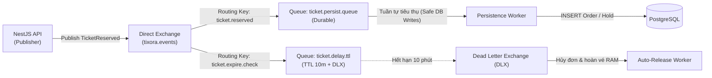

# Event-Driven Architecture — San Phẳng Đỉnh Tải Bằng RabbitMQ

## 1) Vì Sao Cần RabbitMQ Trong Luồng Bán Vé?
Khi Redis Lua script hoàn tất việc trừ vé trên RAM trong nano-giây, hệ thống cần ghi nhận thông tin đơn hàng và thông tin khách hàng vào cơ sở dữ liệu quan hệ PostgreSQL.
- **Nếu ghi trực tiếp đồng bộ xuống DB (Synchronous Write):**  
  Khi có 10.000 giao dịch giữ vé thành công trong 1 giây, 10.000 câu lệnh `INSERT` đồng loạt tấn công vào PostgreSQL. Ổ đĩa I/O sẽ bị nghẽn, transaction connection pool cạn kiệt và API server bị treo.
- **Giải pháp của Tixora (Traffic Leveling / Peak Shaving):**  
  API server chỉ đóng gói sự kiện `TicketReserved` và đẩy vào **RabbitMQ Exchange**, sau đó lập tức trả về mã thành công cho người dùng với độ trễ **< 50ms**. Các Worker phía sau sẽ lấy tin nhắn ra và ghi vào PostgreSQL với tốc độ đều đặn mà cơ sở dữ liệu có thể chịu tải tốt nhất.

---

## 2) Cấu Trúc Message Queue Trong Tixora

---

## 3) Đảm Bảo Độ Bền Vững Của Tin Nhắn (Message Reliability)
Để không bao giờ bị mất đơn hàng của khách khi có sự cố hạ tầng:
1. **Durable Queues & Persistent Messages:** Hàng đợi được khai báo với cờ `durable: true`, tin nhắn được đánh dấu `deliveryMode: 2` (ghi xuống đĩa của RabbitMQ).
2. **Manual Acknowledgment (`ack`):** Worker chỉ gửi tín hiệu `channel.ack(msg)` sau khi đã ghi thành công bản ghi vào PostgreSQL. Nếu Worker bị crash giữa chừng, RabbitMQ sẽ tự động phân phối lại tin nhắn cho Worker khác (`nack` / `requeue`).
3. **Dead Letter Exchange (DLX):** Các tin nhắn xử lý lỗi quá số lần quy định (retry limit) sẽ được chuyển vào hàng đợi lỗi `ticket.dead-letter` để kỹ sư kiểm tra nguyên nhân mà không làm nghẽn luồng xử lý chính.

---

## 4) Câu Hỏi Phỏng Vấn & Cách Trả Lời
1. *Tại sao chọn RabbitMQ thay vì Apache Kafka?*
   - RabbitMQ là một Message Broker truyền thống tối ưu cho việc định tuyến linh hoạt (Routing Keys, Exchanges), hỗ trợ độ trễ cực thấp và cơ chế Dead Letter Queue tích hợp sẵn, rất phù hợp với nghiệp vụ giao dịch đơn hàng bán vé. Kafka phù hợp hơn cho việc lưu trữ luồng log phân tán (Event Streaming) hàng triệu sự kiện/giây.
2. *Làm sao xử lý nếu Worker bị chậm dẫn đến hàng đợi RabbitMQ bị ứ đọng?*
   - Tixora hỗ trợ cơ chế mở rộng ngang (Horizontal Pod Autoscaling). Chúng ta có thể tăng số lượng Worker instance để tiêu thụ song song nhiều message từ cùng một hàng đợi nhờ cơ chế Competing Consumers của RabbitMQ.
