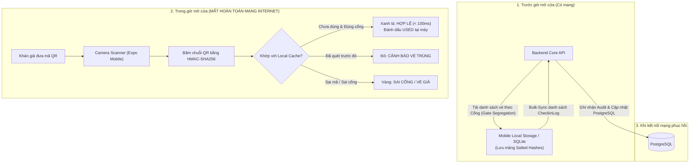

# Soát Vé Ngoại Tuyến Tại Cổng (Offline-First Gate Check-in)

## 1) Bài Toán Nghẽn Sóng Sân Vận Động (Cell Tower Congestion)
Tại các sự kiện âm nhạc quy mô 40.000 khán giả, toàn bộ trạm phát sóng 4G/Wifi khu vực xung quanh sân vận động thường rơi vào tình trạng quá tải hoặc tê liệt hoàn toàn.
- **Nếu app quét vé gọi API trực tuyến (Online-Only):**  
  Mỗi lần quét vé camera phải đợi gọi HTTP request lên server. Khi mất sóng, ứng dụng quay tròn (loading), nhân viên không thể cho khách vào, gây ùn tắc kéo dài hàng cây số bên ngoài cổng.
- **Nếu chỉ lưu danh sách vé dạng text đơn giản trên máy:**  
  Rủi ro bảo mật: Nếu thiết bị bị thất lạc hoặc can thiệp, dữ liệu danh tính khách hàng sẽ bị lộ, và rất dễ bị kẻ gian tạo mã QR giả mạo.

---

## 2) Giải Pháp Của Tixora: Offline-First Architecture

---

## 3) Ba Trụ Cột Kỹ Thuật "Ăn Tiền"

### 1. Phân Luồng Cổng (Gate Segregation)
- Sân vận động được chia thành các cổng độc lập (Gate A cho khán đài VIP, Gate B cho khán đài GA).
- Thiết bị của nhân viên Cổng A chỉ tải danh sách vé thuộc Cổng A. Điều này giúp giảm 80% dung lượng bộ nhớ cache trên điện thoại và ngăn chặn kẻ gian dùng vé cửa này thử vào cửa khác.

### 2. Prefetching Mã Băm Bảo Mật (Salted HMAC-SHA256 Hashes)
- Server không gửi thông tin nhạy cảm của khách xuống điện thoại mà chỉ gửi mảng chuỗi băm:
  `hash = HMAC_SHA256(ticket_id + secret_salt)`
- Khi quét vé, máy tính toán băm chuỗi QR quét được và tra cứu trong tập hợp `Set` hoặc bảng `SQLite` cục bộ. Thời gian tìm kiếm chỉ mất **dưới 10ms**, tổng thời gian quét và hiển thị UI **< 100ms**.

### 3. Tự Động Bulk-Sync & Giải Quyết Xung Đột (Conflict Resolution)
- Mọi lượt quét thành công được ghi kèm mốc thời gian nguyên tử `scanned_at` và mã thiết bị `device_id`.
- Khi điện thoại có kết nối Internet trở lại, background task tự động gửi mảng bản ghi check-in lên endpoint `/api/checkin/bulk-sync`.
- **Quy tắc giải quyết xung đột (Conflict Rule):** Nếu một vé bị quét ở hai máy khác nhau do lỗi phân luồng, server ghi nhận lượt check-in có `scanned_at` sớm nhất là hợp lệ và đánh dấu lượt quét sau vào bảng `FraudAuditLog` để nhân viên an ninh xử lý.

---

## 4) Câu Hỏi Phỏng Vấn & Cách Trả Lời
1. *Tại sao lại chọn Expo React Native để làm ứng dụng Mobile Scanner?*
   - Expo cung cấp module `expo-camera` tối ưu hóa phần cứng camera cực tốt, hỗ trợ nhận diện barcode siêu tốc và hoạt động ổn định trên cả iOS lẫn Android từ một codebase duy nhất.
2. *Làm sao để biết ứng dụng đang ở chế độ Offline hay Online?*
   - Sử dụng thư viện `expo-network` để lắng nghe trạng thái kết nối mạng thời gian thực. Giao diện hiển thị thanh trạng thái màu vàng `Chế độ Ngoại Tuyến (Offline Ready)` để nhân viên hoàn toàn an tâm quét vé.
