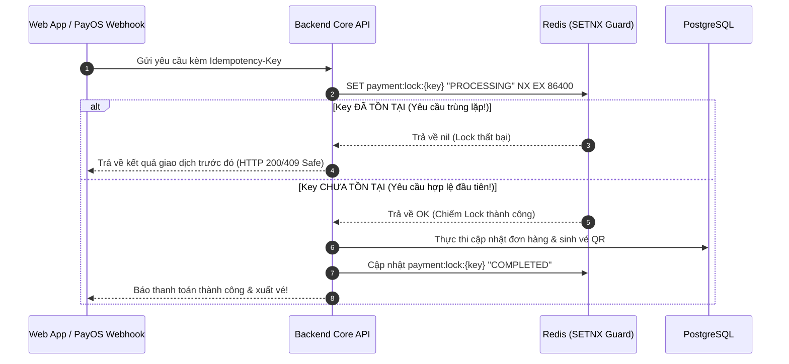

# Thanh Toán An Toàn — PayOS VietQR & Khóa Lũy Đẳng (Idempotency Key)

## 1) Bài Toán Rủi Ro Trong Thanh Toán Trực Tuyến
Trong các hệ thống bán vé có lưu lượng truy cập cao:
1. **Double-Click / Mạng Chập Chờn:** Khách hàng sốt ruột bấm nút "Thanh toán" 2 lần liên tiếp khi mạng chậm. Nếu không kiểm soát, hệ thống có thể tạo ra 2 giao dịch trừ tiền.
2. **Duplicate Webhook Delivery:** Cổng thanh toán (PayOS / VietQR) tự động retry gửi lại Webhook nhiều lần do mạng timeout, dẫn đến nguy cơ hệ thống cộng vé hoặc xuất vé 2 lần cho 1 đơn hàng.

---

## 2) Giải Pháp: Khóa Lũy Đẳng Bằng Redis SETNX (Idempotency Key)

### Nguyên Lý Hoạt Động Của Redis `SETNX`:
Lệnh `SET key value NX EX seconds` chỉ ghi vào Redis nếu key đó **chưa từng tồn tại**. Nếu key đã có sẵn, Redis trả về `nil`.



---

## 3) Tích Hợp Cổng Thanh Toán PayOS & Xác Thực Chữ Ký Webhook
- **Mã VietQR Động:** Khi đơn hàng được tạo, Backend gọi PayOS API để nhận chuỗi mã VietQR chứa đúng số tiền và nội dung chuyển khoản mã hóa (Order Code). Khách hàng chỉ cần mở ứng dụng ngân hàng quét mã trong 1 giây.
- **Xác Thực Chữ Ký Điện Tử (Webhook Verification):** PayOS gửi kèm chữ ký HMAC-SHA256 trong header hoặc payload. Backend bắt buộc phải tự tính toán lại chữ ký bằng `PAYOS_CHECKSUM_KEY` và so sánh chuỗi băm trước khi xử lý bất kỳ logic nào:
  ```typescript
  const isValid = payOS.verifyPaymentWebhookData(webhookBody);
  if (!isValid) throw new UnauthorizedException('Chữ ký Webhook không hợp lệ');
  ```

---

## 4) Câu Hỏi Phỏng Vấn & Cách Trả Lời
1. *Thời gian sống TTL của Idempotency Key nên để bao lâu?*
   - Đối với giao dịch thanh toán vé, Tixora cấu hình TTL là **24 giờ (86.400 giây)**. Khoảng thời gian này đủ dài để bao phủ toàn bộ các đợt retry webhook của đối tác thanh toán và ngăn ngừa người dùng refresh lại form thanh toán trong cùng ngày.
2. *Nếu server bị crash đúng lúc đang xử lý sau khi lấy được lock thì sao?*
   - Key có TTL tự động hết hạn, phòng tránh hiện tượng Deadlock vĩnh viễn. Ngoài ra, trạng thái trong PostgreSQL được bọc trong Database Transaction: nếu crash, transaction sẽ tự động Rollback về trạng thái an toàn ban đầu.
