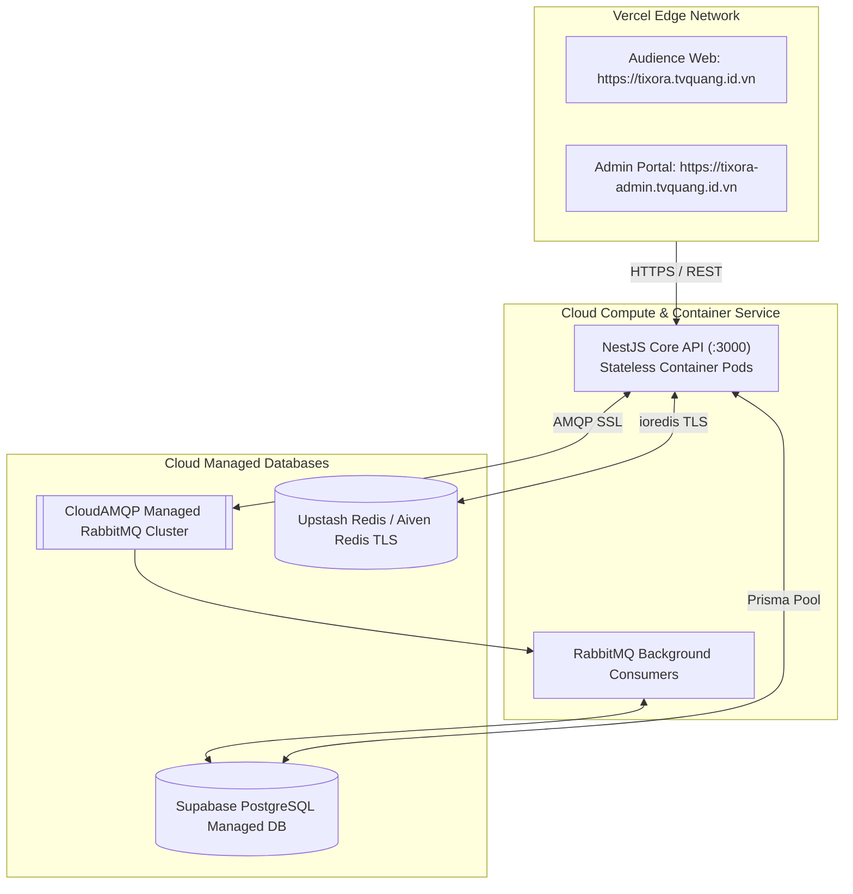

# Hạ Tầng & Triển Khai — Docker Compose & Cloud Deployment

## 1) Hạ Tầng Local Containerized (`infrastructure/docker-compose.yml`)
Để môi trường phát triển cục bộ hoàn toàn tương thích và cô lập, Tixora đóng gói toàn bộ các dịch vụ phụ trợ vào Docker Compose:
- **`postgres` (Cổng `:5432`):** CSDL chính PostgreSQL `16-alpine`, cấu hình persistent volume để lưu trữ dữ liệu an toàn.
- **`redis` (Cổng `:6379`):** Redis `7-alpine`, bật cơ chế AOF (`appendonly yes`) phục vụ động cơ trừ vé nguyên tử Lua Script.
- **`rabbitmq` (Cổng `:5672` & `:15672`):** RabbitMQ `3-management-alpine`, mở sẵn giao diện trực quan RabbitMQ Management Web UI tại `http://localhost:15672` để theo dõi lưu lượng queue và message throughput theo thời gian thực.

Lệnh khởi động hạ tầng:
```bash
cd infrastructure
docker compose up -d
```

---

## 2) Chiến Lược Triển Khai Sản Xuất (Cloud Production Architecture)
Hệ thống Tixora được thiết kế để tận dụng tối đa sức mạnh của hạ tầng Cloud phân tán:



---

## 3) Quản Trị Biến Môi Trường (.env Management)
Để tuân thủ nguyên tắc **12-Factor App**, toàn bộ thông tin nhạy cảm và cấu hình kết nối được tách biệt hoàn toàn khỏi mã nguồn:
- `DATABASE_URL`: Chuỗi kết nối PostgreSQL có pooling connection.
- `REDIS_HOST`, `REDIS_PORT`, `REDIS_PASSWORD`: Thông số kết nối Redis cluster.
- `RABBITMQ_URL`: URI kết nối giao thức AMQP.
- `JWT_SECRET`, `JWT_EXPIRES_IN`: Khóa bí mật ký số Stateless JWT.
- `PAYOS_CLIENT_ID`, `PAYOS_API_KEY`, `PAYOS_CHECKSUM_KEY`: Bộ khóa tích hợp cổng thanh toán VietQR PayOS.

---

## 4) Câu Hỏi Phỏng Vấn & Cách Trả Lời
1. *Làm sao để đảm bảo dữ liệu database không bị mất khi container Docker bị xóa?*
   - Trong `docker-compose.yml`, thư mục dữ liệu `/var/lib/postgresql/data` được mount vào một Named Volume riêng biệt (`pgdata`). Khi xóa hoặc cập nhật container (`docker compose down`), volume này vẫn tồn tại nguyên vẹn trên máy chủ.
2. *Làm thế nào để scale API server khi lượng truy cập tăng vọt?*
   - Vì NestJS Core API được thiết kế theo mô hình **Stateless** (không lưu session trong bộ nhớ local mà ủy thác trạng thái cho Redis và PostgreSQL), chúng ta có thể scale ngang thành nhiều container instance phía sau một Reverse Proxy / Load Balancer (Nginx hoặc AWS ALB) mà không làm gián đoạn bất kỳ phiên làm việc nào của người dùng.
